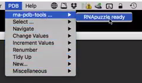

# Changelog
All notable changes to this project will be documented in this file.

The format is based on [Keep a Changelog](https://keepachangelog.com/en/1.0.0/),
and this project adheres to [Semantic Versioning](https://semver.org/spec/v2.0.0.html).

# [Unreleased]

    Fixed:
    
        rna_tools_lib.py (RNAStructure) for remove_hydrogen, correct atom name position now

    Added:
    
        mqapRNA: py3 wrappers and include them in RT
        - RASP
        - Dfire
        - RNA3DCNN
        - QRNA
        - FARNA
        - AnalyzeGeometry and ClashScore (add rna_clashscore.py app)
        - eSCORE (barnaba)
        - 3dRNAscore
        - RNAkb (!!!!)
        - libs

        mq: add mq to RNAStructure and a simple Jupyter notebook to test it

        rna_tools_lib.py (RNAStructure):
        - add .name attribute with filename (only filename, e.g. "1XJR.pdb")
        - --bases-only and --no-backbone
    
        rna_tools_lib.py: add load_rnas to load structural files (via glob)
        
    Changed:
    
        rna_tools_lib.py (RNAStructure) when rpr loads structure with biopython the error is not suppressed
        
# 3.6.2

    Fixed:

        rna_secondary_structure_prediction.py: fixes

    Added:

        PyMOL4RNA.py: mutate, rpr, diff, move rnapuzzle coloring code to own file

# 3.6 201122

    Fixed:

        rna_pdb_toolsx.py: --rpr fix correct resi for remarks
        rna_pdb_toolsx.py: --rpr with --keep-hetatm ! [fixed issue with #71]
	
    Added:
    
        rna_pdb_toolsx.py: --set-chain, set chain for all ATOM lines and TER (quite brutal function)
        rna_pdb_toolsx.py: add --triple-mode,--column-name
        rna_pdb_toolsx.py: add --backbone-only
        rna_pdb_toolsx.py: --rpr no also fixes missing OP1 and OP2 in backbone
        rna_pdb_toolsx.py: refactor, path code executed once
        rna_pdb_toolsx.py: add --inspect
   
        rna_tools_lib.py (RNAStructure) - add get_res_text() & get_remarks_text()
        rna_tools_lib.py (RNAStructure) - add reload()
        rna_tools_lib.py (RNAStructure) - change write() now saves by default to self.fn
    
        rna_calc_rmsd_biopython.py: --triple-mode works (final test!) 201118
        rna_calc_rmsd_biopython.py: introduce way to save models after rmsd calc
        rna_calc_rmsd_biopython.py: add --triple-mode,--column-name
		
	PyMOL4RNA: add inspect function for rna_pdb_toolsx.py: --inspect
		
    Bug fixes and small improvements.

 https://github.com/mmagnus/rna-tools/issues/71

# 3.5.4 200710

- add digitifier.py
- rna_clanstix.py: deal with colors using shapes (type)
- spotifier.py: 
    - clean spotifier.py, -m -> <map>
    - spotifier.py: add logging, process reporters plates, add dont-anntate

# 3.5.3 200703

- spotifier.py: 
    - deal better with fonts
    - add to setup.py spotifier program

# 3.5.2 200702

- spotifier.py: 
    - "--map" should be required=True
    - trim -> dont-align, works on PSD, clean

# 3.5.1 200629

- Fix scrutinizer and small fixes

# 3.5 200629

- rna_calc_inf.py: 
    - --renumber-residues
    - clean sel pdb files, and --dont-remove-sel-files
    - force to run ClaRNA even if <pdb>.outCR file is there, for will be auto True when selection defined
    - rna_calc_inf.py: up readme
    - rna_calc_inf.py: with model_selection and target_selection
    - Fix problems with rna_calc_inf.py, re-write tests, add docs
    
- rna_pdb_toolsx.py: 
    - add --no-progress-bar
    - add --color-seq
    - add --rpr for --mutate
    
- diffpdb.py: fix --names-and-resi
    
Update update_readme.py and update readme (Used in papers)
    
Bug fixes and small improvements.

# 3.4 200626

200626

- rna_pdb_toolsx.py: --undo --suffix --hide-warnings
- rna_pdb_toolsx.py: add fetch RNA-Puzzles standardized_dataset
- rna_pdb_toolsx.py: --to-mol2
- include mini-moderna3
- add spotifier https://github.com/mmagnus/rna-tools/tree/master/rna_tools/tools/spotifier 
- add webserver-engine https://github.com/mmagnus/rna-tools/tree/master/rna_tools/tools/webserver-engine 

# 3.2

- 200330 read the docs py3 now https://readthedocs.org/projects/rna-tools/builds/
- 190821
    - Add `rna_alignment/rna_align_foldability.py`
    - Seq.py now you can set .name
    - Seq.py mc-fold:
        - Add: explore option
        - Change: verbose now also shows full output of the program
        - Add: comment field for some extra information from the program
- 190820 Add: rna_align_distance_to_seq.py
- 190815 Add: Seq.py: load_fasta_ss_into_RNAseqs()
- 190813 Add: copied and edited from rna_pdb_merge_into_one.py to:

      rna_pdb_toolsx.py --nmr-dir . 'cwc15_u5_fragments*.pdb' > ~/Desktop/cwc15-u5.pdb

- 190810 Add: ENTRNA wrapper for foldability

## Added

- `rna_dot2ct.py`
- `rna_pdb_toolsx.py --swap-chains SWAP_CHAINS` [190530]
- Clanstix: with smart group name picking [190500]
- `rna_pdb_toolsx.py --split-alt-locations`
- `rna_pdb_toolsx.py --delete-anisou`
- copied and edited from rna_pdb_merge_into_one.py to `rna_pdb_toolsx.py --nmr-dir . 'cwc15_u5_fragments*.pdb' > ~/Desktop/cwc15-u5.pdb` [190813
]

## Changed
- Rename `rna_ss_pred.py` to `rna_secondary_structure_prediction.py`
- Changed all underscores into dashes in arguments, .e.g --get_seq to --get-seq #94 [190529]
- PyMOL4RNA: scale down shapes for inorganic, to 0.25

## Fixed
- Clanstix problem with group and coloring bug #91

# History

170814 Python3 everywhere (at least it should be)

170608 Add `--get_ss` (secondary structure) using x3dna.

170518 Edit in place [experimental, only for `get_rnapuzzle_ready`] `rna_pdb_tools.py --rpr 7_Das_7_rpr.pdb --inplace`. (2) get a structure in org-mode format <sick!>

170517 Fix #37 mis-align atom names after rpr-ing bug

170515 Fix fixing missing O2'

170404	`rna_simrna_extract.py -t template.pdb -f *05.trafl -c -n 1 # extract only the first model`

170331 rna-pdb-tools meets Emacs!

170325 Seq: secondary structure prediction with constraints

    >>> seq = Seq("CCCCUUUUGGGG")
    >>> seq.name = 'RNA03'
    >>> print(seq.predict_ss("RNAfold", constraints="((((....))))"))
    >RNA03
    CCCCUUUUGGGG
    ((((....)))) ( -6.40)

170324 Starting converting to Python3, fetch_align by Pietro

170320 `rna_cartoon` in PyMOL

170319 Add clanstix (move it from its own GitHub repository).

170315 SimRNA_trajectory:
  - get len of frame, and trajectory
  - warn about broken frame
  - `only_first_frame` to get only the first frame

170311 Get seq (v2) gets segments of chains with correct numbering

	> 6_solution_0 A:1-19 26-113 117-172
	GGCGGCAGGUGCUCCCGACGUCGGGAGUUAAAAGGGA

170308 Add fixing missing atoms of bases, and O2'

... many things! :-)

~2011 Prelimiary version as rnastruc, yapdb_parser etc.
