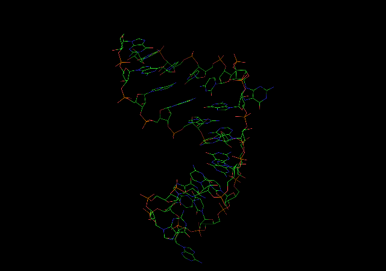

rna-pdb-tools
-------------------------------------------------

A library and a program to run various Python functions related to work with PDB files of RNA structures.

What is fun here?

+ you see input & output -- this is what you want to get?
+ it's tested via Travis! -- it (should) always works as you just want!
+ you lack a converter you would like to have one? *Just Do It Yourself* - compose your converter/parser from LEGO brick-like functions, see for example `--rosetta2generic`)

.. or you might want to use the lib in the program.

**Figure 1**. Cleaned `1osw.pdb`

The main program:

    usage: yapdb_parser ver: unknown [-h] [-r] [-c] [--getchain GETCHAIN]
                                     [--getseq] [--rosetta2generic]
                                     [--getrnapuzzle] [--get_simrna_ready]
                                     [--nohr]
                                     file
    
    positional arguments:
      file                 file
    
    optional arguments:
      -h, --help           show this help message and exit
      -r, --report         get report
      -c, --clean          get clean structure
      --getchain GETCHAIN  get chain, .e.g A
      --getseq             get seq
      --rosetta2generic    convert ROSETTA-like format to generic pdb
      --getrnapuzzle       get RNApuzzle ready
      --get_simrna_ready
      --nohr               do not insert the header into files

## Features:

- [X] get RNA seq
- [X] get chain
- [X] get only first model
- [X] remove RNA modifications (from seq and output file) (at least, GTP)
- [X] find missing atoms and report them (`--getrnapuzzle`) if atoms are missing you get the Exceptions

        $ ./yapdb_parser.py --getrnapuzzle input/1xjr_missing_atom.pdb 
        Missing atoms:
         + C8 <Residue   G het=  resseq=2 icode= > residue # 2
        Traceback (most recent call last):
          File "./yapdb_parser.py", line 101, in <module>
            s.get_rnapuzzle_ready()
          File "/home/magnus/work/yapdb_parser/pdb_parser_lib.py", line 540, in get_rnapuzzle_ready
            raise Exception('Missing atoms')
        Exception: Missing atoms

+ [X] remove H3T atom:

        Wrong middle line:  ATOM    279  H3T  RG A  13      31.479  26.388  41.463  1.00  0.00 H3T
            Wrong middle line:  ATOM    514  H3T RC3 B  24       7.142  23.044  10.287  1.00  0.00 H3T
            [          ]   1 0.04 % 2746 decoy3308.pdb                                           -0.1      -1.0     29.17    -67.13 104916.67     12.74     10.28      -0.0     28.28

- [X] add version of the tool (based on https://github.com/m4rx9/curr_version )
- [X] add a header to pdb file with version of the program (and add `--nohr` option if you don't like the header :-)

.. get report on missing atoms and fixes:

    magnus@maximus:~/src/yapdb_parser$ ./yapdb_parser.py --nohr --get_simrna_ready input/1xjr_no_op3.pdb
    REMARK 000 FIX O5' -> P fix in chain  A
    REMARK 000 FIX O5' -> P fix in chain  B
    REMARK 000 Missing atoms:
    REMARK 000  + P A <Residue G het=  resseq=1 icode= > residue # 1
    REMARK 000  + OP1 A <Residue G het=  resseq=1 icode= > residue # 1
    REMARK 000  + OP2 A <Residue G het=  resseq=1 icode= > residue # 1
    REMARK 000  + P B <Residue A het=  resseq=44 icode= > residue # 1
    REMARK 000  + OP1 B <Residue A het=  resseq=44 icode= > residue # 1
    REMARK 000  + OP2 B <Residue A het=  resseq=44 icode= > residue # 1
    ATOM      1  P     G A   1      72.709  39.396  41.589  1.00 90.49           O
    ATOM      2  C5'   G A   1      71.461  40.065  41.599  1.00 84.73           C
    ATOM      3  C4'   G A   1      71.633  41.579  41.677  1.00 79.18           C
    ATOM      4  O4'   G A   1      72.883  42.002  41.159  1.00 77.89           O
    ATOM      5  C3'   G A   1      70.593  42.265  40.817  1.00 76.34           C
    ATOM      6  O3'   G A   1      69.396  42.552  41.496  1.00 73.29           O
    ATOM      7  C2'   G A   1      71.299  43.523  40.389  1.00 75.44           C
    ATOM      8  O2'   G A   1      71.216  44.501  41.398  1.00 74.42           O
    ATOM      9  C1'   G A   1      72.736  43.064  40.223  1.00 74.81           C
    ATOM     10  N9    G A   1      72.976  42.656  38.801  1.00 74.23           N
    ATOM     11  C8    G A   1      73.267  41.400  38.317  1.00 73.69           C
    ATOM     12  N7    G A   1      73.414  41.450  36.965  1.00 72.93           N
    ATOM     13  C5    G A   1      73.208  42.724  36.560  1.00 73.22           C
    ATOM     14  C6    G A   1      73.225  43.337  35.306  1.00 73.35           C
    ATOM     15  O6    G A   1      73.467  42.698  34.278  1.00 73.29           O
    ATOM     16  N1    G A   1      72.963  44.689  35.217  1.00 73.64           N
    ATOM     17  C2    G A   1      72.694  45.430  36.351  1.00 73.30           C
    ATOM     18  N2    G A   1      72.443  46.732  36.271  1.00 73.22           N
    ATOM     19  N3    G A   1      72.686  44.816  37.581  1.00 73.20           N
    ATOM     20  C4    G A   1      72.935  43.487  37.697  1.00 73.60           C
    TER
    ATOM     21  P     A B   1      67.659  29.034  41.634  1.00 78.05           O
    ATOM     22  C5'   A B   1      67.571  27.600  41.741  1.00 78.31           C
    ATOM     23  C4'   A B   1      66.989  26.984  40.472  1.00 77.28           C
    ATOM     24  O4'   A B   1      65.603  27.391  40.333  1.00 75.64           O
    ATOM     25  C3'   A B   1      67.638  27.460  39.170  1.00 77.12           C
    ATOM     26  O3'   A B   1      68.855  26.813  38.845  1.00 75.76           O
    ATOM     27  C2'   A B   1      66.539  27.221  38.136  1.00 77.78           C
    ATOM     28  O2'   A B   1      66.460  25.908  37.605  1.00 79.71           O
    ATOM     29  C1'   A B   1      65.296  27.546  38.956  1.00 75.44           C
    ATOM     30  N9    A B   1      64.827  28.889  38.626  1.00 74.84           N
    ATOM     31  C8    A B   1      64.960  30.064  39.315  1.00 74.59           C
    ATOM     32  N7    A B   1      64.406  31.108  38.719  1.00 74.09           N
    ATOM     33  C5    A B   1      63.880  30.580  37.549  1.00 74.21           C
    ATOM     34  C6    A B   1      63.167  31.140  36.461  1.00 74.02           C
    ATOM     35  N6    A B   1      62.831  32.427  36.365  1.00 73.72           N
    ATOM     36  N1    A B   1      62.804  30.314  35.448  1.00 74.64           N
    ATOM     37  C2    A B   1      63.120  29.008  35.513  1.00 75.10           C
    ATOM     38  N3    A B   1      63.782  28.360  36.477  1.00 75.34           N
    ATOM     39  C4    A B   1      64.140  29.212  37.472  1.00 75.58           C
    TER
    END

## TODO

*low priority*

- [ ] get protein seq

## Requirement

`.get_rnapuzzle_ready()` needs Biopython

`.is_mol2()` needs OpenBabel

## Inspiration (and alternatives):

+ http://blue11.bch.msu.edu/mmtsb/convpdb.pl
+ https://github.com/haddocking/pdb-tools
+ https://github.com/harmslab/pdbtools
+ http://ginsberg.med.virginia.edu/Links/Phenix/pdbtools.htm
+ .. and more!
