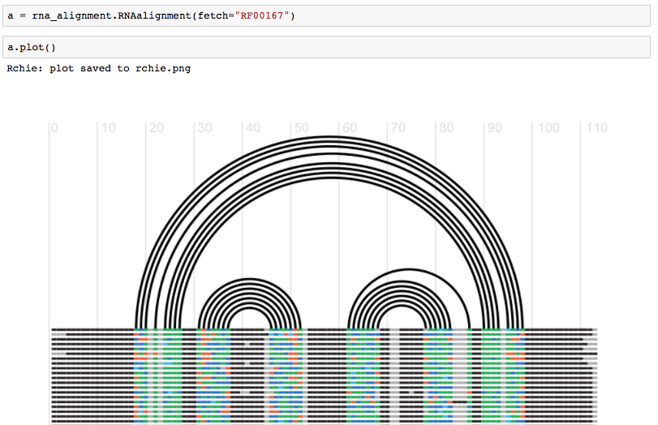
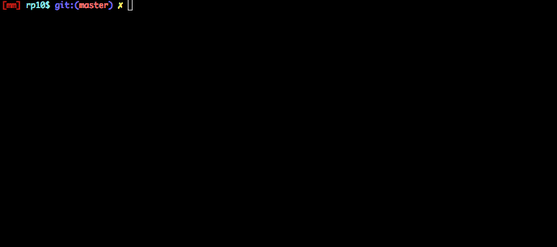
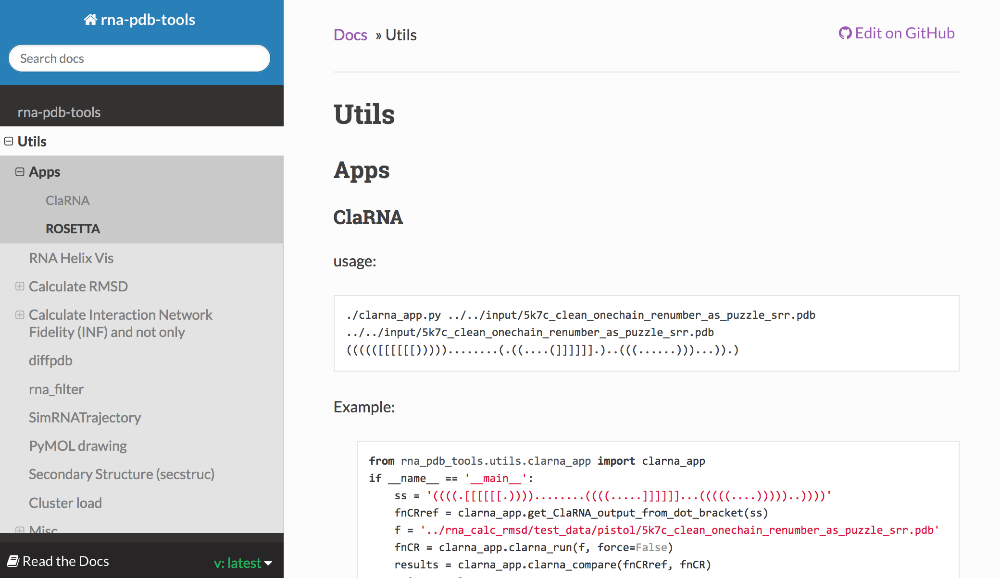

<h1 align="center">
  rna-tools
</h1>
<p align="center" style="font-size:20px">
  <b >a toolbox to analyze sequences, structures and simulations of RNA</b>
</p>

<p align="center">
  Look for other our projects at https://github.com/RNA-Puzzles.
</p>

<p align="center">
  <a href="https://twitter.com/rna_tools"></a>
<!--
  <a href="https://github.com/mmagnus/rna-tools/releases"></a>-->
  <a href="https://travis-ci.org/mmagnus/rna-tools"></a>
  <a href="http://rna-tools.readthedocs.io/en/latest/?badge=latest"></a>
  <a href="https://scrutinizer-ci.com/g/mmagnus/rna-tools/?branch=master"></a>
	<span class="badge-paypal"><a href="https://www.paypal.me/MarcinMagnus" title="Donate to this project using Paypal"></a></span>
	<span class="badge-flattr"><a href="https://flattr.com/profile/mmagnus" title="Donate to this project using Flattr"></a></span>

<p>

The latest
--------------------------------------------------------------------

**20-03-23** Finally, to install rna-tools simply type in the terminal: `pip install rna-tools`

**20-03-21** [PyMOL Preview Generator for OSX](https://github.com/mmagnus/rna-tools/tree/master/rna_tools/tools/pymol_preview_generator) a new tool for generation of previews in Finders created :-)

**20-02-17** Release v3.1 some cool new features https://github.com/mmagnus/rna-tools/releases/tag/v3.1

**19-11-08** The RNA-Puzzles toolkit paper has been accepted for publication in Nucleic Acid Research :-) Release v3

RNA-Puzzles toolkit: A computational resource of RNA 3D structure benchmark datasets, structure manipulation, and evaluation tools
Magnus, Marcin; Antczak, Maciej; Zok, Tomasz; Wiedemann, Jakub ; Lukasiak, Piotr; Cao, Yang ; Bujnicki, Janusz; Westhof, Eric; Szachniuk, Marta; Miao, Zhichao
https://academic.oup.com/nar/advance-article/doi/10.1093/nar/gkz1108/5651330

**19-10-22** We made a searchable [index]( https://github.com/mmagnus/rna-tools/blob/master/rna-tools-index.csv) of all the tools. There are around 100 functionalities implemented, enjoy it! Let us know if something is missing or unclear!

**19-10-10** **rna-tools finally works with Python 3, to get Python 2 version go to this [branch](https://github.com/mmagnus/rna-tools/tree/py2)** However, not all tools can be used with Python 3, for example, ClaRNA is written in Python 2 and we can do nothing about it. So, for now, we suggest using Conda or something else that supports kind of hybrid Python2/Python3 environments. Read more on this [here](https://towardsdatascience.com/environment-management-with-conda-python-2-3-b9961a8a5097) and [here](https://docs.anaconda.com/anaconda/user-guide/tasks/switch-environment/)

**19-10-01** The EvoClustRNA manuscript with the heavy use of rna-tools is accepted for publication!

M. Magnus, M., Kappel, K., Das, R., & Bujnicki, J. M. (2019). RNA 3D structure prediction guided by independent folding of homologous sequences, BMC Bioinformatics, https://github.com/mmagnus/EvoClustRNA https://bmcbioinformatics.biomedcentral.com/articles/10.1186/s12859-019-3120-y

**19-06-15** rna-tools used for spliceosome! :-) is accepted for publication! See [this folder](https://github.com/mmagnus/rna-tools/tree/master/U6MolCell) for the description of the analysis!

Eysmont, K., Matylla-Kulinska, K., Jaskulska, A., Magnus, M., & Konarska, M. M. (2018). Rearrangements within the U6 snRNA core at the transition between the two catalytic steps of splicing. Molecular Cell https://github.com/mmagnus/rna-tools/tree/master/U6MolCell https://www.cell.com/molecular-cell/pdfExtended/S1097-2765(19)30390-9 

See also [CHANGELOG](https://github.com/mmagnus/rna-tools/blob/master/CHANGELOG.md).

Introduction
--------------------------------------------------------------------

<!--
*If you find the tools helpful you can by me a beer via PayPal or Flattr, and if you like the project, please "Star it", so it would be easier to find it for others and to make me happy that the toolbox useful not only for me.*

-->

A core library and a set of programs to run various Python functions related to work, initially, with PDB files of RNA structures, but right now this is a huge toolbox of tools to process various types of RNA data.

**That is why in 2019, after publishing our U6 Molecular Cell paper I decided to rename the package to rna-tools. Simply, various tools to work with RNA data: sequences, alignments, structures, trajectories, RNA-seq data.** If you want access the old version see the [branch](https://github.com/mmagnus/rna-tools/tree/rna-pdb-tools).

The software is used by me in my servers **NPDock** (RNA/DNA-protein docking method, http://genesilico.pl/NPDock/) and **SimRNAweb** (RNA 3D structure prediction method, http://iimcb.genesilico.pl/SimRNAweb/) and **mqapRNA** (RNA 3D quality control, http://iimcb.genesilico.pl/mqapRNA/) and other projects [EvoClustRNA](https://github.com/mmagnus/EvoClustRNA) and [RNA-Puzzles-Normalized-submissions](https://github.com/mmagnus/RNA-Puzzles-Normalized-submissions).

**What is fun here?**

`rna-tools` (formerly rna-pdb-tools) is a packages of shell utils that are using the common core library. You can also access functions of the library from your scripts.

A command-line tools:

```shell
$ rna_pdb_toolsx.py --is-pdb input/1I9V_A.pdb
True
$ rna_pdb_toolsx.py --is-pdb input/image.png
False
```

or from a script:

```python
>>> from rna_tools_lib import *
>>> s = RNAStructure('input/1I9V_A.pdb')
>>> s.is_pdb()
True
```

or from a Jupyter Notebook:



Fig. Fetch an alignment and generate an RChie plot for it. See more <https://github.com/mmagnus/rna-tools/blob/master/rna_tools/tools/rna_alignment/rna_alignment.ipynb>

Take a tour [http://mmagnus.github.io/rna-tools/#/](http://mmagnus.github.io/rna-tools/) and/or read the doc [rna-tools.rtfd.io/en/latest/](http://rna-tools.rtfd.io/en/latest/).

<p align="center">
  
</p>

Fig. `rna_pdb_toolsx.py --get-rnapuzzle-ready *pdb --inplace`


Table of Contents
-----------------

   * [Tour](#tour)
   * [rna_pdb_toolsx.py](#rna_pdb_toolsxpy)
   * [Tools](#tools)
   * [Docs](#docs)
   * [Cite](#cite)
   * [Used in papers](#used-in-papers)
   * [RNA Puzzle Submission](#rna-puzzle-submission)
   * [Inspiration (and alternatives)](#inspiration-and-alternatives)
   * [Install](#install)
   * [Index of Tools](#index-of-tools)
      * [rna\_pdb\_toolsx\.py](#rna_pdb_toolsxpy)
      * [Sequence analysis](#sequence-analysis)
      * [Secondary structure analysis](#secondary-structure-analysis)
      * [Tertiary structure comparison](#tertiary-structure-comparison)
      * [Tertiary structure formats](#tertiary-structure-formats)
      * [Tertiary structure analysis](#tertiary-structure-analysis)
      * [Tertiary structure processing](#tertiary-structure-processing)
      * [PyMOL4RNA](#pymol4rna)
      * [SimRNA](#simrna)
      * [Rosetta](#rosetta)
      * [RNA Alignment](#rna-alignment)
      * [Python Classes](#python-classes)
      * [Other](#other)
   * [Index of Jupyter Notebooks](#index-of-jupyters)   


## Tour

Take a tour http://mmagnus.github.io/rna-tools/#/

## rna_pdb_toolsx.py

```
usage: rna_pdb_toolsx.py [-h] [--version] [-r] [--renum-atoms]
usage: rna_pdb_toolsx.py [-h] [--version] [-r] [--renum-atoms]
                         [--renum-residues-dirty] [--delete-anisou]
                         [--split-alt-locations] [-c] [--is-pdb] [--is-nmr]
                         [--nmr-dir NMR_DIR] [--un-nmr] [--orgmode]
                         [--get-chain GET_CHAIN] [--fetch] [--fetch-ba]
                         [--get-seq] [--hide-warnings] [--compact] [--get-ss]
                         [--rosetta2generic] [--get-rnapuzzle-ready] [--rpr]
                         [--no-hr] [--renumber-residues]
                         [--dont-rename-chains] [--dont-fix-missing-atoms]
                         [--dont-report-missing-atoms] [--collapsed-view]
                         [--cv] [-v] [--replace-hetatm] [--inplace]
                         [--mutate MUTATE] [--edit EDIT]
                         [--rename-chain RENAME_CHAIN]
                         [--swap-chains SWAP_CHAINS]
                         [--replace-chain REPLACE_CHAIN] [--delete DELETE]
                         [--extract EXTRACT] [--extract-chain EXTRACT_CHAIN]
                         [--uniq UNIQ] [--chain-first] [--oneline] [--fasta]
                         file [file ...]

rna_pdb_toolsx - a swiss army knife to manipulation of RNA pdb structures

Tricks:

   for i in *pdb; do rna_pdb_toolsx.py --get-rnapuzzle-ready $i >  ${i/.pdb/_rpr.pdb}; done

Usage::

   $ for i in *pdb; do rna_pdb_toolsx.py --delete A:46-56 $i > ../rpr_rm_loop/$i ; done

    $ rna_pdb_toolsx.py --get-seq *
    # BujnickiLab_RNApuzzle14_n01bound
    > A:1-61
    # BujnickiLab_RNApuzzle14_n02bound
    > A:1-61
    CGUUAGCCCAGGAAACUGGGCGGAAGUAAGGCCCAUUGCACUCCGGGCCUGAAGCAACGCG
    [...]

positional arguments:
  file                  file

optional arguments:
  -h, --help            show this help message and exit
  --version
  -r, --report          get report
  --renum-atoms         renumber atoms, tested with --get-seq
  --renum-residues-dirty
  --delete-anisou       remove files with ANISOU records, works with --inplace
  --split-alt-locations
                        @todo
  -c, --clean           get clean structure
  --is-pdb              check if a file is in the pdb format
  --is-nmr              check if a file is NMR-style multiple model pdb
  --nmr-dir NMR_DIR     make NMR-style multiple model pdb file from a set of files 
                        
                          rna_pdb_toolsx.py --nmr-dir . 'cwc15_u5_fragments*.pdb' > ~/Desktop/cwc15-u5.pdb
                        
                        please use '' for pattern file recognition, this is a hack to deal with folders with
                        thousands of models, if you used only *.pdb then the terminal will complain that you
                        selected to many files.
  --un-nmr              split NMR-style multiple model pdb files into individual models [biopython]
  --orgmode             get a structure in org-mode format <sick!>
  --get-chain GET_CHAIN
                        get chain, one or many, e.g, A, but now also ABC works
  --fetch               fetch file from the PDB db
  --fetch-ba            fetch biological assembly from the PDB db
  --get-seq             get seq
  --hide-warnings       hide warnings, works with --get-chain, it hides warnings that given changes are not detected in a PDB file
  --compact             with --get-seq, get it in compact view'
                        $ rna_pdb_toolsx.py --get-seq --compact *.pdb
                        # 20_Bujnicki_1
                        ACCCGCAAGGCCGACGGCGCCGCCGCUGGUGCAAGUCCAGCCACGCUUCGGCGUGGGCGCUCAUGGGU # A:1-68
                        # 20_Bujnicki_2
                        ACCCGCAAGGCCGACGGCGCCGCCGCUGGUGCAAGUCCAGCCACGCUUCGGCGUGGGCGCUCAUGGGU # A:1-68
                        # 20_Bujnicki_3
                        ACCCGCAAGGCCGACGGCGCCGCCGCUGGUGCAAGUCCAGCCACGCUUCGGCGUGGGCGCUCAUGGGU # A:1-68
                        # 20_Bujnicki_4
                        
  --get-ss              get secondary structure
  --rosetta2generic     convert ROSETTA-like format to a generic pdb
  --get-rnapuzzle-ready
                        get RNApuzzle ready (keep only standard atoms).'
                        Be default it does not renumber residues, use --renumber-residues
                        [requires BioPython]
  --rpr                 alias to get_rnapuzzle ready)
  --no-hr               do not insert the header into files
  --renumber-residues   by defult is false
  --dont-rename-chains  used only with --get-rnapuzzle-ready.
                        By default:
                           --get-rnapuzzle-ready rename chains from ABC.. to stop behavior switch on this option
  --dont-fix-missing-atoms
                        used only with --get-rnapuzzle-ready
  --dont-report-missing-atoms
                        used only with --get-rnapuzzle-ready
  --collapsed-view
  --cv                  alias to collapsed_view
  -v, --verbose         tell me more what you're doing, please!
  --replace-hetatm      replace 'HETATM' with 'ATOM' [tested only with --get-rnapuzzle-ready]
  --inplace             in place edit the file! [experimental,
                        only for get_rnapuzzle_ready, delete, --get-ss, --get-seq, --edit-pdb]
  --mutate MUTATE       mutate residues,
                        e.g.,
                              --mutate "A:1A+2A+3A+4A,B:1A"
                        to mutate to adenines the first four nucleotides of the chain A
                        and the first nucleotide of the chain B
  --edit EDIT           edit 'A:6>B:200', 'A:2-7>B:2-7'
  --rename-chain RENAME_CHAIN
                        edit 'A>B' to rename chain A to chain B
  --swap-chains SWAP_CHAINS
                        B>A, rename A to _, then B to A, then _ to B
  --replace-chain REPLACE_CHAIN
                        a file PDB name with one chain that will be used to
                        replace the chain in the original PDB file,
                        the chain id in this file has to be the same with the chain id of the original chain
  --delete DELETE       delete the selected fragment, e.g. A:10-16, or for more than one fragment --delete 'A:1-25+30-57'
  --extract EXTRACT     extract the selected fragment, e.g. A:10-16, or for more than one fragment --extract 'A:1-25+30-57'
  --extract-chain EXTRACT_CHAIN
                        extract chain, e.g. A
  --uniq UNIQ           
                        rna_pdb_toolsx.py --get-seq --uniq '[:5]' --compact --chain-first * | sort
                        A:1-121        ACCUUGCGCAACUGGCGAAUCCUGGGGCUGCCGCCGGCAGUACCC...CA # rp13nc3295_min.out.1
                        A:1-123        ACCUUGCGCGACUGGCGAAUCCUGAAGCUGCUUUGAGCGGCUUCG...AG # rp13cp0016_min.out.1
                        A:1-123        ACCUUGCGCGACUGGCGAAUCCUGAAGCUGCUUUGAGCGGCUUCG...AG # zcp_6537608a_ALL-000001_AA
                        A:1-45 57-71   GGGUCGUGACUGGCGAACAGGUGGGAAACCACCGGGGAGCGACCCGCCGCCCGCCUGGGC # solution
  --chain-first
  --oneline
  --fasta               with --get-seq, show sequences in fasta format,
                        can be combined with --compact (mind, chains will be separated with ' ' in one line)
                        
                        $ rna_pdb_toolsx.py --get-seq --fasta --compact input/20_Bujnicki_1.pdb
                        > 20_Bujnicki_1
                        ACCCGCAAGGCCGACGGC GCCGCCGCUGGUGCAAGUCCAGCCACGCUUCGGCGUGGGCGCUCAUGGGU
                        
```

Tricks:

    $ for i in *; do echo $i; rna_pdb_toolsx.py --delete A:48-i > noloop/${i/.pdb/_noloop.pdb}; done
    10_rp17c.out.14.pdb
    10_rp17c.out.14_out.pdb
    [..]

    $ for i in *.pdb; do rna_pdb_toolsx.py --c $i > ${i/.pdb/_clx.pdb}; done

    $ for i in *.pdb; do rna_pdb_toolsx.py --get_rnapuzzle_ready $i > ${i/.pdb/_rpr.pdb}; done

.. keep original structures in original and use rpr:

    ➜  bujnicki_server_ss for i in original/*.pdb; do rna_pdb_toolsx.py --get_rnapuzzle_ready $i > ${i/.pdb/_rpr.pdb}; done
    ➜  bujnicki_server_ss ls
    17pz_withSS_all_thrs6.00A_clust01-000001_AA_rpr.pdb 17pz_withSS_all_thrs6.00A_clust06-000001_AA_rpr.pdb
    17pz_withSS_all_thrs6.00A_clust02-000001_AA_rpr.pdb 17pz_withSS_all_thrs6.00A_clust07-000001_AA_rpr.pdb
    17pz_withSS_all_thrs6.00A_clust03-000001_AA_rpr.pdb 17pz_withSS_all_thrs6.00A_clust08-000001_AA_rpr.pdb
    17pz_withSS_all_thrs6.00A_clust04-000001_AA_rpr.pdb 17pz_withSS_all_thrs6.00A_clust09-000001_AA_rpr.pdb
    17pz_withSS_all_thrs6.00A_clust05-000001_AA_rpr.pdb original

.. or to get SimRNAready structures:

    $ for i in *pdb; do rna_pdb_toolsx.py --get_simrna_ready $i >  ${i/.pdb/_srr.pdb}; done

## Tools

The (almost) full list of tools can be found here: <https://github.com/mmagnus/rna-tools/blob/master/index-of-tools.md>

Read more http://rna-tools.readthedocs.io/en/latest/

## Docs

Read the documentations at [rna-tools.rtfd.io/en/latest/](http://rna-tools.rtfd.io/en/latest/).

<a href="http://rna-tools.rtfd.io/en/latest/"></a>

## Cite

Magnus M, Antczak M, Zok T, Wiedemann J, Lukasiak P, Cao Y, Bujnicki JM, Westhof E, Szachniuk M, Miao Z. RNA-Puzzles toolkit: a computational resource of RNA 3D structure benchmark datasets, structure manipulation, and evaluation tools.  
Nucleic Acids Research. 2019  
10.1093/nar/gkz1108  
<https://academic.oup.com/nar/advance-article/doi/10.1093/nar/gkz1108/5651330>

## Used in papers

1. M. Magnus, M., Kappel, K., Das, R., & Bujnicki, J. M. (2019). *RNA 3D structure prediction guided by independent folding of homologous sequences*, BMC Bioinformatics, https://github.com/mmagnus/EvoClustRNA

2. Eysmont, K., Matylla-Kulinska, K., Jaskulska, A., Magnus, M., & Konarska, M. M. (2018). *Rearrangements within the U6 snRNA core at the transition between the two catalytic steps of splicing*. Molecular Cell https://github.com/mmagnus/rna-tools/tree/master/U6MolCell

3. Li, J., Zhu, W., Wang, J., Li, W., Gong, S., Zhang, J., & Wang, W. (2018). *RNA3DCNN: Local and global quality assessments of RNA 3D structures using 3D deep convolutional neural networks*. PLoS Computational Biology, 14(11), e1006514. http://doi.org/10.1371/journal.pcbi.1006514

4. Boccaletto, P., Magnus, M., Almeida, C., Zyła, A., Astha, A., Pluta, R., et al. (2018). *RNArchitecture: a database and a classification system of RNA families, with a focus on structural information*. Nucleic Acids Research, 46(D1), D202–D205. http://doi.org/10.1093/nar/gkx966

5. Magnus, M., Boniecki, M. J., Dawson, W. K., & Bujnicki, J. M. (2016). *SimRNAweb: a web server for RNA 3D structure modeling 4with optional restraints*. Nucleic Acids Research, 44(W1), W315–9. http://doi.org/10.1093/nar/gkw279

6. Tuszyńska, I., Magnus, M., Jonak, K., Dawson, W. K., & Bujnicki, J. M. (2015). *NPDock: a web server for protein-nucleic acid docking*. Nucleic Acids Research, 43(W1), W425–30. http://doi.org/10.1093/nar/gkv493

## RNA Puzzle Submission

Read at https://rna-tools.readthedocs.io/en/latest/rna-puzzles.html

## Inspiration (and alternatives)

+ https://www.rosettacommons.org/docs/latest/application_documentation/rna/RNA-tools
+ http://blue11.bch.msu.edu/mmtsb/convpdb.pl
+ https://github.com/haddocking/pdb-tools
+ https://github.com/harmslab/pdbtools
+ http://ginsberg.med.virginia.edu/Links/Phenix/pdbtools.htm
+ .. and more!

## Install

    pip install rna-tools

For developers see this http://rna-tools.readthedocs.io/en/latest/install-dev.html

## Index of tools

The index in a form of a searchable table can be found [here](https://github.com/mmagnus/rna-tools/blob/master/rna-tools-index.csv).

* [Index of tools](#index-of-tools)
  * [rna\_pdb\_toolsx\.py](#rna_pdb_toolsxpy)
  * [Sequence analysis](#sequence-analysis)
  * [Secondary structure analysis](#secondary-structure-analysis)
  * [Tertiary structure comparison](#tertiary-structure-comparison)
  * [Tertiary structure formats](#tertiary-structure-formats)
  * [Tertiary structure analysis](#tertiary-structure-analysis)
  * [Tertiary structure processing](#tertiary-structure-processing)
  * [PyMOL4RNA](#pymol4rna)
  * [SimRNA](#simrna)
  * [Rosetta](#rosetta)
  * [RNA Alignment](#rna-alignment)
  * [Python Classes](#python-classes)
  * [Other](#other)

<h3><a href="https://rna-tools.readthedocs.io/en/latest/main.html#rna-pdb-toolsx"><code>rna_pdb_toolsx.py</code></a></h3>

1. `--get-rnapuzzle-ready` format PDB file to be compatible with the "RNA-Puzzle PDB format",
1. `--report`             get report
1. `--renum-atoms`        renumber atoms, tested with --get-seq
1. `--renum-residues-dirty`
1. `--renumber-residues`  by defult is false
1. `--delete-anisou`      remove files with ANISOU records, works with --inplace
1. `--split-alt-locations`
1. `--clean`              get clean structure
1. `--is-pdb`             check if a file is in the pdb format
1. `--is-nmr`             check if a file is NMR-style multiple model pdb
1. `--un-nmr`             Split NMR-style multiple model pdb files into individual models [biopython]
1. `--orgmode`            get a structure in org-mode format <sick!>
1. `--get-chain GET_CHAIN`
1. `--fetch`              fetch file from the PDB db
1. `--fetch-ba`           fetch biological assembly from the PDB db
1. `--get-seq`            get seq
1. `--compact`            with --get-seq, get it in compact view'
1. `--get-ss`             get secondary structure
1. `--rosetta2generic`    convert ROSETTA-like format to a generic pdb
1. `--get-rnapuzzle-ready`
1. `--collapsed-view`
1. `--replace-hetatm`     replace 'HETATM' with 'ATOM' [tested only with --get-rnapuzzle-ready]
1. `--mutate MUTATE`      mutate residues,
1. `--edit EDIT`          edit 'A:6>B:200', 'A:2-7>B:2-7'
1. `--rename-chain RENAME_CHAIN`
1. `--swap-chains SWAP_CHAINS`
1. `--replace-chain REPLACE_CHAIN`
1. `--delete DELETE`      delete the selected fragment, e.g. A:10-16, or for more than one fragment --delete 'A:1-25+30-57'
1. `--extract EXTRACT`    extract the selected fragment, e.g. A:10-16, or for more than one fragment --extract 'A:1-25+30-57'
1. `--extract-chain EXTRACT_CHAIN`

### Sequence analysis

1. <a href="https://rna-tools.readthedocs.io/en/latest/tools.html#blast-pdb"><code>BlastPDB.py</code></a> - a simple Blast search,
1. <a href="https://rna-tools.readthedocs.io/en/latest/tools.html#rfam-search"><code>RfamSearch.py</code></a> - a simple Rfam search.

### Secondary structure analysis

1. <a href="https://rna-tools.readthedocs.io/en/latest/tools.html#module-rna_tools.Seq"><code>rna_secondary_structure_prediction.py</code></a> - a wrapper for secondary structure prediction methods, e.g., cyclefold, mcfold,ipknot, RNAsubopt, contextfold, centroid_fold, with a use of restraints (if applicable)
1. `rna_dot2ct.py` - convert dot notation to ct notation.
1. <a href="https://rna-tools.readthedocs.io/en/latest/tools.html#secondary-structure-format-conversion">secondary structure format conversion tools</a>

### Tertiary structure comparison

1. **`rna_calc_rmsd.py`** - calculate RMSDs of structures to the target
1. **`rna_calc_evo_rmsd.py`** - calculate RMSD between structures based on a given alignment and selected residues as defined in the "x line",
1. **`rna_calc_inf.py`** - including multiprocessing based on ClaRNA (in Python 2!)
1. **`rna_clanstix.py`** - a tool for visualizing RNA 3D structures based on pairwise structural similarity with Clans,
1. `rna_prediction_significance.py` - calculate significance of an RNA tertiary structure prediction.

### Tertiary structure formats

1. <a href="https://rna-tools.readthedocs.io/en/latest/tools.html#module-rna_tools.tools.diffpdb.diffpdb><code>diffpdb</code></a> - a simple tool to compare text-content of PDB files,

1. `rna_pdb_merge_into_one.py` - merge single files into an NMR-style multiple model file PDB file.

### Tertiary structure analysis
1. **`clarna_app.py`** - a wrapper to ClaRNA, See also PyMOL4RNA, Python 2!
1. **`rna_x3dna.py`** - a wrapper to 3dna, See also PyMOL4RNA,
1. `ClashCalc.py` - a simple clash score calculator, used in NPDock, requires BioPython,

### Tertiary structure processing
1. `rna_refinement.py` - a wrapper for QRNAS (Quick Refinement of Nucleic Acids)

### PyMOL4RNA

1. Undo ("Quick Save & Load") for PyMOL, `CTRL-S` & `CTRL-Z`,
1. [PyMOL4Spliceosome](https://github.com/mmagnus/PyMOL4Spliceosome) (link to its own repository)
1. `clarna()` - contact classification with ClaRNA directly in PyMOL for selected residues,
1. `x3dna()` - contact classification with X3DNA directly in PyMOL for selected residues,
1. `ss()` - get secondary structures of selected objects,
1.  `sav <fn>` - save on Desktop a session and a PNG file illustrating the session,
1. color structure domains according to pre-defined styles, e.g., `rp17()`
1. [PyMOL Preview Generator for OSX](https://github.com/mmagnus/rna-tools/tree/master/rna_tools/tools/pymol_preview_generator)

<h3><a target="_blank" href="https://rna-tools.readthedocs.io/en/latest/tools.html#simrna">SimRNA</a></h3>

1. `rna_simrna_cluster.py`
1. `rna_simrna_extract.py`
1. `rna_simrna_get_data`
1. `rna_simrna_lowest.py`
1. SimRNAweb: `rna_simrnaweb_download_job.py` - download model files, trajectory for a given SimRNAweb job
1. `rna_pdb_merge_structure_with_fragments.py` - insert fragments into the structure, used at the SimRNAweb server for modeling with a given pre-define structure,
1. `rna_pdb_edit_occupancy_bfactor.py` - edit occupancy or bfactor in PDB file,
1. `rna_pk_simrna_to_one_line.py` - convert multi-line SimRNA secondary structure format to one line bracket format,
1. `rna_ss_pk_to_simrna.py` - do opposite as previous one, convert one line bracket format with pseudoknots into multi-line SimRNA secondary structure format,
1. See also `simrna_trajectory` in Python Classes.

<h3><a target="_blank" href="https://rna-tools.readthedocs.io/en/latest/tools.html#rosetta">Rosetta</a></h3>

1. `rna_rosetta_n.py`
1. `rna_rosetta_check_progress.py`
1. `rna_rosetta_min.py`
1. `rna_rosetta_cluster.py`
1. `rna_rosetta_extract_lowscore_decoys.py`
1. `rna_rosetta_run.py`
1. `rna_rosetta_head.py`

### RNA Alignment

1. `get_seq()` - get sequence,
1. `get_ss()` - get secondary structure for a given sequence,
1. `fetch()` - fetch an alignment from Rfam,
1. `cmalign()` - aligns the RNA sequences in <seqfile> to the covariance model (CM) in <cmfile>
1. `Rchie()` - plotting arc diagrams of RNA secondary structures,
1. `find_core()` - finds core of molecules in alignment,

### Python Classes

1. `Seq.py` - seq processing, including secondary structure prediction
1. `SecondaryStructure.py::draw_ss()`
1. `SecondaryStructure.py::parse_vienna_to_pairs()`
1. `simrna_trajectory`

### Other

1. <a href="https://rna-tools.readthedocs.io/en/latest/tools.html#module-rna_tools.tools.rnakb_utils.rnakb_utils">rnakb_utils</a> - RNAkb-related tools,
1. rnapuzzle_sender - a script to send PDB files to the RNA-Puzzle organizers,
1. rnashape2ascii - convert RNA shape data into ascii characters ;-) `▅▄▆▄▂▁▁▁▁▁▁▁▁▁▁▂▁▁▁▁▁▁▁▁▁▁▁▁▁▁▁▁▂▅▇▅▄▃▂▁`
1. cluster_load - scripts to view cluster load, based on processing `qstat`.
## Index of Jupyters

- https://github.com/mmagnus/rna-tools/blob/master/notes/fig3-manuscript.ipynb
- https://github.com/mmagnus/rna-tools/blob/master/rna_tools/tools/rna_alignment/rna_alignment.ipynb
