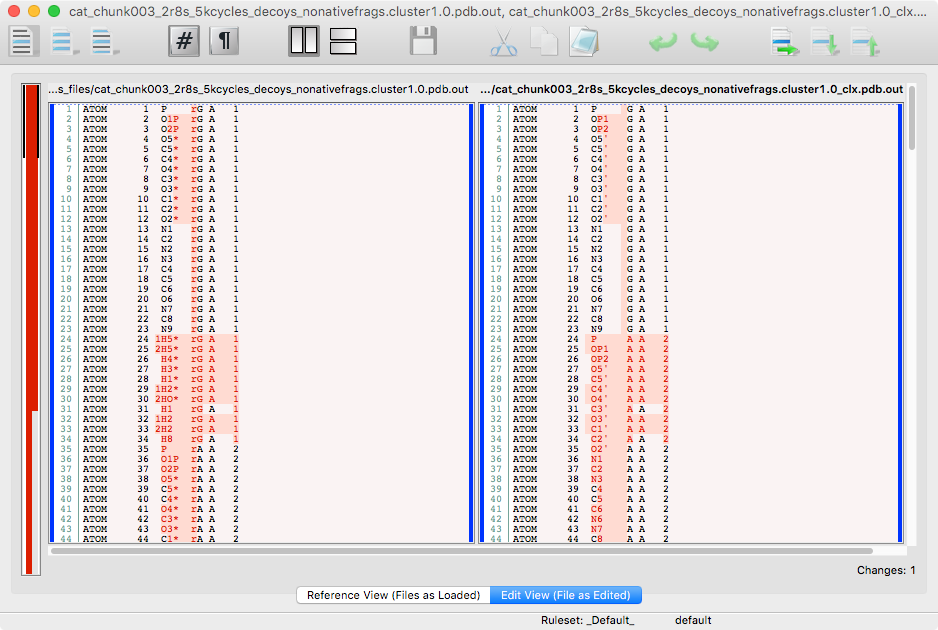

rna-pdb-tools
=================

**This is still under development. We'll be adding features and possibly making breaking changes in future releases.**

 

> Magnus, Marcin. (2016). rna-pdb-tools. Zenodo. 10.5281/zenodo.60933 

**If you find the tools helpful, you can cite the repo using the DOI above :-) and if you like the project, please "Star it", so it would be easier to find it for others and to make me happy that the toolbox useful not only for me.**

A library and a program to run various Python functions related to work with PDB files of RNA structures.

The software is used by me in my servers **NPDock** (RNA/DNA-protein docking method, http://genesilico.pl/NPDock/) and **SimRNAweb** (RNA 3D structure prediction method, http://iimcb.genesilico.pl/SimRNAweb/) and **mqapRNA** (RNA 3D quality control, http://iimcb.genesilico.pl/mqapRNA/, in progress). 

This project is a merge of various related projects such as `rnastruc`, `yapdb_parser` started starting from 2011 :-)

What is fun here?

+ you see input & output -- this is what you want to get?
+ it's tested via Travis! -- it (should) always works as you just want!
+ you lack a converter you would like to have one? *Just Do It Yourself* - compose your converter/parser from LEGO brick-like functions, see for example `--rosetta2generic`)

.. or you might want to use the lib in the program.

Take a tour [http://mmagnus.github.io/rna-pdb-tools/#/](http://mmagnus.github.io/rna-pdb-tools/) and/or read the doc [rna-pdb-tools.rtfd.io/en/latest/](http://rna-pdb-tools.rtfd.io/en/latest/).

Table of Contents
-----------------
	
   * [Tour](#tour)
   * [Docs](#docs)
   * [RNA Puzzle Submission](#rna-puzzle-submission)
   * [Tricks](#tricks)
   * [Main program](#main-program)
   * [Utils](#utils)
     * [diffpdb](#diffpdb)
     * [rmsd_calc](#rmsd_calc)
     * [rna\_convert\_pseudoknot\_formats](#rna_convert_pseudoknot_formats)
     * [misc](#misc)
   * [Inspiration (and alternatives):](#inspiration-and-alternatives)
   * [Install](#install)
   * [Requirement](#requirement)
   * [Used libraries](#used-libraries)
   * [Quick notes](#quick-notes)
   * [History](#history)

## Tour

Take a tour http://mmagnus.github.io/rna-pdb-tools/#/ 

## Docs

Read the documentations at [rna-pdb-tools.rtfd.io/en/latest/](http://rna-pdb-tools.rtfd.io/en/latest/).

## RNA Puzzle Submission
Prepare your structures in the folder and run to get them RNApuzzle ready (`_rpr`):

	$ for i in `ls *.pdb`; do rna_pdb_tools.py --get_rnapuzzle_ready $i > ${i/.pdb/_rpr.pdb}; done
	
.. merge them as one file in the order as you like (or use `*`):

	$ rna_pdb_merge_into_one.py 02_19pz_v1_SimRNA3.22_thrs6.60A_clust02-000001_AA_out_rpr.pdb 09_19pz_v2_SimRNA3.22_thrs6.60A_clust03-000001_AA_out_rpr.pdb d311d821-a075-4df0-bd7d-1dcf7669dad9_ALL_thrs6.20A_clust01-000001_AA_out_rpr.pdb d311d821-a075-4df0-bd7d-1dcf7669dad9_ALL_thrs6.20A_clust03-000001_AA_out_rpr.pdb 05_19pz_v1_SimRNA4.xx_thrs6.60A_clust02-000001_AA_out_rpr.pdb  > rp19_bujnicki.pdb
	
and verify your file with the template provided by the organizers:

	$ diffpdb --method diff Reference_19.pdb rp19_bujnicki.pdb
	#<empty = no difference but xyz columns, OK!>
	
[diffpdb](rna_pdb_tools/utils/diffpdb/) is a part of the rna-pdb-tools package.

	$ head -n 5 Reference_19.pdb rp19_bujnicki.pdb
	==> Reference_19.pdb <==
	MODEL        1
	ATOM      1  P     G A   1       0.000   0.000   0.000  1.00  0.00           P
	ATOM      2  OP1   G A   1       0.000   0.000   0.000  1.00  0.00           O
	ATOM      3  OP2   G A   1       0.000   0.000   0.000  1.00  0.00           O
	ATOM      4  O5'   G A   1       0.000   0.000   0.000  1.00  0.00           O
	==> rp19_bujnicki.pdb <==
	MODEL        1
	ATOM      1  P     G A   1      31.463  14.180  -0.676  1.00  0.00           P
	ATOM      2  OP1   G A   1      31.412  12.806  -1.223  1.00  0.00           O
	ATOM      3  OP2   G A   1      30.646  15.083  -1.517  1.00  0.00           O
	ATOM      4  O5'   G A   1      30.955  14.212   0.842  1.00  0.00           O

	$ tail -n 5 Reference_19.pdb rp19_bujnicki.pdb
	==> Reference_19.pdb <==
	ATOM   1325  C5    C B  22       0.000   0.000   0.000  1.00  0.00           C
	ATOM   1326  C6    C B  22       0.000   0.000   0.000  1.00  0.00           C
	TER    1327        C B  22
	ENDMDL
	END
	==> rp19_bujnicki.pdb <==
	ATOM   1325  C5    C B  22      29.927  21.506  -6.542  1.00  0.00           C
	ATOM   1326  C6    C B  22      29.822  22.338  -5.500  1.00  0.00           C
	TER    1327        C B  22
	ENDMDL
	END

## Tricks

    $ for i in *; do echo $i; rna_pdb_tools.py --delete A:48-52 $i > noloop/${i/.pdb/_noloop.pdb}; done
    10_rp17c.out.14.pdb
    10_rp17c.out.14_out.pdb
    [..]
    
    $ for i in `ls *.pdb`; do rna_pdb_tools.py --c $i > ${i/.pdb/_clx.pdb}; done
    
    $ for i in `ls *.pdb`; do rna_pdb_tools.py --get_rnapuzzle_ready $i > ${i/.pdb/_rpr.pdb}; done

.. keep original structures in original and use rpr:

    ➜  bujnicki_server_ss for i in `ls original/*.pdb`; do rna_pdb_tools.py --get_rnapuzzle_ready $i > ${i/.pdb/_rpr.pdb}; done
    ➜  bujnicki_server_ss ls
    17pz_withSS_all_thrs6.00A_clust01-000001_AA_rpr.pdb 17pz_withSS_all_thrs6.00A_clust06-000001_AA_rpr.pdb
    17pz_withSS_all_thrs6.00A_clust02-000001_AA_rpr.pdb 17pz_withSS_all_thrs6.00A_clust07-000001_AA_rpr.pdb
    17pz_withSS_all_thrs6.00A_clust03-000001_AA_rpr.pdb 17pz_withSS_all_thrs6.00A_clust08-000001_AA_rpr.pdb
    17pz_withSS_all_thrs6.00A_clust04-000001_AA_rpr.pdb 17pz_withSS_all_thrs6.00A_clust09-000001_AA_rpr.pdb
    17pz_withSS_all_thrs6.00A_clust05-000001_AA_rpr.pdb original

.. or to get SimRNAready structures:

    $ for i in `ls *pdb`; do rna_pdb_tools.py --get_simrna_ready $i >  ${i/.pdb/_srr.pdb}; done

## Main program

	./rna_pdb_tools.py -h
	usage: rna-pdb-tools.py ver: 58d5946-dirty [-h] [-r] [-c]
	                                           [--get_chain GET_CHAIN] [--fetch]
	                                           [--fetch_ba] [--get_seq]
	                                           [--rosetta2generic]
	                                           [--get_rnapuzzle_ready] [--no_hr]
	                                           [--renumber_residues]
	                                           [--get_simrna_ready]
	                                           [--collapsed_view] [--cv]
	                                           [--edit EDIT] [--delete DELETE]
	                                           file
	
	positional arguments:
	  file                  file
	
	optional arguments:
	  -h, --help            show this help message and exit
	  -r, --report          get report
	  -c, --clean           get clean structure
	  --get_chain GET_CHAIN
	                        get chain, .e.g A
	  --fetch               fetch file from the PDB db
	  --fetch_ba            fetch biological assembly from the PDB db
	  --get_seq             get seq
	  --rosetta2generic     convert ROSETTA-like format to a generic pdb
	  --get_rnapuzzle_ready
	                        get RNApuzzle ready (keep only standard atoms,
	                        renumber residues)
	  --no_hr               do not insert the header into files
	  --renumber_residues
	  --get_simrna_ready
	  --collapsed_view
	  --cv                  alias to collapsed_view
	  --edit EDIT           edit 'A:6>B:200', 'A:2-7>B:2-7'
	  --delete DELETE       delete the selected fragment, e.g. A:10-16

## Utils

See [Utils](rna_pdb_tools/utils) for simple but useful rna pdb tools.

### diffpdb
[diffpdb](rna_pdb_tools/utils/diffpdb/) - a simple tool to compare text-content of PDB files

### rmsd_calc
[rna_calc_rmsd](rna_pdb_tools/utils/rna_calc_rmsd/) - various ways how to calc rmsd.

### rna_convert_pseudoknot_formats

[rna_convert_pseudoknot_formats](rna_pdb_tools/utils/rna_convert_pseudoknot_formats)

### misc

[rnashape2ascii](rna_pdb_tools/utils/rnashape2ascii/
) `▅▄▆▄▂▁▁▁▁▁▁▁▁▁▁▂▁▁▁▁▁▁▁▁▁▁▁▁▁▁▁▁▂▅▇▅▄▃▂▁▁▁▁▁▁▁▁▁▁▁▁▁▁▁▁▂▂▁▁▁▁▁▁▁▁▁▁`

## Inspiration (and alternatives):

+ https://www.rosettacommons.org/docs/latest/application_documentation/rna/RNA-tools
+ http://blue11.bch.msu.edu/mmtsb/convpdb.pl
+ https://github.com/haddocking/pdb-tools
+ https://github.com/harmslab/pdbtools
+ http://ginsberg.med.virginia.edu/Links/Phenix/pdbtools.htm
+ .. and more!

## Install

Install requirements and do these three steps:

1. add the path to the package to your PYTHONPATH (in ~/.bashrc), e.g. `PYTHONPATH=$PYTHONPATH:/home/magnus/src/rna-pdb-tools/` 
2. add the path to the bin folder of the package to your PATH (in ~/.bashrc), e.g.  `PATH=$PATH:/home/magnus/src/rna-pdb-tools/bin/`
3. and run the install script:
	
	    ➜  rna-pdb-tools git:(master) ✗ ./install_links_bin.sh
	    Installed in ./bin
	    rmsd_calc_to_target.py

should be OK now :-)

## Requirement

Some functions e.g. `.get_rnapuzzle_ready()` needs Biopython, rmsd calculations need numpy, `.is_mol2()` needs OpenBabel. Basically you should be asked to install anything extra only if you need a given function.

## Used libraries

This packages uses other pieces of software, it would be impossible without them to develop rna-pdb-tools, thanks!

+ biopython (https://github.com/biopython/biopython)
+ rmsd (https://github.com/charnley/rmsd)
+ forgi (http://www.tbi.univie.ac.at/%7Ethiel/forgi/graph_tutorial.html)

## Quick notes

    |1.......|10.......|20.......|30.......|40.......|50.......|60.......|70.......|80.......|90.......
    123456789112345678921234567893123456789412345678951234567896123456789712345678981234567899123456789
    .........10.....

## History

170311 Get seq (v2) gets segments of chains with correct numbering

170308 Add fixing missing atoms of bases, and O2'
