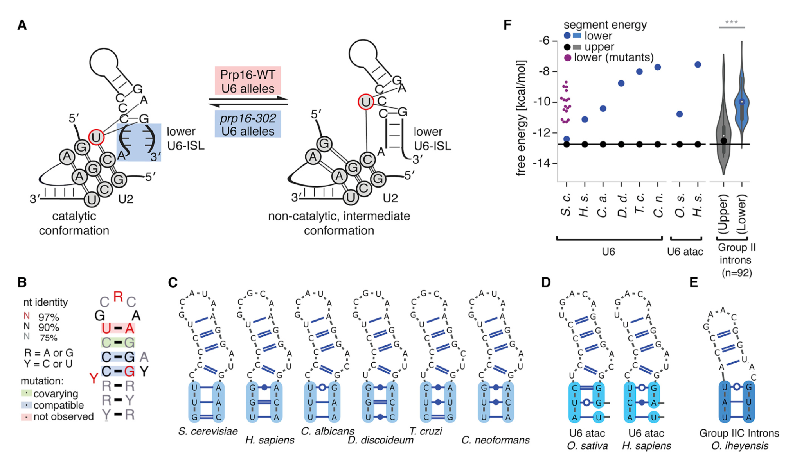

# Rearrangements within the U6 snRNA core during the transition between the two catalytic steps of splicing

Eysmont K., Matylla-Kulińska K., Jaskulska A., Magnus M., Konarska M.

<b>General Model of the Catalytic Core Structural Rearrangements during Splicing</b>

(A) Rearrangements within the U6 core between the catalytic and inactive conformations, facilitated by Prp16. We propose that upon destabilization of the lower U6-ISL stem, the catalytic center adopts the optimal geometry for catalysis. Conversely, stabilization of pairing interactions within the lower stem promotes the Prp16-dependent transition out of the first-step conformation.
(B) Consensus sequence and secondary structure diagram for U6-ISL based on the Rfam alignment.
(C–E) Structural features of (C) U6-ISL, (D) U6atac-ISL, and (E) group II introns domain V. Sequences and secondary structures are shown for group representatives.
(F) The free energy plot. For each representative, free energy of the lower (in blue) and upper segment (in black) is shown. The upper stem free energy shared by all U6-ISL (-12.75 kcal/mol) is shown as a black line. For group II introns, the free energies for the representative sequence (*O. iheyensis*) are shown as dots, and distributions of free energies for all (n = 92) diverse segments taken from the Rfam alignment are shown as violin plots. Statistical significance of differences between free energies was determined by the non-parametric Mann-Whitney test (p value = 7.85e-20). Free energies of destabilizing yeast lower ISL mutants (n = 18) are shown as purple dots.

Alignments
-------------------------------------------------------------------------------

- U6_RF00026.stockholm.sto
- Intron_gpII_RF00029.stockholm.sto
- U6atac_minor_RF00619.stockholm.sto

R2R
-------------------------------------------------------------------------------

    ../../src/r2r --GSC-weighted-consensus u6-only.stk u6-only-cons.sto 3 0.97 0.9 0.75 4 0.97 0.9 0.75 0.5 0.1

    R2R-1.0.5
    [dhcp177-lan203] u6$ ../../src/r2r u6-only-cons.sto u6_cons.pdf
    PROCESSING: u6-only-cons
    NOTE: no #=GC R2R_LABEL line.  But that's okay.
    <<<.<<<<.....>>>..>>>>
    ssContextList:
    [0,3;19,22) T,F,T Pair
    [3,4;19,19) F,F,T InternalLoop
    [4,5;18,19) F,F,T Pair
    [5,5;16,18) F,F,T InternalLoop
    [5,8;13,16) F,F,T Pair
    [8,13;13,13) F,T,T TerminalLoop
    ssContext
            [41,43;62,64] {raw [0,3;19,22) }  Pair  openHairpin
        link
            posFrom: 2 , [41,43;62,64] {raw [0,3;19,22) }
            posTo  : 3 , [44,44;62,=] {raw [3,4;19,19) }
            default rule
            involvesCircularLayout==true
    ssContext
            [44,44;62,=] {raw [3,4;19,19) }  InternalLoop
        link
            posFrom: 3 , [44,44;62,=] {raw [3,4;19,19) }
            posTo  : 2 , [41,43;62,64] {raw [0,3;19,22) }
            default rule
            involvesCircularLayout==true
        link
            posFrom: 3 , [44,44;62,=] {raw [3,4;19,19) }
            posTo  : 4 , [46,46;61,61] {raw [4,5;18,19) }
            default rule
            involvesCircularLayout==true
    ssContext
            [46,46;61,61] {raw [4,5;18,19) }  Pair
        link
            posFrom: 4 , [46,46;61,61] {raw [4,5;18,19) }
            posTo  : 3 , [44,44;62,=] {raw [3,4;19,19) }
            default rule
            involvesCircularLayout==true
        link
            posFrom: 4 , [46,46;61,61] {raw [4,5;18,19) }
            posTo  : 17 , [47,=;59,60] {raw [5,5;16,18) }
            default rule
            involvesCircularLayout==true
    ssContext
            [47,=;59,60] {raw [5,5;16,18) }  InternalLoop
        link
            posFrom: 17 , [47,=;59,60] {raw [5,5;16,18) }
            posTo  : 4 , [46,46;61,61] {raw [4,5;18,19) }
            default rule
            involvesCircularLayout==true
        link
            posFrom: 17 , [47,=;59,60] {raw [5,5;16,18) }
            posTo  : 5 , [47,49;55,58] {raw [5,8;13,16) }
            default rule
            involvesCircularLayout==true
    ssContext
            [47,49;55,58] {raw [5,8;13,16) }  Pair
        link
            posFrom: 5 , [47,49;55,58] {raw [5,8;13,16) }
            posTo  : 17 , [47,=;59,60] {raw [5,5;16,18) }
            default rule
            involvesCircularLayout==true
        link
            posFrom: 7 , [47,49;55,58] {raw [5,8;13,16) }
            posTo  : 8 , [50,54;55,=] {raw [8,13;13,13) }
            default rule
            involvesCircularLayout==true
    ssContext
            [50,54;55,=] {raw [8,13;13,13) }  TerminalLoop
        link
            posFrom: 8 , [50,54;55,=] {raw [8,13;13,13) }
            posTo  : 7 , [47,49;55,58] {raw [5,8;13,16) }
            default rule
            involvesCircularLayout==true
    going through place_explicit's in queue
    got place_explicit from queue: calling PositionBackboneElement
        link
            posFrom: dummy ssContext
            posTo  : 0 , [41,43;62,64] {raw [0,3;19,22) }
            priorityClass=FirstRule
            default rule
            dummy rule to position first element
                at: (0,0) -90  no flip
    got place_explicit from queue: calling PositionBackboneElement
        link
            posFrom: 2 , [41,43;62,64] {raw [0,3;19,22) }
            posTo  : 3 , [44,44;62,=] {raw [3,4;19,19) }
            default rule
            involvesCircularLayout==true
    got place_explicit from queue: calling PositionBackboneElement
        link
            posFrom: 3 , [44,44;62,=] {raw [3,4;19,19) }
            posTo  : 4 , [46,46;61,61] {raw [4,5;18,19) }
            default rule
            involvesCircularLayout==true
    got place_explicit from queue: calling PositionBackboneElement
        link
            posFrom: 4 , [46,46;61,61] {raw [4,5;18,19) }
            posTo  : 17 , [47,=;59,60] {raw [5,5;16,18) }
            default rule
            involvesCircularLayout==true
    got place_explicit from queue: calling PositionBackboneElement
        link
            posFrom: 17 , [47,=;59,60] {raw [5,5;16,18) }
            posTo  : 5 , [47,49;55,58] {raw [5,8;13,16) }
            default rule
            involvesCircularLayout==true
    got place_explicit from queue: calling PositionBackboneElement
        link
            posFrom: 7 , [47,49;55,58] {raw [5,8;13,16) }
            posTo  : 8 , [50,54;55,=] {raw [8,13;13,13) }
            default rule
            involvesCircularLayout==true
        done: going through place_explicit's in queue

    doing place_defer (bulges)
    DONE PARSING: u6-only-cons

Free Energy Calculations
-------------------------------------------------------------------------------

- `free-energies-used-for-the-plot.csv` summary of the data mentioned belowe, used to calculate final plot

- `u6 representatives free energies/u6evo-seq-ss-groups-3x3-GC.csv` free energies and sequences of U6 representatives
- `yeast u6 mutants free energies/yeast u6 mutants/energies.csv` free energies and sequences of mutants of U6 ILS
- `group two introns free energies/gii_dv_mini-gii3shift-upper-loop-guaa-lower-loop-guaa-flanks-GC.csv` free energies and sequences of Group II Introns

- `src/calc-energy2.py` the tools used to calculate free energies
