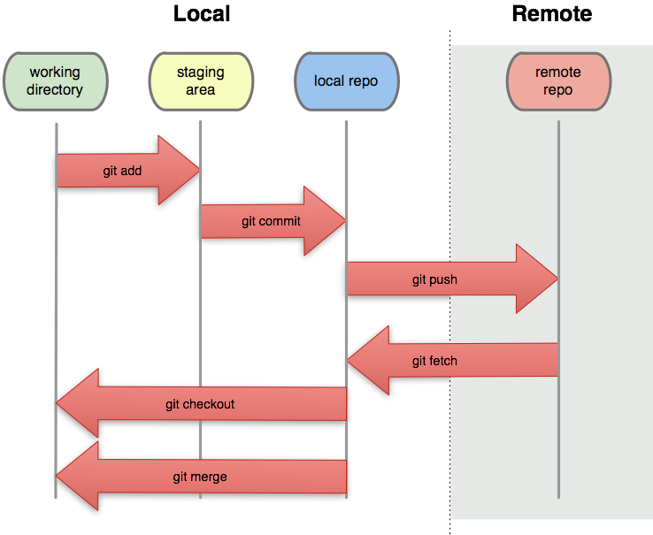
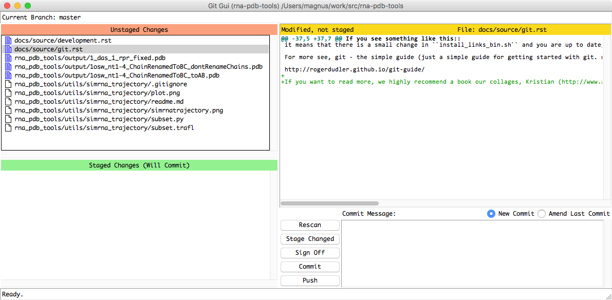

Git Quickref
=========================================

	  
For Git in a scientific environment, please read:

	Perez-Riverol, Y. et al., 2016. Ten Simple Rules for Taking Advantage of Git and GitHub S. Markel, ed. PLoS computational biology, 12(7), p.e1004947.

	Blischak, J.D., Davenport, E.R. & Wilson, G., 2016. A Quick Introduction to Version Control with Git and GitHub F. Ouellette, ed. PLoS computational biology, 12(1), pp.e1004668–18.

Git is a version control system that is used for software development that helps you to keep track of versions of your program. To start using git you have to know only these two commands below. If you want to contribute to the package you need a few more, but it's not important right now :-)

To get the package for the first time on your computer go to the selected package and on the top left corner select clone or download. Copy the link and run it on console with git clone::

  $ git clone git@github.com:mmagnus/rna-pdb-tools.git

and if you want to update the package later run::

  $ git pull # be in the folder like ~/src/rna-pdb-tools/ <here>

if you see something like this::

  $ git pull
  Already up-to-date.  

it means that your version of the package is up to date, congrats! :-)

If you see something like this::

	 $ git pull
	remote: Counting objects: 3, done.
	remote: Compressing objects: 100% (1/1), done.
	remote: Total 3 (delta 2), reused 3 (delta 2), pack-reused 0
	Unpacking objects: 100% (3/3), done.
	From github.com:mmagnus/rna-pdb-tools
	  69c4ee3..7f90739  master     -> origin/master
	Updating 69c4ee3..7f90739
	Fast-forward
	install_links_bin.sh | 1 + 
	1 file changed, 1 insertion(+)

it means that there is a small change in ``install_links_bin.sh`` and you are up to date, congrats as well! You might need to run ``./install_links_bin.sh`` to "install" new tools that were added to the packages (if this is the case). If you get any error then talk to me ``magnus@genesilico.pl``.

Git sheet cheat
-------------------------------------------

::

   $ git init # start git repo in a folder
   $ git add <file> # add file to stage area
   $ git commit -m <text> # send file to 
   $ git push # sent this remote
   $ git gui # install `apt-get install git-gui`
   $ git log # 
   $ git status # get status of your repo

   $ git clone git@gitlab.genesilico.pl:magnus/git_crash_course.git

   $ git remote add origin git@gitlab.genesilico.pl:magnus/git_crash_course.git

   $ git push -u origin master
   Counting objects: 45, done.
   Delta compression using up to 8 threads.
   Compressing objects: 100% (41/41), done.
   Writing objects: 100% (45/45), 4.97 KiB | 0 bytes/s, done.
   Total 45 (delta 12), reused 0 (delta 0)
   To git@gitlab.genesilico.pl:magnus/git_crash_course.git
   * [new branch]      master -> master
     Branch master set up to track remote branch master from origin.

Learn Git
-------------------------------------------

Model used by Git vs Svn::

  file <-> stage area <-> local repo <-> git repo/gitlab
  file <-------------------------------> SVM repo

Figure. from: https://greenido.files.wordpress.com/2013/07/git-local-remote.png?w=696&h=570

For more see, git - the simple guide (just a simple guide for getting started with git. no deep shit ;))

http://rogerdudler.github.io/git-guide/ 

A git cheat sheet http://rogerdudler.github.io/git-guide/files/git_cheat_sheet.pdf .

If you want to read more, we highly recommend a book our collages, Kristian (http://www.apress.com/us/book/9781484222409).

To understand the principles of Git, a bit more advance, by Linus Torvals (an author of Git) https://www.youtube.com/watch?v=4XpnKHJAok8)

How to learn Git in 20min https://www.youtube.com/watch?v=Y9XZQO1n_7c

Git GUI
------------------------------------------

You don't have to use terminal to work with git. Git comes with ``git gui``. 

You can also use ``qgit`` (http://sourceforge.net/projects/qgit/) and much more, a list of tools: https://git-scm.com/download/gui/linux .

==================================
