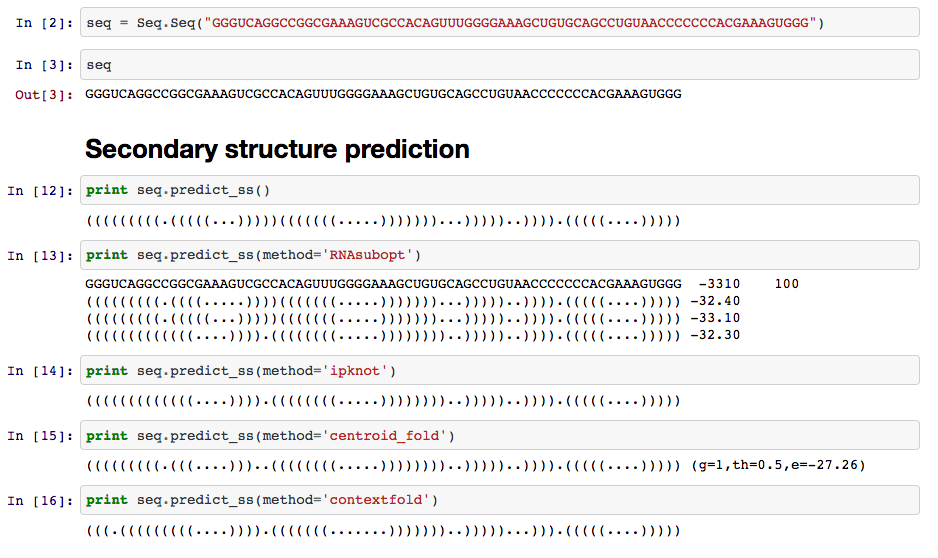

Jupyter Notebooks & rna-tools
=============================================

The tools collected here as rna-tools, ideally could be also used in IPython/Jupiter (https://ipython.org/notebook.html)
Notebooks. We belive it would be valuable if we could, as scientists share our notebooks used for RNA structure analysis, e.g, protocols of modeling used in the RNA Puzzle challenge.

See more at https://github.com/mmagnus/rna-tools/blob/master/rp18.ipynb https://github.com/mmagnus/rna-tools/blob/master/rp19.ipynb

Share your notebooks
----------------------------------------
You can share Jupyter notebooks from your Google Drive using the new Jupyter Drive. This allows you share Jupyter notebooks like NBViewr with all the access control that Google Drive provides. You can also push your notebooks to a Github repository, so then can be rendered for easy viewing.

E.g., https://github.com/mmagnus/rna-tools/blob/master/rp18.ipynb

Learn Jupyter
----------------------------------------
This is a quick introduction to jupyter which is the IPython version 3. It covers some of the new and interesting features about Jupyter. 

https://www.youtube.com/watch?v=Rc4JQWowG5I
