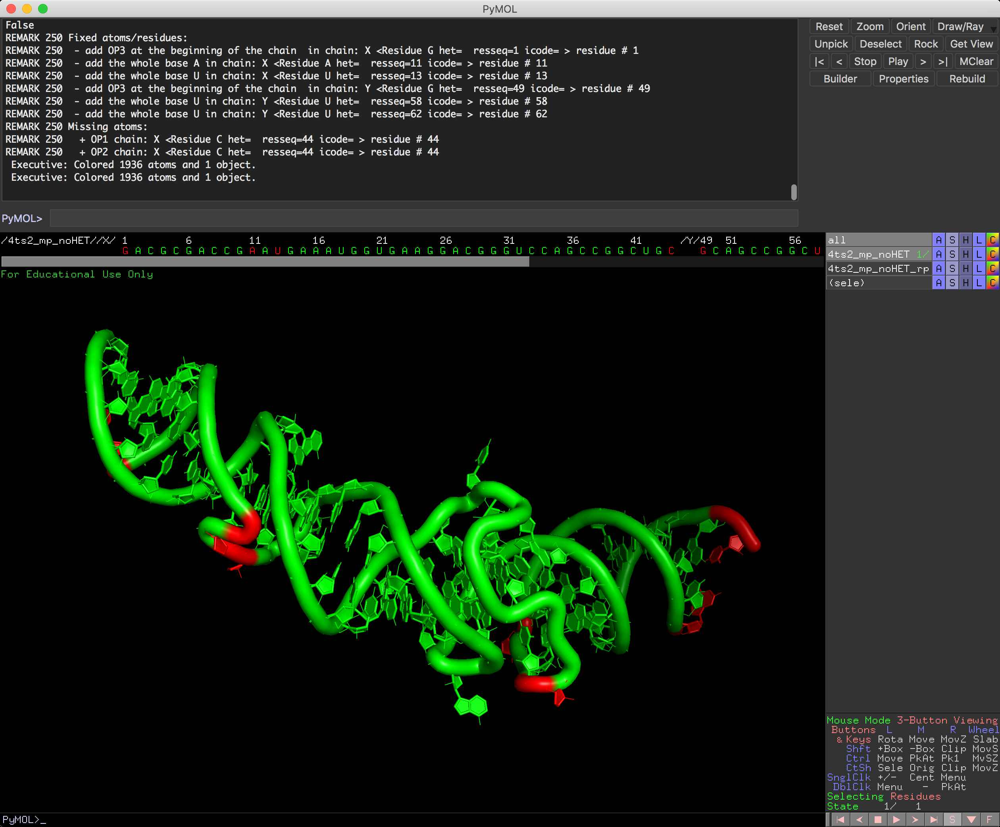
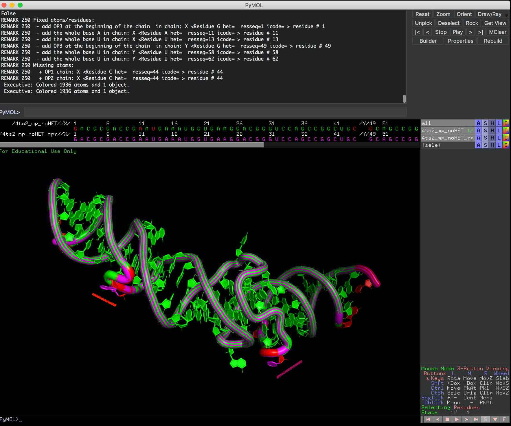
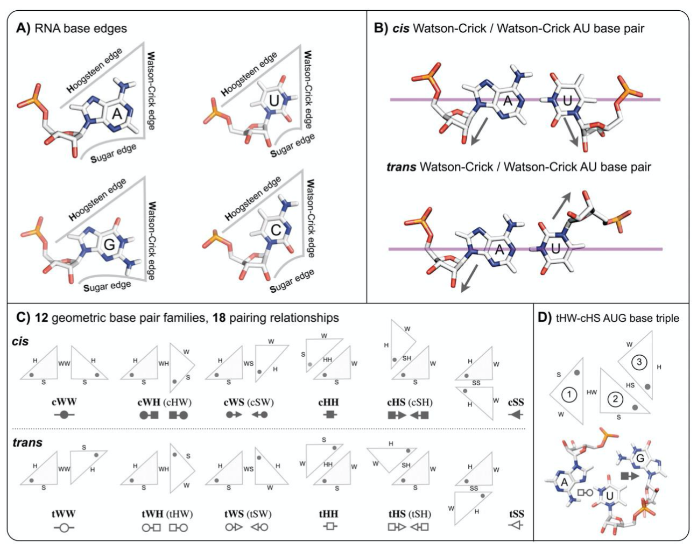
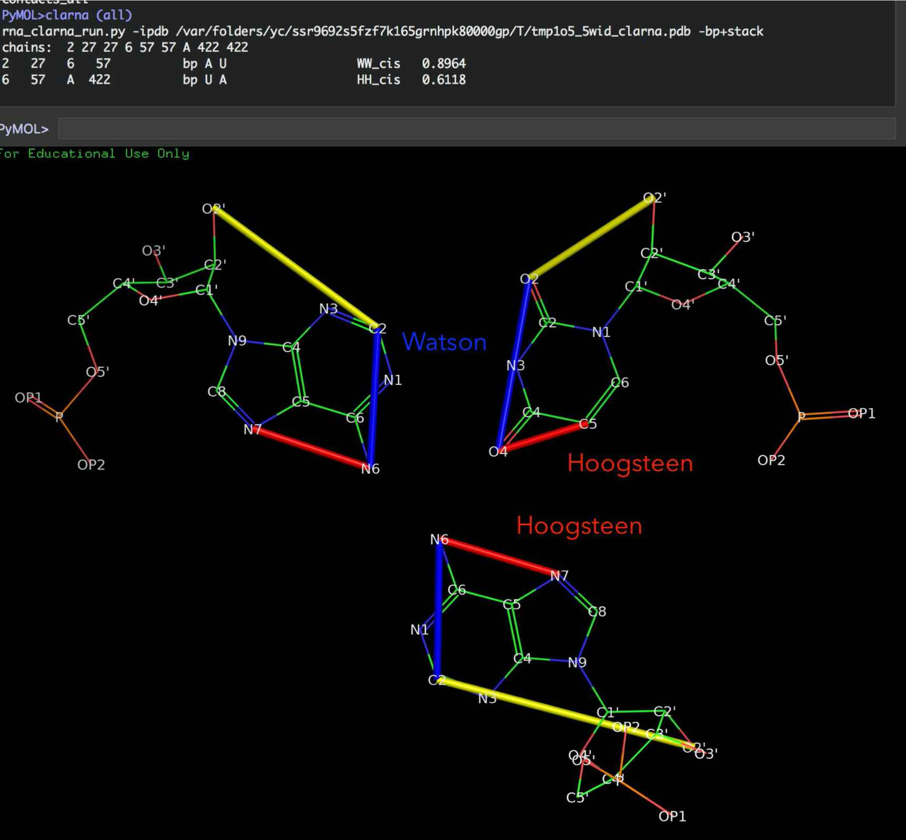

PyMOL4RNA
=========================================

(See also https://github.com/mmagnus/rna-tools/tree/master/rna_tools/tools/PyMOL4RNA)

Inspect structure
----------------------------------------------------------------------

There is new ```--inspect``` function for rna_pdb_toolsx.py that tells you what are missing atoms in your structure file.

You can run it also from PyMOL, so in here you can see missing atoms directly in PyMOL (the object comes green and the residues missing atoms comes in red).

PyMOL::

    inspect <object name>
    


and here you can compare the input file vs file after ``--rpr`` (of rna_pdb_toolsx.py) to see what was rebuilt (in pink).
	   


Show base pair edges
----------------------------------------------------------------------
	   


Leontis/Westhof classification of base pairings. (A) RNA bases - adenine (A), cytosine (C), guanine (G) and uracil (U) - involve one of three distinct edges: the Watson– Crick (W) edge, the Hoogsteen (H) edge, and the Sugar (S) edge. (B) Each pair of can interact in either cis or trans orientations with respect to the glycosidic bonds. (C) For these reasons, all base pairs can be grouped into twelve geometric base pair families and eighteen pairing relationships (bases are represented as triangles). Each pair is represented by a symbol that can be used in a secondary structure and a tertiary structure diagrams. Filled symbols mean cis base pair configuration, and open symbols, trans base pair. (D) Interestingly, bases can form triples and they have own classification devised by Leontis and coworkers (Creative Commons License) (A. S. Abu Almakarem, A. I. Petrov, J. Stombaugh, C. L. Zirbel, and N. B. Leontis, “Comprehensive survey and geometric classification of base triples in RNA structures.,” Nucleic Acids Research, vol. 40, no. 4, pp. 1407–1423, Feb. 2012.)
	   


Type::

    edges (<selection>)

e.g.,::

    edges (all)

to show the edges drawn on bases.
    
.. image:: ../pngs/edges.png
   

PyMOL4Spliceosome: all spliceosome structures in one PyMOL session
----------------------------------------------------------------------

Download one PyMOL session with structures for each step.

See own project https://github.com/mmagnus/PyMOL4Spliceosome

PyMOL: Color by conservation
----------------------------------------------------------------------

Show conserved regions of proteins in PyMOL.

.. image:: ../pngs/pymol_color_by_conserv.png

See more: https://github.com/mmagnus/rna-tools/tree/master/rna_tools/tools/pymol_color_by_conserv

.. automodule:: rna_tools.tools.PyMOL4RNA.PyMOL4RNA
   :members:
   :undoc-members:


PyMOL Drawing
-----------------------------------------

.. automodule:: rna_tools.tools.pymol_drawing.pymol_drawing
   :members:
   :undoc-members:

Install PyMOL plugin to view the interactions with PyMOL::

    run <path>rna-tools/tools/pymol_drawing/pymol_dists.py

and type::

    draw_dists([[29, 41], [7, 66], [28, 42], [51, 63], [50, 64], [2, 71], [5, 68], [3, 70], [31, 39], [4, 69], [6, 67], [12, 23], [52, 62], [30, 40], [49, 65], [27, 43], [11, 24], [1, 72], [10, 25], [15, 48], [53, 61], [19, 56], [13, 22], [36, 37], [18, 19], [22, 46], [35, 73], [32, 38], [9, 13], [19, 20], [18, 20], [54, 60], [9, 23], [34, 35], [36, 38], [53, 54], [20, 56], [9, 12], [26, 44], [18, 55], [54, 61], [32, 36]])

.. image:: ../pngs/pymol_dists.png

Install
-----------------------------------------

After you install rna-tools, run these two lines your terminal::

    $ echo "sys.path.append('`rna_tools_which.py --site`')" >> ~/.pymolrc 
    $ echo "PyMOL4RNA_PATH='`rna_tools_which.py`/tools/PyMOL4RNA/PyMOL4RNA.py'; cmd.run(PyMOL4RNA_PATH)" >> ~/.pymolrc

so something like this will be added to your ``~/.pymolrc``::

    sys.path.append('/Users/magnus/work/src/rna-tools')
    PyMOL4RNA_PATH='/Users/magnus/work/src/rna-tools/rna_tools/tools/PyMOL4RNA/PyMOL4RNA.py'; cmd.run(PyMOL4RNA_PATH)
