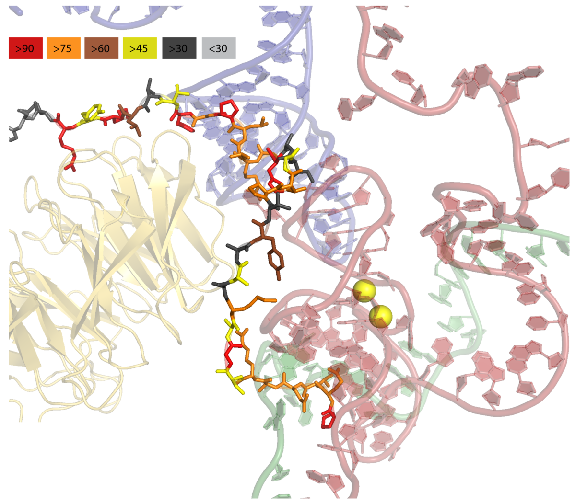
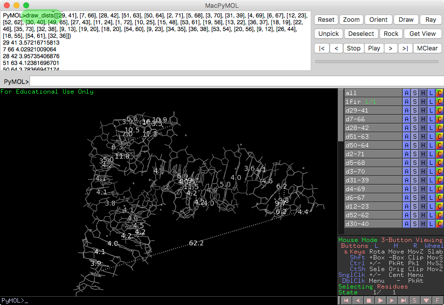

PyMOL4RNA
=========================================

PyMOL4Spliceosome: all spliceosome structures in one PyMOL session
----------------------------------------------------------------------

Download one PyMOL session with structures for each step.

See own project https://github.com/mmagnus/PyMOL4Spliceosome

PyMOL: color by conservation
----------------------------------------------------------------------

Show conserved regions of proteins in PyMOL.

See more: https://github.com/mmagnus/rna-tools/tree/master/rna_tools/tools/pymol_color_by_conserv

PyMOL Drawing
-----------------------------------------

.. automodule:: rna_tools.tools.pymol_drawing.pymol_drawing
   :members:
   :undoc-members:

Install PyMOL plugin to view the interactions with PyMOL::

    run <path>rna-tools/tools/pymol_drawing/pymol_dists.py

and type::

    draw_dists([[29, 41], [7, 66], [28, 42], [51, 63], [50, 64], [2, 71], [5, 68], [3, 70], [31, 39], [4, 69], [6, 67], [12, 23], [52, 62], [30, 40], [49, 65], [27, 43], [11, 24], [1, 72], [10, 25], [15, 48], [53, 61], [19, 56], [13, 22], [36, 37], [18, 19], [22, 46], [35, 73], [32, 38], [9, 13], [19, 20], [18, 20], [54, 60], [9, 23], [34, 35], [36, 38], [53, 54], [20, 56], [9, 12], [26, 44], [18, 55], [54, 61], [32, 36]])

Install
-----------------------------------------

Open your `~/.pymolrc` and set up following variables as you need::

   # rna-tools
   RNA_TOOLS="/Users/magnus/work-src/rna-tools"
   EXECUTABLE="/bin/zsh" # set up your shell, usually /bin/bash or /bin/zsh
   SOURCE="source ~/.zshrc" # set up the path to the file where you keep your shell variables
   CLARNA_RUN="/Users/magnus/work-src/clarna_play/clarna_run.py"  # if you want to run clarna_run.py set up the path
   sys.path.append('/Users/magnus/work-src/rna-tools')
   run ~/work-src/rna-tools/rna_tools/tools/PyMOL4RNA/PyMOL4RNA.py
   run ~/work-src/rna-tools/rna_tools/tools/pymol_drawing/pymol_drawing.py
   run ~/work-src/rna-tools/rna_tools/tools/rna_filter/pymol_dists.py

The plugins have been tested with MacPyMOL version 1.7.4.5 Edu.
