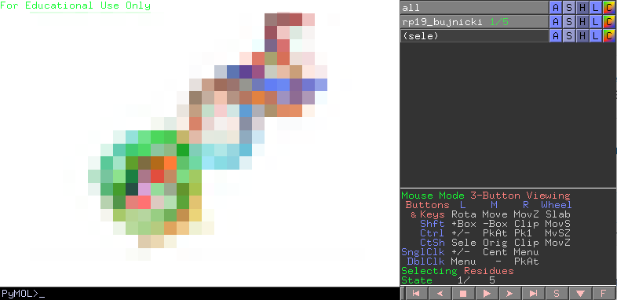

RNA Puzzle Submission
=============================================

The RNA Puzzle organizers required ONE file with your submissions in the NMR-style multiple model PDB format.

First, prepare your structures in the folder and run to get them RNApuzzle ready (`_rpr`)::

	$ for i in *.pdb; do rna_pdb_toolsx.py --get-rnapuzzle-ready $i > ${i/.pdb/_rpr.pdb}; done

merge them as one file in the order as you like (or use `*`)::

	$ rna_pdb_merge_into_one.py 02_19pz_v1_SimRNA3.22_thrs6.60A_clust02-000001_AA_out_rpr.pdb \
 	09_19pz_v2_SimRNA3.22_thrs6.60A_clust03-000001_AA_out_rpr.pdb \
	d311d821-a075-4df0-bd7d-1dcf7669dad9_ALL_thrs6.20A_clust01-000001_AA_out_rpr.pdb \
	d311d821-a075-4df0-bd7d-1dcf7669dad9_ALL_thrs6.20A_clust03-000001_AA_out_rpr.pdb \
	05_19pz_v1_SimRNA4.xx_thrs6.60A_clust02-000001_AA_out_rpr.pdb  > rp19_bujnicki.pdb

and verify your file with the template provided by the organizers (if provided):::

	$ diffpdb --method diff Reference_19.pdb rp19_bujnicki.pdb
	#<empty = no difference but xyz columns, OK!>

diffpdb_ is a part of the rna-tools package.

.. _diffpdb: https://github.com/mmagnus/rna-tools/tree/master/rna_tools/utils/diffpdb

In terminal::

	$ head -n 5 Reference_19.pdb rp19_bujnicki.pdb
	==> Reference_19.pdb <==
	MODEL        1
	ATOM      1  P     G A   1       0.000   0.000   0.000  1.00  0.00           P
	ATOM      2  OP1   G A   1       0.000   0.000   0.000  1.00  0.00           O
	ATOM      3  OP2   G A   1       0.000   0.000   0.000  1.00  0.00           O
	ATOM      4  O5'   G A   1       0.000   0.000   0.000  1.00  0.00           O
	==> rp19_bujnicki.pdb <==
	MODEL        1
	ATOM      1  P     G A   1      31.463  14.180  -0.676  1.00  0.00           P
	ATOM      2  OP1   G A   1      31.412  12.806  -1.223  1.00  0.00           O
	ATOM      3  OP2   G A   1      30.646  15.083  -1.517  1.00  0.00           O
	ATOM      4  O5'   G A   1      30.955  14.212   0.842  1.00  0.00           O

	$ tail -n 5 Reference_19.pdb rp19_bujnicki.pdb
	==> Reference_19.pdb <==
	ATOM   1325  C5    C B  22       0.000   0.000   0.000  1.00  0.00           C
	ATOM   1326  C6    C B  22       0.000   0.000   0.000  1.00  0.00           C
	TER    1327        C B  22
	ENDMDL
	END
	==> rp19_bujnicki.pdb <==
	ATOM   1325  C5    C B  22      29.927  21.506  -6.542  1.00  0.00           C
	ATOM   1326  C6    C B  22      29.822  22.338  -5.500  1.00  0.00           C
	TER    1327        C B  22
	ENDMDL
	END

The Bujnicki lab is using this script to process the results and send the results, you can hack it for your own case::

	[mm] rnapuzzle_sender$ git:(master) ✗ ./rnapuzzle_sender.py
	rnapuzzle_sender

	Usage: rnapuzzle_sender.py

	Options:
	  -h, --help            show this help message and exit
	  -d DIR, --dir=DIR
	  -s EMAIL_SUBJECT, --email_subject=EMAIL_SUBJECT
				email subject

File: `rna-tools/rna_tools/tools/rnapuzzle_sender`.
