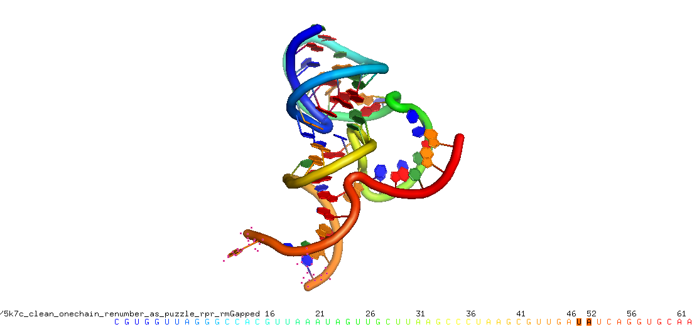
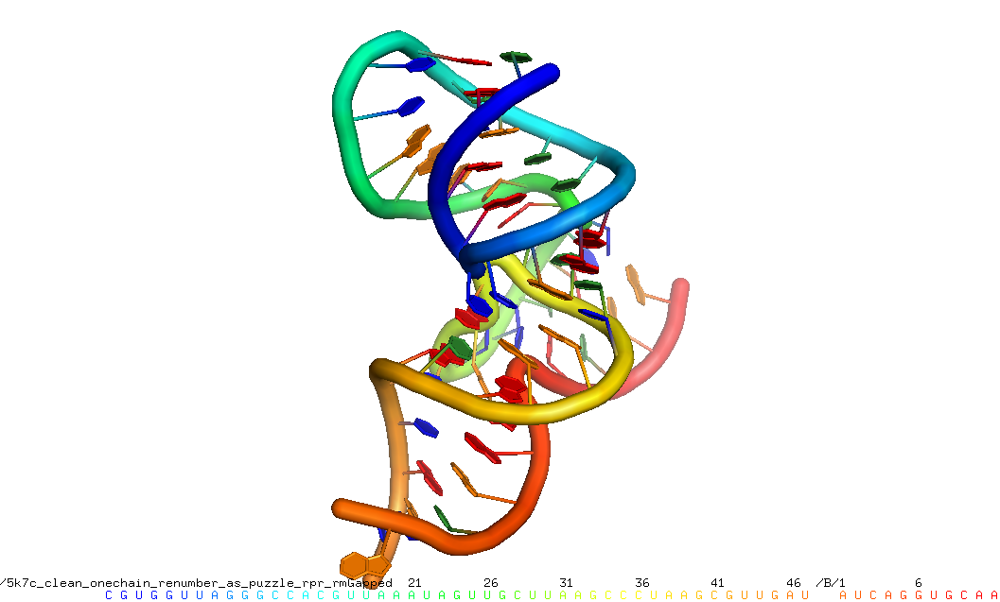
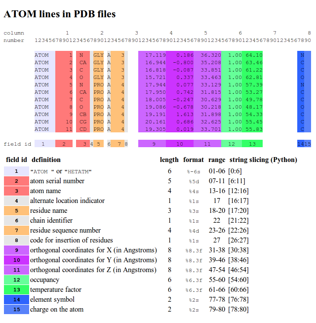

======
 Tips
======

Run in batch
============

You can easily run a single tool in batch and rename new files::

    $ for i in *.pdb; do rna_pdb_toolsx.py --get_rnapuzzle_ready $i > ${i/.pdb/_rpr.pdb}; done

or write new files in a different folder (`out`)::

    $ for i in *.pdb; do rna_pdb_toolsx.py --get_rnapuzzle_ready $i > ../out/$i; done

You can also easily run a single tool parallel using parallel_::

    $ parallel "rna_add_chain.py -c A {} > ../nchain/{}" ::: *.pdb

.. _parallel:: https://www.gnu.org/software/parallel/

Using sed
=========
sed (stream editor) is a Unix utility that parses and transforms text, using a simple, compact programming language.

You can used sed to find & replace parts of text files::

    $ head 1msy_rnakbmd_decoy1661_clx.pdb.outCR
    Classifier: Clarna
    chains:  1 27
         2       26          bp G U                  WW_cis   0.8500
         3       25          bp C G                  WW_cis   0.8114
         4       24          bp U A                  WW_cis   0.9222
         5       23          bp C G                  WW_cis   0.9038
         6       22          bp C G                  WW_cis   0.8913
         9       10          bp G U                  SH_cis   0.8563
        10       19          bp U A                 WH_tran   0.7826
        11       18          bp A G                 HS_tran   0.7620

    $ sed 's/chains: /chains: A/' 1msy_rnakbmd_decoy1661_clx.pdb.outCR
    Classifier: Clarna
    chains: A 1 27
         2       26          bp G U                  WW_cis   0.8500
         3       25          bp C G                  WW_cis   0.8114
         4       24          bp U A                  WW_cis   0.9222
         5       23          bp C G                  WW_cis   0.9038
         6       22          bp C G                  WW_cis   0.8913
         9       10          bp G U                  SH_cis   0.8563
        10       19          bp U A                 WH_tran   0.7826
        11       18          bp A G                 HS_tran   0.7620
        12       17          bp C G                  WW_cis   0.7242

Read more about sed_.

.. _sed: https://en.wikipedia.org/wiki/Sed

In PyMOL
========

Quickref::

     set ignore_case, off
	
Rename a chain::

	PyMOL>alter (sele), chain="B"
	Alter: modified 708 atoms.
	PyMOL>sort

don't forget about `sort`.

To select all, use `PyMOL>alter all, resv -= 12`.

To renumber a fragment starting with 24 to 29, select the fragment and::

	PyMOL>alter (sele), resv += 5
	 Alter: modified 109 atoms.

To renumber residues::

	PyMOL>alter (chain B), resv -= 44
	Alter: modified 708 atoms.
	PyMOL>sort

Read more_.

.. _more: https://pymolwiki.org/index.php?title=Iterate&redirect=no

The example of the pistol ribozyme editing.

Run::

    PyMOL>alter (sele), chain="B"
     Alter: modified 236 atoms.
    PyMOL>alter (chain B), resv -= 51
     Alter: modified 236 atoms.
    PyMOL>sort

In Python
=========

To get residue index use::

    resi = int(l[22:26].strip())

Qucikref::

    COLUMNS PYTHON     DATA  TYPE    FIELD        DEFINITION
    -------------------------------------------------------------------------------------
     1 -  6 [0:6]      Record name   "ATOM  "
     7 - 11 [6:11]     Integer       serial       Atom  serial number.
    13 - 16 [12:16]    Atom          name         Atom name.
    17      [16]       Character     altLoc       Alternate location indicator.
    18 - 20 [17:20]    Residue name  resName      Residue name.
    22      [21]       Character     chainID      Chain identifier.
    23 - 26 [22:26]    Integer       resSeq       Residue sequence number.
    27      [26]       AChar         iCode        Code for insertion of residues.
    31 - 38 [30:38]    Real(8.3)     x            Orthogonal coordinates for X in Angstroms.
    39 - 46 [38:46]    Real(8.3)     y            Orthogonal coordinates for Y in Angstroms.
    47 - 54 [46:54]    Real(8.3)     z            Orthogonal coordinates for Z in Angstroms.
    55 - 60 [54:60]    Real(6.2)     occupancy    Occupancy.
    61 - 66 [60:66]    Real(6.2)     tempFactor   Temperature  factor.
    77 - 78 [76:78]    LString(2)    element      Element symbol, right-justified. # l[76:78]
    79 - 80 [78:80]    LString(2)    charge       Charge  on the atom.

(source: http://cupnet.net/pdb-file-atom-line-memo/)

Working with cluster
====================
Tips::

  # get your pdb files
  [mm] ade rsync -v peyote2:'~/ade/*.pdb' . # ' is required!

See long name with ``qstat``::

	magnus@peyote2:~$ qstat -xml | tr '\n' ' ' | sed 's#<job_list[^>]*>#\n#g' \
	>   | sed 's#<[^>]*>##g' | grep " " | column -t
	4752204  5.54737  r_6bd26658_run_04                magnus  dr  2017-02-20T22:09:04  all.q@c6.cluster3.genesilico.pl   10
	4752201  5.54737  r_6bd26658_run_01                magnus  dr  2017-02-20T22:09:04  all.q@c6.cluster3.genesilico.pl   10
	4752203  5.54737  r_6bd26658_run_03                magnus  dr  2017-02-20T22:09:04  all.q@c6.cluster3.genesilico.pl   10
	4752202  5.54737  r_6bd26658_run_02                magnus  dr  2017-02-20T22:09:04  all.q@c6.cluster3.genesilico.pl   10
	4805710  5.54737  r_hTERC_251-451-85d4ac69_run_01  magnus  r   2017-08-20T17:04:15  all.q@c11.cluster3.genesilico.pl  10
	4805711  5.54737  r_hTERC_251-451-85d4ac69_run_02  magnus  r   2017-08-20T17:04:15  all.q@c11.cluster3.genesilico.pl  10
	4805712  5.54737  r_hTERC_251-451-85d4ac69_run_03  magnus  r   2017-08-20T17:04:15  all.q@c8.cluster3.genesilico.pl   10
	4805713  5.54737  r_hTERC_251-451-85d4ac69_run_04  magnus  r   2017-08-20T17:04:15  all.q@c8.cluster3.genesilico.pl   10
	4805714  5.54737  r_hTERC_251-451-85d4ac69_run_05  magnus  r   2017-08-20T17:04:15  all.q@c8.cluster3.genesilico.pl   10
	4805715  5.54737  r_hTERC_251-451-85d4ac69_run_06  magnus  r   2017-08-20T17:04:15  all.q@c8.cluster3.genesilico.pl   10
	4805716  5.54737  r_hTERC_251-451-85d4ac69_run_07  magnus  r   2017-08-20T17:04:15  all.q@c8.cluster3.genesilico.pl   10
	4805728  5.54737  r_mCherry_sub3-3c970489_run_03   magnus  r   2017-08-20T17:21:15  all.q@c15.cluster3.genesilico.pl  10

https://stackoverflow.com/questions/26104116/qstat-and-long-job-names 

Numbering line used in my flat-file notes
======================

Numbering::

   |1.......|10.......|20.......|30.......|40.......|50.......|60.......|70.......|80.......|90.......
   123456789112345678921234567893123456789412345678951234567896123456789712345678981234567899123456789

TER format
=======================
Example of pro TER::

	ATOM  72307  C4    U x   9     304.768 147.960 320.897  1.00218.84           C
	ATOM  72308  O4    U x   9     304.171 146.902 321.104  1.00225.09           O
	ATOM  72309  C5    U x   9     304.190 149.269 320.912  1.00211.91           C
	ATOM  72310  C6    U x   9     304.960 150.336 320.668  1.00205.76           C
	TER   72311        U x   9
	
Add missing atoms
=======================
Add missing atoms etc.::

	(py37) [mx] cwc46$ pdbfixer prp46.pdb --add-atoms all --add-residues

with http://htmlpreview.github.io/?https://raw.github.com/pandegroup/pdbfixer/master/Manual.html
