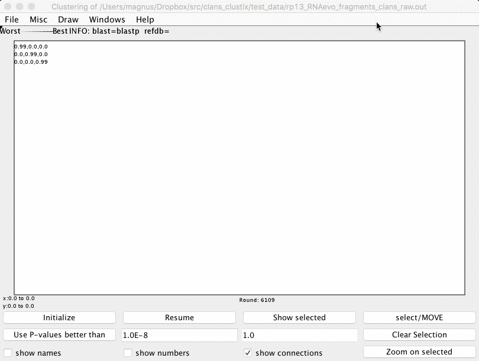

Utils
=========================================
Class in the package (@todo).

.. inheritance-diagram:: rna_pdb_tools.Seq rna_pdb_tools.pdb_parser_lib rna_pdb_tools.utils.rna_alignment.rna_alignment.RNAalignment rna_pdb_tools.utils.rna_alignment.rna_alignment.CMAlign

RNA Sequence
------------------------------------------

@todo should be renamed to RNASeq, and merged with RNASeq class from RNAalignment.

.. automodule:: rna_pdb_tools.Seq
   :members:

BlastPDB
------------------------------------------

A super-simple wrapper around Blast on the PDB db (online).

.. automodule:: rna_pdb_tools.BlastPDB
   :members:

RfamSearch
------------------------------------------

A super-simple wrapper around cmscan (Infernal) on local RFAM.

.. automodule:: rna_pdb_tools.RfamSearch
   :members:

RNA Alignment
------------------------------------------

.. automodule:: rna_pdb_tools.utils.rna_alignment.rna_alignment

RNASeq
~~~~~~~~~~~~~~~~~~~~~~~~~~~~~~~~~~~~~~~~~~

.. autoclass:: rna_pdb_tools.utils.rna_alignment.rna_alignment.RNASeq
   :members:

RNAalignment
~~~~~~~~~~~~~~~~~~~~~~~~~~~~~~~~~~~~~~~~~~

.. autoclass:: rna_pdb_tools.utils.rna_alignment.rna_alignment.RNAalignment
   :members:

CMAlign
~~~~~~~~~~~~~~~~~~~~~~~~~~~~~~~~~~~~~~~~~~

.. autoclass:: rna_pdb_tools.utils.rna_alignment.rna_alignment.CMAlign
   :members:

RChie
~~~~~~~~~~~~~~~~~~~~~~~~~~~~~~~~~~~~~~~~~~

.. autoclass:: rna_pdb_tools.utils.rna_alignment.rna_alignment.RChie
   :members:

RNA clustering with CLANS (clanstix)
------------------------------------------
A tool for visualizing RNA 3D structures based on pairwise structural similarity.

The RMSDs between structures are converted into p-values based on the method from the Dokholyan lab.

How to use ClanstixRNA?

1. Get a matrix of distances, save it as e.g. matrix.txt
2. run ClanstixRNA on this matrix to get an input file to Clans (e.g. clans_rna.txt)::

     clanstix.py test_data/matrix.txt > clans_run.txt

3. open CLANS and click File -> Load run and load clans_run.txt
4. You're done! :-)

Hajdin, C. E., Ding, F., Dokholyan, N. V, & Weeks, K. M. (2010). On the significance of an RNA tertiary structure prediction. RNA (New York, N.Y.), 16(7), 1340–9. doi:10.1261/rna.1837410

An output of this tool can be viewed using CLANS.

Frickey, T., & Lupas, A. (2004). CLANS: a Java application for visualizing protein families based on pairwise similarity. Bioinformatics (Oxford, England), 20(18), 3702–4. doi:10.1093/bioinformatics/bth444

RNA Helix Vis (draw helices using PyMOL)
-----------------------------------------

.. argparse::
   :ref: rna_pdb_tools.utils.rna_helix_vis.rna_helix_vis.get_parser
   :prog: rna_helix_vis

.. automodule:: rna_pdb_tools.utils.rna_helix_vis.rna_helix_vis
   :members:

Calculate Root Mean Square Deviation (RMSD)
---------------------------------------------

rna_calc_rmsd
~~~~~~~~~~~~~~~~~~~~~~~

.. automodule:: rna_pdb_tools.utils.rna_calc_rmsd.rna_calc_rmsd
   :members:

rna_calc_rmsd_all_vs_all
~~~~~~~~~~~~~~~~~~~~~~~~

.. automodule:: rna_pdb_tools.utils.rna_calc_rmsd.rna_calc_rmsd_all_vs_all
   :members:

Calculate Interaction Network Fidelity (INF) and not only
----------------------------------------------------------

rna_calc_inf
~~~~~~~~~~~~~~~~~~~~~~~

.. argparse::
   :ref: rna_pdb_tools.utils.rna_calc_inf.rna_calc_inf.get_parser
   :prog: rna_calc_inf

.. automodule:: rna_pdb_tools.utils.rna_calc_inf.rna_calc_inf
   :members:

diffpdb
-----------------------------------------

.. image:: ../../rna_pdb_tools/utils/diffpdb/doc/diffpdb_osx_diffmerge.png

rna_filter
-----------------------------------------

.. automodule:: rna_pdb_tools.utils.rna_filter.rna_filter
   :members:

Secondary structure format conversion
-----------------------------------------

rna\_convert\_pseudoknot\_formats

Run this as::

	python rna-pk-simrna-to-one-line.py test_data/simrna.ss

Convert::

	> a
	....((.(..(((....)))..((((.(.........).)))....).)).......((((......))))
	..............................((((...................))))..............

to::

	> a
	....((.(..(((....)))..((((.(..[[[[...).)))....).))...]]]]((((......))))

and::

	>2 chains
	(((((......)))))........(.((....(.......)..(((. .)))...)).)
	.....((((((......................))))))........ ...........

to::

	>2 chains
	((((([[[[[[)))))........(.((....(]]]]]].)..(((. .)))...)).)

and::

	> b
	..(.......(((....)))..((((.(.........).))))).............((((......))))
	....((.(......................................).)).....................
	..............................((((...................))))..............

to::

	> b
	..(.[[.[..(((....)))..((((.(..{{{{...).)))))..].]]...}}}}((((......))))

and it works with VARNA:

.. image:: ../../rna_pdb_tools/utils/rna_convert_pseudoknot_formats/doc/varna_2pk.png

.. automodule:: rna_pdb_tools.utils.rna_convert_pseudoknot_formats.rna_ss_pk_to_simrna
   :members:

Secondary structure (secstruc)
-----------------------------------------

.. automodule:: rna_pdb_tools.utils.secstruc.secstruc
   :members:

ClaRNA (contacts detection)
-----------------------------------------

.. automodule:: rna_pdb_tools.utils.clarna_app.clarna_app
   :members:

SimRNA
-----------------------------------------

Download files of a SimRNAweb run
~~~~~~~~~~~~~~~~~~~~~~~~~~~~~~~~~~~~~~~~~~

.. argparse::
   :ref: rna_pdb_tools.rna_pdb_download_simrna_job.get_parser
   :prog: rna_pdb_download_simrna_job.py

Select low energy frames
~~~~~~~~~~~~~~~~~~~~~~~~~~~~~~~~~~~~~~~~~~

.. argparse::
   :ref: rna_pdb_tools.utils.simrna_trajectory.rna_simrna_lowest.get_parser
   :prog: rna_simrna_lowest.py

Extract
~~~~~~~~~~~~~~~~~~~~~~~~~~~~~~~~~~~~~~~~~~

.. argparse::
   :ref: rna_pdb_tools.utils.simrna_trajectory.rna_simrna_extract.get_parser
   :prog: rna_simrna_extract.py

SimRNATrajectory
-----------------------------------------

.. automodule:: rna_pdb_tools.utils.simrna_trajectory.simrna_trajectory
   :members:

ROSETTA
-----------------------------------------

Run (modeling)
~~~~~~~~~~~~~~~~~~~~~~~~~~~~~~~~~~~~~~~~~~

.. argparse::
   :ref: rna_pdb_tools.utils.rna_rosetta.rna_rosetta_run.get_parser
   :prog: rna_rosetta_run.py

.. automodule:: rna_pdb_tools.utils.rna_rosetta.rna_rosetta_run
   :members:

Get a number of structures
~~~~~~~~~~~~~~~~~~~~~~~~~~~~~~~~~~~~~~~~~~

.. argparse::
   :ref: rna_pdb_tools.utils.rna_rosetta.rna_rosetta_n.get_parser
   :prog: rna_rosetta_n.py

.. automodule:: rna_pdb_tools.utils.rna_rosetta.rna_rosetta_n
   :members:

Minimize
~~~~~~~~~~~~~~~~~~~~~~~~~~~~~~~~~~~~~~~~~~

.. argparse::
   :ref: rna_pdb_tools.utils.rna_rosetta.rna_rosetta_min.get_parser
   :prog: rna_rosetta_min.py

.. automodule:: rna_pdb_tools.utils.rna_rosetta.rna_rosetta_min
   :members:

Cluster
~~~~~~~~~~~~~~~~~~~~~~~~~~~~~~~~~~~~~~~~~~

.. argparse::
   :ref: rna_pdb_tools.utils.rna_rosetta.rna_rosetta_cluster.get_parser
   :prog: rna_rosetta_cluster.py

.. automodule:: rna_pdb_tools.utils.rna_rosetta.rna_rosetta_cluster
   :members:

PyMOL
-----------------------------------------

.. automodule:: rna_pdb_tools.utils.PyMOL4RNA.PyMOL4RNA
   :members:

.. automodule:: rna_pdb_tools.utils.pymol_drawing.pymol_drawing
   :members:

Install PyMOL plugin to view the interactions with PyMOL::

    run <path>rna-pdb-tools/utils/pymol_drawing/pymol_dists.py

and type::

    draw_dists([[29, 41], [7, 66], [28, 42], [51, 63], [50, 64], [2, 71], [5, 68], [3, 70], [31, 39], [4, 69], [6, 67], [12, 23], [52, 62], [30, 40], [49, 65], [27, 43], [11, 24], [1, 72], [10, 25], [15, 48], [53, 61], [19, 56], [13, 22], [36, 37], [18, 19], [22, 46], [35, 73], [32, 38], [9, 13], [19, 20], [18, 20], [54, 60], [9, 23], [34, 35], [36, 38], [53, 54], [20, 56], [9, 12], [26, 44], [18, 55], [54, 61], [32, 36]])

.. image:: ../pngs/pymol_dists.png    

Misc
------------------------------------------

rna_sali2dotbracket
~~~~~~~~~~~~~~~~~~~~~~~~~~~~~~~~~~~~~~~~~~

.. argparse::
   :ref: rna_pdb_tools.utils.rna_sali2dotbracket.rna_sali2dotbracket.get_parser
   :prog: rna_sali2dotbracket

.. automodule:: rna_pdb_tools.utils.rna_sali2dotbracket.rna_sali2dotbracket
   :members:

rna_add_chain
~~~~~~~~~~~~~~~~~~~~~~~~~~~~~~~~~~~~~~~~~~

.. automodule:: rna_pdb_tools.utils.misc.rna_add_chain
   :members:

.. argparse::
   :ref: rna_pdb_tools.utils.misc.rna_add_chain.get_parser
   :prog: rna_add_chain

Cluster load
~~~~~~~~~~~~~~~~~~~~~~~~~~~~~~~~~~~~~~~~~~

A very simple tool to see your cluster load per user::

  MAX_JOBS: 1000
  #jobs cluster 917 load:  0.917  to use: 83
  #jobs you     749 load:  0.749  to use: 251
  {'deepak': 160, 'azyla': 8, 'magnus': 749}
  1 azyla        r 8
  20 magnus       r 10
  16 deepak       r 10
  329 magnus       r 1
  22 magnus       qw 10

.. automodule:: rna_pdb_tools.utils.cluster_load.cluster_load
   :members:
