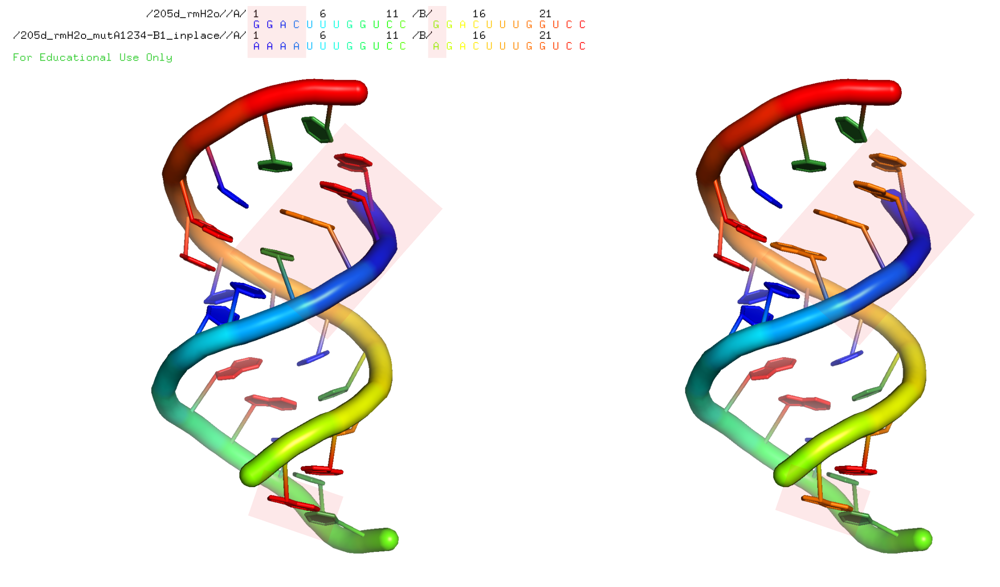
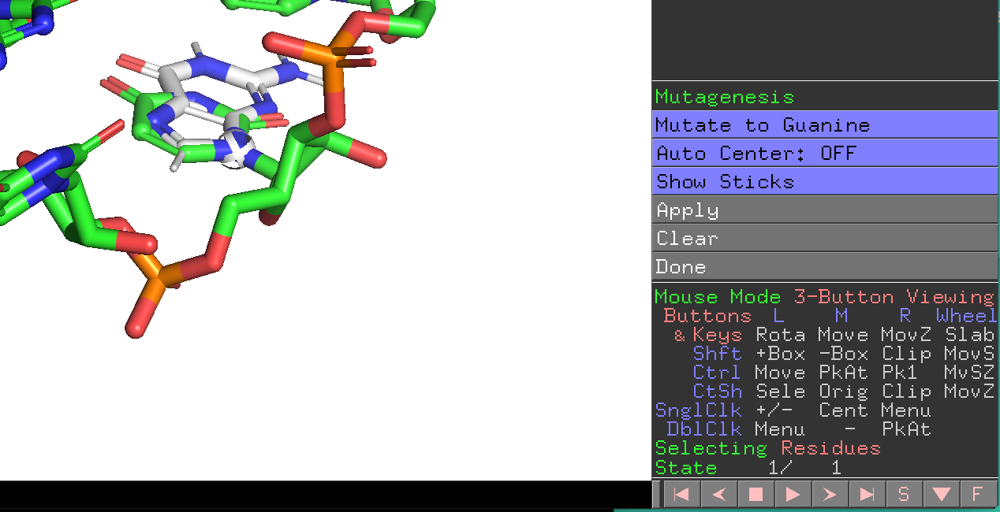

Getting Started: I want to ...
===========================================

fetch a structure from the PDB database
--------------------------------------------

Example::

  $ rna_pdb_toolsx.py --fetch 1xjr
  downloading...1xjr ok

fetch a biologicaly assembly
--------------------------------------------

Example::

  $ rna_pdb_toolsx.py --fetch_ba 1xjr
  downloading...1xjr_ba.pdb ok

or over a list of pdb ids in a text file::

  $ cat data/pdb_ids.txt
  1y26
  1fir

  $ while read p; do rna_pdb_toolsx.py --fetch_ba $p; done < data/pdb_ids.txt
  downloading...1y26_ba.pdb ok
  downloading...1fir_ba.pdb ok

  $ ls *.pdb
  1fir_ba.pdb 1y26_ba.pdb

get sequences of a bunch of PDB files
--------------------------------------------

Example::

    rna_pdb_toolsx.py --get_seq *.pdb
    # 1xjr
    > A:1-47
    GGAGUUCACCGAGGCCACGCGGAGUACGAUCGAGGGUACAGUGAAUU
    # 6TNA
    > A:1-76
    GCGGAUUUAgCUCAGuuGGGAGAGCgCCAGAcUgAAgAucUGGAGgUCcUGUGuuCGaUCCACAGAAUUCGCACCA
    # rp2_bujnicki_1_rpr
    > A:1-15
    CCGGAGGAACUACUG
    > B:1-10
    CCGGCAGCCU
    > C:1-15
    CCGGAGGAACUACUG
    > D:1-10
    CCGGCAGCCU
    > E:1-15
    CCGGAGGAACUACUG
    > F:1-10
    CCGGCAGCCU
    > G:1-15
    CCGGAGGAACUACUG
    > H:1-10
    CCGGCAGCCU

get secondary structures of your PDB files
--------------------------------------------

.. automodule:: rna_tools.tools.rna_x3dna.rna_x3dna
   :members:

delete a part of of your structure
--------------------------------------------

Examples::

    $ for i in *pdb; do rna_pdb_toolsx.py --delete A:46-56 $i > ../rpr_rm_loop/$i ; done

go over all files in the current directory, remove a fragment of chain A, residues between 46-56 (including them) and save outputs to in the folder `rpr_rm_loops`.

get numbering of your structure and rename chains
----------------------------------------------------
Rename chain B in structure 4_das_1_rpr.pdb::

  $ rna_pdb_toolsx.py --get_seq  4_das_1_rpr.pdb
  > 4_das_1_rpr.pdb B:1-126
  GGCUUAUCAAGAGAGGUGGAGGGACUGGCCCGAUGAAACCCGGCAACCACUAGUCUAGCGUCAGCUUCGGCUGACGCUAGGCUAGUGGUGCCAAUUCCUGCAGCGGAAACGUUGAAAGAUGAGCCA
  $ rna_pdb_toolsx.py --edit 'B:1-126>A:1-126' 4_das_1_rpr.pdb > 4_das_1_rpr2.pdb
  $ rna_pdb_toolsx.py --get_seq  4_das_1_rpr2.pdb
  > 4_das_1_rpr2.pdb A:1-126
  GGCUUAUCAAGAGAGGUGGAGGGACUGGCCCGAUGAAACCCGGCAACCACUAGUCUAGCGUCAGCUUCGGCUGACGCUAGGCUAGUGGUGCCAAUUCCUGCAGCGGAAACGUUGAAAGAUGAGCCA

edit your structure (rename chain)
--------------------------------------------

Examples::

   $ rna_pdb_toolsx.py --edit 'A:3-21>A:1-19' 1f27_clean.pdb > 1f27_clean_A1-19.pdb

or even::

   $ rna_pdb_toolsx.py --edit 'A:3-21>A:1-19,B:22-32>B:20-30' 1f27_clean.pdb > 1f27_clean_renumb.pdb

or even, even, do rename X chain to A only for Chen's pdb structures in the folder, in place (so don't create a new file)::

    for i in *Chen*; do rna_pdb_toolsx.py --edit 'X:1-125>A:1-125' $i > ${i}_temp; mv ${i}_temp ${i}; done
    # do only edit for Chen's pdb structures, in place.

find missing atoms in my structure
--------------------------------------------

Run::

    $ rna_pdb_toolsx.py --get_rnapuzzle_ready input/1_das_1_rpr_fixed.pdb
    HEADER Generated with rna-pdb-tools
    HEADER ver 91ed4f8-dirty
    HEADER https://github.com/mmagnus/rna-pdb-tools
    HEADER Sun Mar  5 10:58:07 2017
    REMARK 000 Missing atoms:
    REMARK 000  + P B <Residue C het=  resseq=1 icode= > residue # 1
    REMARK 000  + OP1 B <Residue C het=  resseq=1 icode= > residue # 1
    REMARK 000  + OP2 B <Residue C het=  resseq=1 icode= > residue # 1
    REMARK 000  + O5' B <Residue C het=  resseq=1 icode= > residue # 1
    ATOM      1  P     C A   1     -16.936  -3.789  68.770  1.00 11.89           P
    ATOM      2  OP1   C A   1     -17.105  -3.675  67.302  1.00 14.35           O
    ATOM      3  OP2   C A   1     -15.666  -4.265  69.342  1.00 12.68           O
    ...

mutate residues
-------------------------------------------

For example, to replace the first four residues of chain A into adenines and 13th A of chain B, run::

    rna_pdb_toolsx.py --mutate 'A:1A+2A+3A+4A,B:13A' \
       --inplace output/205d_rmH2o_mutA1234-B1_inplace.pdb

Figure. Input structure on the left, mutated structure on the right.

If, for whatever reason, the tool here does not do what you want, use the tool from MC-Fold|MC-Sym Pipeline (go there https://www.major.iric.ca/MC-Pipeline/ and scroll down to the Section: "RNA SEQUENCE MUTATION" at the very bottom of the page).

Moreover, you can also mutate interactively proteins and nucleic acids with PyMOL >2.

Learn more here https://pymolwiki.org/index.php/Mutagenesis

If you want to mutate with PyMOL with command-line see this https://pymolwiki.org/index.php/Rotkit

add missing atoms
--------------------------------------------

The tool is using the function:

.. automethod:: rna_tools.rna_tools_lib.RNAStructure.get_rnapuzzle_ready
