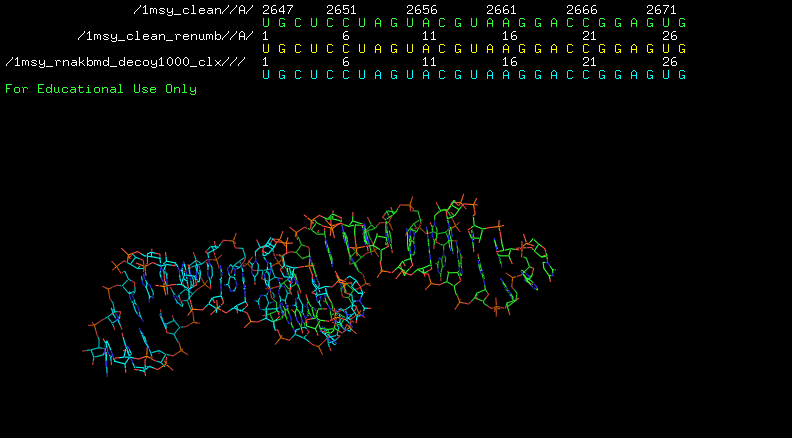
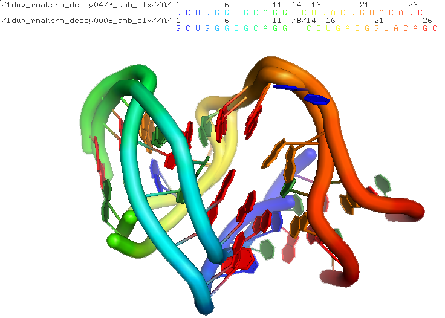
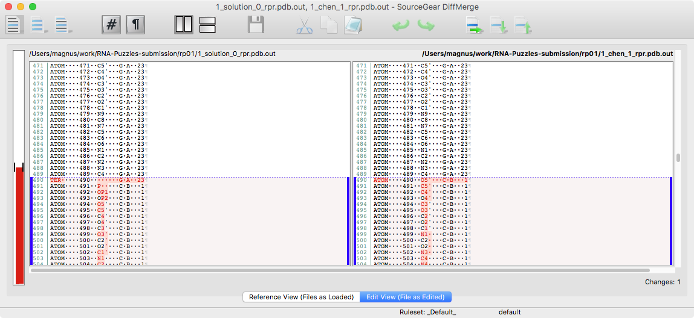

===========
 Workflows
===========

Example #1
-----------------------------------------------------------------------

The native::

	[mq] md_1msy_clx cat 1msy_clean.pdb.outCR
	Classifier: Clarna
	chains:  A 2647 2673
	A 2648   A 2672          bp G U                  WW_cis   0.8732
	A 2649   A 2671          bp C G                  WW_cis   0.9160
	A 2650   A 2670          bp U A                  WW_cis   0.9289
	A 2651   A 2669          bp C G                  WW_cis   0.9439
	A 2652   A 2668          bp C G                  WW_cis   0.9281
	A 2655   A 2656          bp G U                  SH_cis   0.9227
	A 2656   A 2665          bp U A                 WH_tran   0.8526
	A 2657   A 2664          bp A G                 HS_tran   0.8513
	A 2658   A 2663          bp C G                  WW_cis   0.9421
	A 2659   A 2662          bp G A                 SH_tran   0.7619

but analyzed structres are like::

	[mq] md_1msy_clx cat struc/1msy_rnakbmd_decoy1478_clx.pdb.outCR
	Classifier: Clarna
	chains: A 1 27
	 2       26          bp G U                  WW_cis   0.7196
	 3       25          bp C G                  WW_cis   0.6702
	 4       24          bp U A                  WW_cis   0.8911
	 5       23          bp C G                  WW_cis   0.8925
	 6       22          bp C G                  WW_cis   0.9026
	 9       10          bp G U                  SH_cis   0.8714
	 10       19          bp U A                 WH_tran   0.7279
	 11       18          bp A G                 HS_tran   0.8810
	 12       17          bp C G                  WW_cis   0.9115

You have to renumber 1msy_clean.pdb to 1:27::

    $ rna_pdb_toolsx.py --edit 'A:2647-2673>A:1:17' 1msy_clean.pdb > 1msy_clean_renumb.pdb

Example #2
-----------------------------------------------------------------------

Listing:

.. code-block:: console

    $ rna_pdb_toolsx.py --get-seq 1nuj_rnakbmd_decoy1000_clx.pdb
    > 1nuj_rnakbmd_decoy1000_clx.pdb A:1-13
    CGGACCGAGCCAG
    > 1nuj_rnakbmd_decoy1000_clx.pdb B:14-24
    GCUGGGAGUCC

    $ rna_pdb_toolsx.py --get-seq 1nuj_clean.pdb
    > 1nuj_clean.pdb A:18-30
    CGGACCGAGCCAG
    > 1nuj_clean.pdb B:39-49
    GCUGGGAGUCC

    $ rna_pdb_toolsx.py --edit 'A:18-30>A:1-13,B:39-49>B:14-24' 1nuj_clean.pdb > 1nuj_clean_renumber.pdb

    $ rna_pdb_toolsx.py --get-seq 1nuj_clean_renumber.pdb
    > 1nuj_clean_renumber.pdb A:1-13
    CGGACCGAGCCAG
    > 1nuj_clean_renumber.pdb B:14-24
    GCUGGGAGUCC

Example #3
------------------------------------------------------------------------

Starting structure doesn't have chain id:

.. code-block:: console

  # add chain A
  $ parallel "rna_add_chain.py -c A {} > ../struc_with_chain/{}" ::: *.pdb
  # edit the second part of the new chain A as B
  $ parallel "rna_pdb_gtools.py --edit 'A:14-27>B:14-27' {} > out/{}" ::: *.pdb

Example #4 Calculate RMSDs of unstandardized structures (RNA Puzzle #1)
------------------------------------------------------------------------

You try to calculate RMSDs for RNA Puzzles #1::

    rna_calc_rmsd.py -t 1_solution_0_rpr.pdb *.pdb
    method: all-atom-built-in
    # of models: 15
    1_bujnicki_1_rpr.pdb 5.71 978
    1_bujnicki_2_rpr.pdb 6.16 978
    1_bujnicki_3_rpr.pdb 5.3 978
    1_bujnicki_4_rpr.pdb 4.95 978
    1_bujnicki_5_rpr.pdb 5.1 978
    Error: # of atoms is not equal target (1_solution_0_rpr.pdb):978 vs model (1_chen_1_rpr.pdb):975

you can see that there is a different number of atoms in `1_solution_0_rpr.pdb` and `1_chen_1_rpr.pdb`.

To see more you can run `diffpdb`.

you see that something is wrong. To fix it, run::

   rna_pdb_toolsx.py --rpr --inplace *.pdb
   93% (15 of 16) |########################################################################################################################         | Elapsed Time: 0:00:03 ETA: 0:00:00

you can tail the files::

    tail *.pdb
    ==> 1_bujnicki_1_rpr.pdb <==
    ATOM    971  N7    G B  23     -16.558  -3.375  78.345  1.00  0.00           N
    ATOM    972  C5    G B  23     -17.169  -2.575  77.384  1.00  0.00           C
    ATOM    973  C6    G B  23     -17.589  -2.874  76.053  1.00  0.00           C
    ATOM    974  O6    G B  23     -17.497  -3.930  75.430  1.00  0.00           O
    ATOM    975  N1    G B  23     -18.234  -1.800  75.459  1.00  0.00           N
    ATOM    976  C2    G B  23     -18.441  -0.576  76.049  1.00  0.00           C
    ATOM    977  N2    G B  23     -19.127   0.345  75.382  1.00  0.00           N
    ATOM    978  N3    G B  23     -18.053  -0.282  77.292  1.00  0.00           N
    ATOM    979  C4    G B  23     -17.419  -1.324  77.898  1.00  0.00           C

    ...

    ==> 1_chen_1_rpr.pdb <==
    ATOM    971  N7    G B  23     -14.462  -1.101  79.998  1.00  0.00           N
    ATOM    972  C5    G B  23     -14.952  -0.485  78.839  1.00  0.00           C
    ATOM    973  C6    G B  23     -15.577  -1.020  77.655  1.00  0.00           C
    ATOM    974  O6    G B  23     -15.822  -2.189  77.351  1.00  0.00           O
    ATOM    975  N1    G B  23     -15.972  -0.051  76.763  1.00  0.00           N
    ATOM    976  C2    G B  23     -15.787   1.274  76.944  1.00  0.00           C
    ATOM    977  N2    G B  23     -16.269   2.059  76.021  1.00  0.00           N
    ATOM    978  N3    G B  23     -15.224   1.822  78.022  1.00  0.00           N
    ATOM    979  C4    G B  23     -14.818   0.884  78.935  1.00  0.00           C
    TER     980        G B  23

    ==> 1_solution_0_rpr.pdb <==
    ATOM    971  N7    G B  23      22.256  -1.292  27.403  1.00 34.10           N
    ATOM    972  C5    G B  23      22.625  -0.176  28.135  1.00 31.12           C
    ATOM    973  C6    G B  23      23.470  -0.096  29.260  1.00 28.80           C
    ATOM    974  O6    G B  23      24.062  -1.036  29.804  1.00 28.26           O
    ATOM    975  N1    G B  23      23.616   1.224  29.705  1.00 27.28           N
    ATOM    976  C2    G B  23      22.971   2.318  29.112  1.00 28.31           C
    ATOM    977  N2    G B  23      23.179   3.538  29.655  1.00 27.03           N
    ATOM    978  N3    G B  23      22.170   2.245  28.047  1.00 28.85           N
    ATOM    979  C4    G B  23      22.041   0.961  27.632  1.00 28.58           C
    TER     980        G B  23%

so now you can see that the files look the same. Let's try to calculate RMSDs again::

    rna_calc_rmsd.py -t 1_solution_0_rpr.pdb *.pdb
    method: all-atom-built-in
    # of models: 16
    1_bujnicki_1_rpr.pdb 5.71 978
    1_bujnicki_2_rpr.pdb 6.16 978
    1_bujnicki_3_rpr.pdb 5.3 978
    1_bujnicki_4_rpr.pdb 4.95 978
    1_bujnicki_5_rpr.pdb 5.1 978
    1_chen_1_rpr.pdb 4.35 978
    1_chen_1_rpr_v2.pdb 4.35 978
    1_das_1_rpr.pdb 3.97 978
    1_das_2_rpr.pdb 4.48 978
    1_das_3_rpr.pdb 3.43 978
    1_das_4_rpr.pdb 3.92 978
    1_das_5_rpr.pdb 4.57 978
    1_dokholyan_1_rpr.pdb 7.25 978
    1_major_1_rpr.pdb 4.34 978
    1_santalucia_1_rpr.pdb 5.76 978
    1_solution_0_rpr.pdb 0.0 978
    # of atoms used: 978
    csv was created!  rmsds.csv

worked! :-)

This is a real-life case, https://github.com/mmagnus/RNA-Puzzles-Normalized-submissions/tree/master/rp01.
