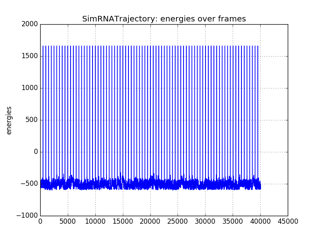
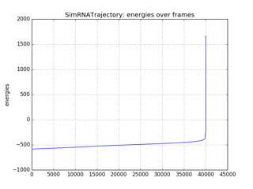

# SimRNA/SimRNAweb

For SimRNA you can download trajectories and clusters directly from your shell, you can get all atoms, distances between MB, you can slice frames like in Python lists etc.

Read more here <https://rna-tools.readthedocs.io/en/latest/tools.html#module-rna_tools.tools.simrna_trajectory.simrna_trajectory>

For example, the whole analysis done in 6 lines:

Download a trajectory from SimRNAweb you need only this:
```
$ rna_simrnaweb_download_job.py -w rp14_aa22-6d8fb934
```

and then this is a program that will process the trajectory, plot energy (plot1) then sort frames according to the energy and plot it again (plot2). Takes 20s to run it.

```python
#!/usr/bin/env python
from rna_tools.tools.simrna_trajectory.simrna_trajectory import SimRNATrajectory
s = SimRNATrajectory()
s.load_from_file('rp14_aa22-6d8fb934_ALL.trafl', top_level=True)
s.plot_energy('plot1.png')
s.sort()
s.plot_energy('plot2.png')
```

 
