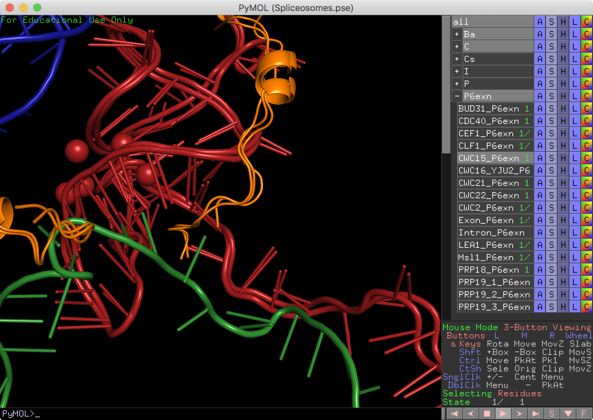
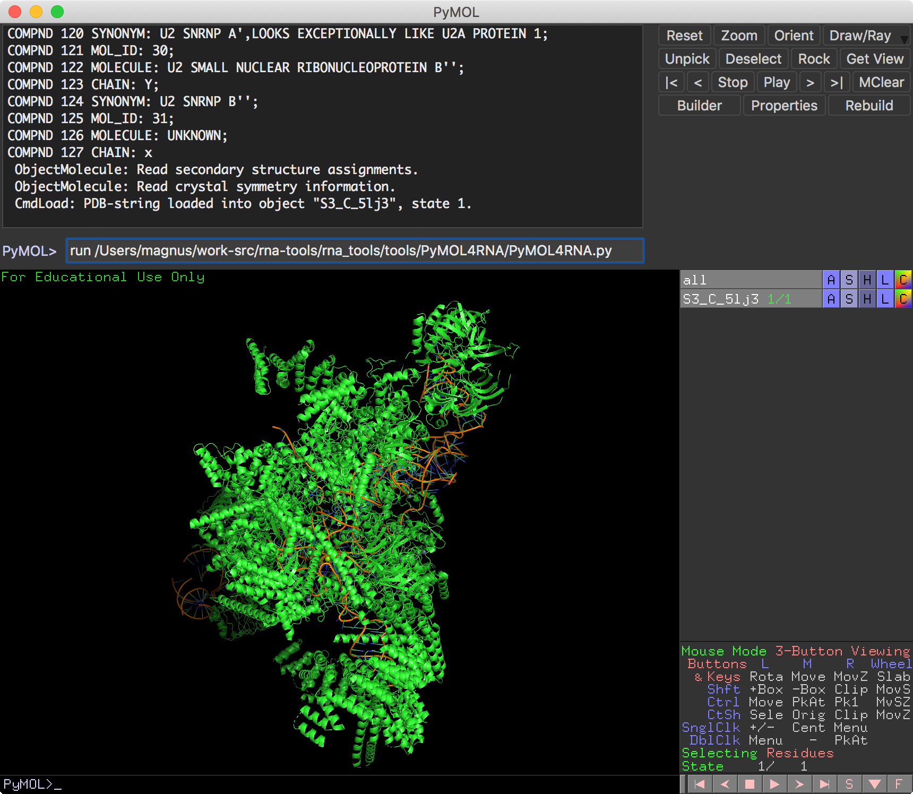
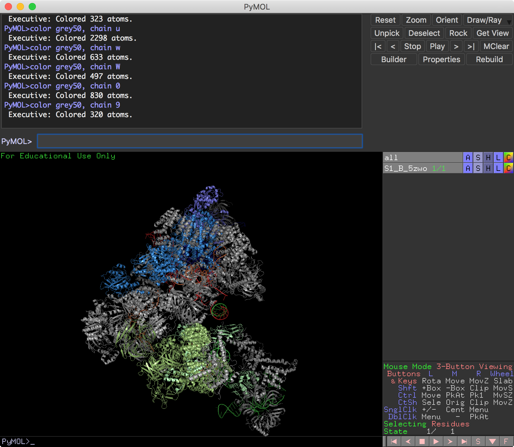

PyMOL4RNA
=========

## PyMOL4Spliceosome: all spliceosome structures in one PyMOL session

See releases for PyMOL sessions: https://github.com/mmagnus/PyMOL4Spliceosome

Quick ref:

	PyMOL>enable CWC15*
	PyMOL>disable CWC15*

You can also download sessions for single steps prepared by the Nagai lab: <https://www2.mrc-lmb.cam.ac.uk/groups/nagai/resources/>

Read more: https://pymolwiki.org/index.php/Enable

## Example: Color-coding for RNA Puzzles

To get:

(install the plugin) and run:

	PyMOL>rp
	PyMOL>rp17

The source of the pdb: <http://www.rcsb.org/pdb/explore/explore.do?structureId=5K7C> see also `test_data/5k7c_clean.pdb`

## Install

See the docs, https://rna-tools.readthedocs.io/en/latest/pymol4rna.html#install

## One-time load of the functions
(less complicated than install, but you have to do it each time, it's better to properly install the package).

To load the functions of PyMOL4RNA.py, type `run <path to the file of PyMOL4RNA.py>` into the PyMOL console. 

In my case, this will be [1]:

OK, now the functions are loaded into PyMOL. Unfortunately, you have to type run each time when you open and close PyMOL. If you want this to be loaded at the start of PyMOL see the Install section.

Now we can open a PDB file and color spliceosomal proteins. The way how it works at the moment is a bit hacky. The function `spl color` reads the name of the object (like in this case 5zwo) in your PyMOL session and based on that, the function colors the chains according to the rules encoded in the function. 

At the moment, the following structure can be colored with the PyMOL4RNA: (1) complex B (5zwo), (2) complex Bact (5gm6), (3) complex C (5lj3), (4) C* (5mps), (5) complex P (6exn), and (6) ILS (5y88). To learn more about these structures, see the review (Zhang, & Zhao, 2019).

Chains and colors can be found here pyMoL_colors-EMX.xlsx.

The structure ready to use with the function can be download from [here](https://www.dropbox.com/s/jz4qoqu6p8mfhof/spls.zip?dl=0).

    [1] run /Users/magnus/work-src/rna-tools/rna_tools/tools/PyMOL4RNA/PyMOL4RNA.py

Zhang, L., Vielle, A., Espinosa, S., & Zhao, R. (2019). RNAs in the spliceosome: Insight from cryoEM structures. Wiley Interdisciplinary Reviews: RNA, 10(3), e1523–11. http://doi.org/10.1002/wrna.1523
