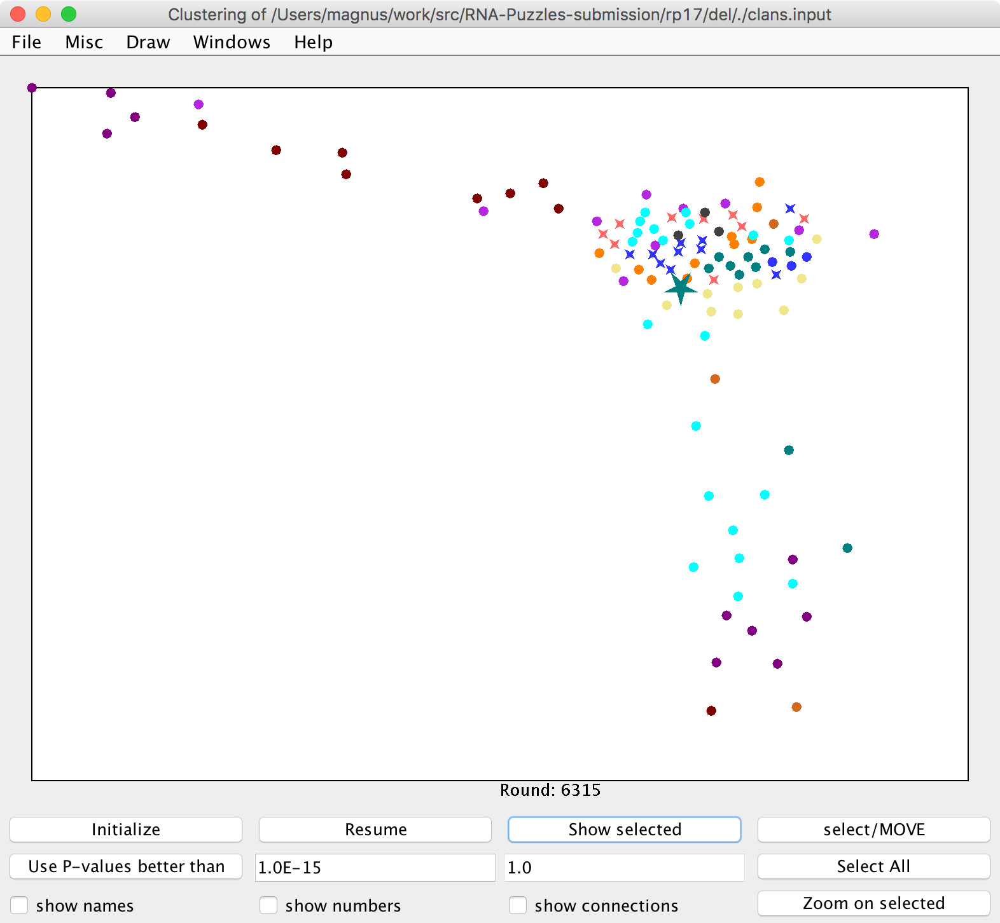
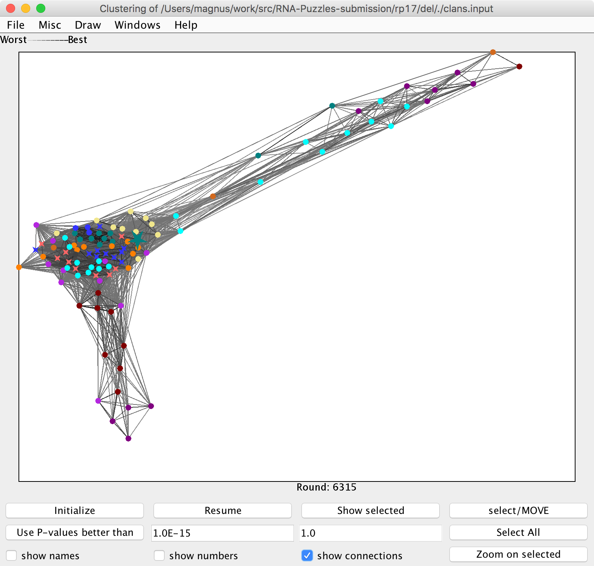

rna_clanstix.py
-------------------------------------------------------------------------------

A tool for visualizing RNA 3D structures based on pairwise structural similarity.

The RMSDs between structures are converted into p-values based on the method from the Dokholyan lab and Magnus' hacky way.

Hajdin, C. E., Ding, F., Dokholyan, N. V, & Weeks, K. M. (2010). On the significance of an RNA tertiary structure prediction. RNA (New York, N.Y.), 16(7), 1340–9. doi:10.1261/rna.1837410

An output of this tool can be viewed using <a href="http://www.eb.tuebingen.mpg.de/research/departments/protein-evolution/software/clans.html">CLANS</a>.

Frickey, T., & Lupas, A. (2004). CLANS: a Java application for visualizing protein families based on pairwise similarity. Bioinformatics (Oxford, England), 20(18), 3702–4. doi:10.1093/bioinformatics/bth444

Read more https://rna-tools.readthedocs.io/en/latest/tools.html#module-rna_tools.tools.clanstix.rna_clanstix

Examples
-------------------------------------------------------------------------------

    $ rna_calc_rmsd_all_vs_all.py -i struc -o rp17_rmsd.csv
     # of models: 108
    ... 1 struc/17_0_solution_5K7C_rpr_del.pdb
    ... 2 struc/17_Adamiak_1_rpr_del.pdb
    ... 3 struc/17_Adamiak_2_rpr_del.pdb
    (..)

    rna_clanstix.py --groups 1:native+3:Adamiak+10:Bujnicki+10:Chen+3:DasExp+10:Das+10:Ding+3:Dohkolyan+10:Major+10:RNAComposerAS1+10:RNAComposerAS2+9:SimRNAwebAS1+9:SimRNAwebAS2+10:Xioa rp17_rmsd.csv

Figure. Clustering visualized with Clanstix/CLANS for RNA-Puzzle 17. The native structure is grouped with the models in the center (A). Interestingly, there is a group of models of different topology than the native (the blue helix is in the different orientations (B). This cluster includes models generated with different methods. Moreover, there is a group of outliers that came from automated methods (C).

