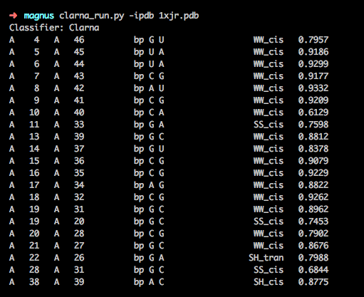

ClaRNA_play
-------------------------------------------------------------------------------

Author: @wkdawson based on the code and publication of

This is mini_ClaRNA 3.0 (mini = code only required to run ClaRNA and calculate INFs), prepared by @mmagnus for rna-tools that works with Python3.

T. Waleń, G. Chojnowski, P. Gierski, and J. M. Bujnicki, “ClaRNA: a classifier of contacts in RNA 3D structures based on a comparative analysis of various classification schemes.,” Nucleic Acids Research, vol. 42, no. 19, pp. e151–e151, Oct. 2014.

Integrate/tested by @mmagnus

# Install 

	pip install rna-tools simplejson networkx scipy
	# on m1/mac tested with
	# networkx==2.7.1
	# scipy==1.7.3
	# simplejson==3.17.6 and 3.17.0

# Start
To start:

    $ rna_clarna_run.py -ipdb test_data/3e5fA_M15_c.pdb > test_output/3e5fA_M15_c.pdb.outCR
    $ rna_clarna_run.py -ipdb test_data/3e5fA_M500_c.pdb > test_output/3e5fA_M500_c.pdb.outCR

to analyze:

    $ rna_clarna_compare.py -iref test_output/3e5fA_M15_c.pdb.outCR -ichk test_output/3e5fA_M500_c.pdb.outCR
    3e5A_M15_c.pdb.outCR                       3e5fA_M500_c.pdb.outCR      0.662      NA         0.647      0.707      0.538      0.778      0.500      1.000

Tested with ClaRNA only.

    $ rna_clarna_run.py -ipdb test_data/3e5fA_M500_c.pdb
    Classifier: Clarna
    A    5   A   49          bp C G                  WW_cis   0.6965
    A    6   A   48          bp C G                  WW_cis   0.6878
    A   10   A   34          bp A U                  WW_cis   0.6209
    A   10   A   35          bp A U                  WW_cis   0.6951
    A   13   A   28          bp A G                  WW_cis   0.9170
    A   14   A   27          bp U A                  WW_cis   0.7730
    A   15   A   26          bp G C                  WW_cis   0.8426
    A   16   A   25          bp G C                 WW_tran   0.6505
    A   17   A   24          bp C G                  WW_cis   0.7311
    A   18   A   23          bp G C                 WW_tran   0.7475
    A   31   A   36          bp G G                 HW_tran   0.6888
    A   41   A   46          bp C G                  WW_cis   0.8555

## Get secondary structure

First, you have to make a binary file of Michal's program. Go to `lib/ClaRNAwd_to_vienaSS/` and run `make` you should get a binary file. Now you can run:

    $ lib/ClaRNAwd_to_vienaSS/ClaRNAwd_output_parser_get_SS test_output/3e5fA_M15_c.pdb.outCR
    (((((..(((...(((......)))......)))....((....))))))).

or 

	$ lib/ClaRNAwd_to_vienaSS/ClaRNAwd_output_parser_get_SS lib/ClaRNAwd_to_vienaSS/example.pdb.outCR
	(((((......)))))........(.((....(.......)..(((. .)))...)).)
	.....((((((......................))))))........ ...........

To "re-make" the installation do `make clean` and `make` again.

## Compare two structures

.. `rna_clarna_compare.py -v`:
    
    $ rna_clarna_compare.py -v -iref test_output/3e5fA_M15_c.pdb.outCR -ichk test_output/3e5fA_M500_c.pdb.outCR 
    test_output/3e5fA_M15_c.pdb.outCR
    test_output/3e5fA_M15_c.pdb.outCR
    A    2   A   52          bp U A                  WW_cis   0.9511
    A    3   A   51          bp U A                  WW_cis   0.8414
    A    4   A   50          bp C G                  WW_cis   0.7113
    A    5   A   49          bp C G                  WW_cis   0.9349
    A    6   A   48          bp C G                  WW_cis   0.8963
    A    9   A   35          bp A U                  WW_cis   0.7912
    A   10   A   34          bp A U                  WW_cis   0.9165
    A   11   A   33          bp G C                  WW_cis   0.8996
    A   13   A   27          bp A A                 WW_tran   0.6134
    A   13   A   28          bp A G                  WW_cis   0.8797
    A   15   A   26          bp G C                  WW_cis   0.8868
    A   16   A   25          bp G C                  WW_cis   0.7712
    A   17   A   24          bp C G                  WW_cis   0.9009
    A   18   A   23          bp G C                 WW_tran   0.7947
    A   19   A   22          bp G A                 SH_tran   0.7556
    A   31   A   36          bp G G                 HW_tran   0.8840
    A   38   A   48          bp A G                 WS_tran   0.6725
    A   40   A   47          bp C G                  WW_cis   0.9030
    A   41   A   46          bp C G                  WW_cis   0.8988

    test_output/3e5fA_M500_c.pdb.outCR
    A    5   A   49          bp C G                  WW_cis   0.6965
    A    6   A   48          bp C G                  WW_cis   0.6878
    A   10   A   34          bp A U                  WW_cis   0.6209
    A   10   A   35          bp A U                  WW_cis   0.6951
    A   13   A   28          bp A G                  WW_cis   0.9170
    A   14   A   27          bp U A                  WW_cis   0.7730
    A   15   A   26          bp G C                  WW_cis   0.8426
    A   16   A   25          bp G C                 WW_tran   0.6505
    A   17   A   24          bp C G                  WW_cis   0.7311
    A   18   A   23          bp G C                 WW_tran   0.7475
    A   31   A   36          bp G G                 HW_tran   0.6888
    A   41   A   46          bp C G                  WW_cis   0.8555

    compare:
    3e5fA_M15_c.pdb.outCR     3e5fA_M500_c.pdb.outCR

    reference vs prediction:                                                                                                                                                                                                                                                       
      WC    ref    13   pred-match     7                                                                                                                                                                                                                                          
      nWC    ref     6   pred-match     3                                                                                                                                                                                                                                          
    stack    ref     0   pred-match     0                                                                                                                                                                                                                                          
																																
    prediction vs reference:   WC   pred     8    ref-match     6                                                                                                                                                                                                                  
      nWC   pred     4    ref-match     4                                                                                                                                                                                                                                          
    stack   pred     0    ref-match     0                                                                                                                                                                                                                                          
																																
    for all motifs:nref   19,  nchkTP   10,  nFN    9                                                                                                                                                                                                                              
    nchk   12,  nrefTP   10,  nFP    2                                                                                                                                                                                                                                             
																																
																																
    summary:                                                                                                                                                                                                                                                                       
    inf_all      0.662                                                                                                                                                                                                                                                             
    inf_stack -999.999                                                                                                                                                                                                                                                             
    inf_WC       0.647                                                                                                                                                                                                                                                             
    inf_nWC      0.707                                                                                                                                                                                                                                                             
    SNS_WC       0.538                                                                                                                                                                                                                                                             
    PPV_WC       0.778                                                                                                                                                                                                                                                             
    SNS_nWC      0.500                                                                                                                                                                                                                                                             
    PPV_nWC      1.000
	
## Example with two chains

    $ rna_clarna_run.py -ipdb test_data/5k7c_clean_onechain_renumber_as_puzzle_srr_AB.pdb
    Classifier: Clarna
    # A:1-47 B:52-62
    A    1   A   16          bp C G                  WW_cis   0.8667
    A    2   A   15          bp G C                  WW_cis   0.9263
    A    3   A   14          bp U A                  WW_cis   0.9244
    A    4   A   20          bp G A                  SH_cis   0.6670
    A    4   A   13          bp G C                  WW_cis   0.9239
    A    4   A   21          bp G A                 SW_tran   0.7298
    A    5   A   24          bp G G                 SS_tran   0.7785
    A    5   A   12          bp G C                  WW_cis   0.8932
    A    6   A   39          bp U A                  WW_cis   0.8611
    A    7   A   38          bp U A                  WW_cis   0.9304
    A    8   A   37          bp A U                  WW_cis   0.9297
    A    9   A   36          bp G C                  WW_cis   0.9159
    A   10   A   35          bp G C                  WW_cis   0.9070
    A   11   A   34          bp G C                  WW_cis   0.9215
    A   14   A   20          bp A A                  SW_cis   0.6638
    A   15   A   19          bp C A                  SW_cis   0.7975
    A   16   A   17          bp G U                  SW_cis   0.6665
    A   25   B   62          bp U A                  WW_cis   0.8659
    A   27   B   60          bp G C                  WW_cis   0.7851
    A   28   B   59          bp C G                  WW_cis   0.8167
    A   29   B   58          bp U U                  WW_cis   0.8238
    A   33   A   41          bp G C                  WW_cis   0.9406
    A   40   A   41          bp G C                  SH_cis   0.6214
    A   42   B   57          bp G G                 HS_tran   0.7572
    A   44   B   55          bp U A                  WW_cis   0.8551
    A   45   B   54          bp G C                  WW_cis   0.8454
    A   46   B   53          bp A U                  WW_cis   0.8995

# Warning
I changed the default value -9999 to 0. I don't know it this simplification is good in your projects! Think about it!
