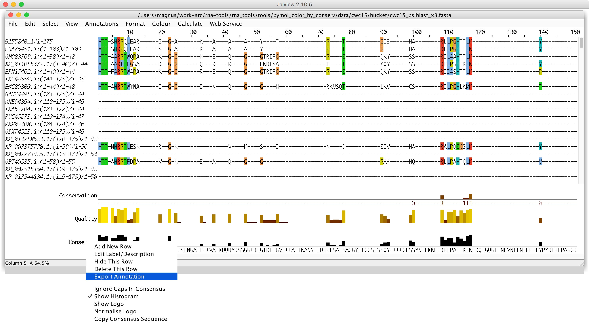
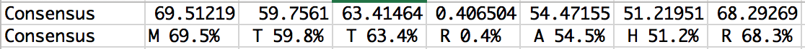
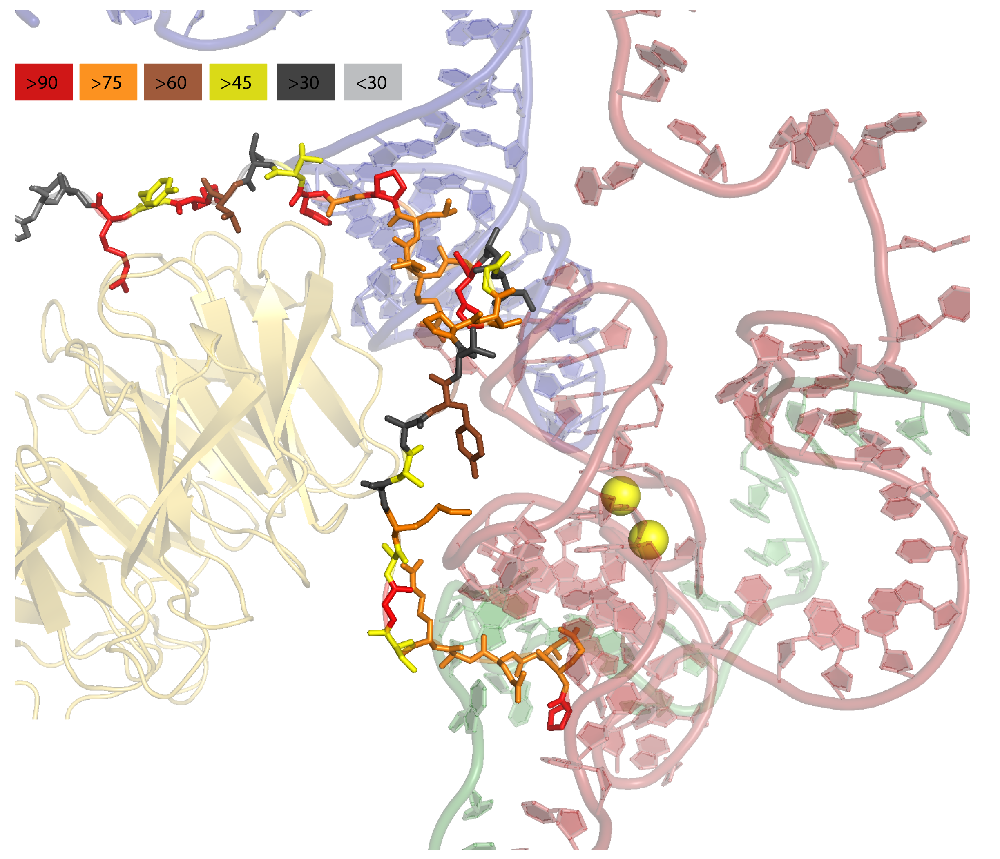

PyMOL: color by conservation
--------------------------------------

See also https://pymolwiki.org/index.php/Color_by_conservation

Get an alignment for your protein sequence from <https://toolkit.tuebingen.mpg.de/tools/psiblast>

Download the alignment and open the alignment in JalView and save Export Annotation -> To CSV

The file should like this:

	 
Run `pymol_color_by_conserv.py` on the alignment and the consensus file:

    (base) [mm] pymol_color_by_conserv$ git:(master) ✗ ./pymol_color_by_conserv.py -h
    usage: pymol_color_by_conserv.py [-h] [-v] conserv alignment chain

    positional arguments:
      conserv        consigns file
      alignment
      chain

    optional arguments:
      -h, --help     show this help message and exit
      -v, --verbose  be verbose

example:

    python pymol_color_by_conserv.py data/cwc15/cwc15_consensus.csv data/cwc15/psiblast_8183496.aln A
    (see full output below)
    
Load your protein in PyMOL and load the script (pml file) to color residues according to conservation:

    # in PyMOL
    @ <path to a file> cwc15.pml

Enjoy!

Full output:

	(base) [mm] pymol_color_by_conserv$ git:(master) ✗ python pymol_color_by_conserv.py data/cwc15/cwc15_consensus.csv data/cwc15/psiblast_8183496.aln A | tee data/cwc15/cwc15.pml
	color red, resi 1 and chain A; #96.296295
	color orange, resi 2 and chain A; # 88.888885
	color orange, resi 3 and chain A; # 85.18519
	color brown, resi 4 and chain A; # 74.07407
	color red, resi 5 and chain A; # 92.59259
	color red, resi 6 and chain A; # 96.296295
	color red, resi 7 and chain A; # 92.59259
	color orange, resi 8 and chain A; # 81.48148
	color orange, resi 9 and chain A; # 81.48148
	color orange, resi 10 and chain A; # 81.48148
	color orange, resi 11 and chain A; # 85.18519
	color orange, resi 12 and chain A; # 85.18519
	color yellow, resi 13 and chain A; # 51.851852
	color red, resi 14 and chain A; # 92.59259
	color yellow, resi 15 and chain A; # 59.25926
	color orange, resi 16 and chain A; # 77.77778
	color gray30, resi 17 and chain A; # 33.333332
	color yellow, resi 18 and chain A; # 48.148148
	color gray30, resi 19 and chain A; # 33.333332
	color brown, resi 20 and chain A; # 66.666664
	color gray30, resi 21 and chain A; # 40.74074
	color orange, resi 22 and chain A; # 77.77778
	color orange, resi 23 and chain A; # 85.18519
	color yellow, resi 24 and chain A; # 51.851852
	color gray30, resi 25 and chain A; # 44.444443
	color gray30, resi 26 and chain A; # 37.037037
	color red, resi 27 and chain A; # 92.59259
	color orange, resi 28 and chain A; # 81.48148
	color orange, resi 29 and chain A; # 88.888885
	color orange, resi 30 and chain A; # 85.18519
	color orange, resi 31 and chain A; # 88.888885
	color red, resi 32 and chain A; # 96.296295
	color orange, resi 33 and chain A; # 77.77778
	color red, resi 34 and chain A; # 96.296295
	color yellow, resi 35 and chain A; # 48.148148
	color gray30, resi 36 and chain A; # 37.037037
	color brown, resi 37 and chain A; # 70.37037
	color red, resi 38 and chain A; # 96.296295
	color yellow, resi 39 and chain A; # 59.25926
	color red, resi 40 and chain A; # 96.296295
	color gray30, resi 41 and chain A; # 37.037037
	color gray, resi 42 and chain A; # 11.111111
	color gray30, resi 43 and chain A; # 44.444443
	color gray, resi 44 and chain A; # 18.518518
	color gray, resi 45 and chain A; # 25.925926
	color gray30, resi 46 and chain A; # 33.333332
	color gray, resi 47 and chain A; # 25.925926
	color gray, resi 48 and chain A; # 29.62963
	color gray, resi 49 and chain A; # 29.62963
	color gray, resi 50 and chain A; # 18.518518
	color gray, resi 51 and chain A; # 25.925926
	color gray, resi 52 and chain A; # 11.111111
	color gray, resi 53 and chain A; # 25.925926
	color gray, resi 54 and chain A; # 18.518518
	color gray30, resi 55 and chain A; # 33.333332
	color gray, resi 56 and chain A; # 25.925926
	color gray, resi 57 and chain A; # 25.925926
	color gray30, resi 58 and chain A; # 33.333332
	color gray, resi 59 and chain A; # 22.222221
	color gray30, resi 60 and chain A; # 40.74074
	color gray, resi 61 and chain A; # 25.925926
	color gray, resi 62 and chain A; # 22.222221
	color gray, resi 63 and chain A; # 22.222221
	color gray30, resi 64 and chain A; # 37.037037
	color gray, resi 65 and chain A; # 29.62963
	color gray, resi 66 and chain A; # 11.111111
	color gray, resi 67 and chain A; # 18.518518
	color gray, resi 68 and chain A; # 11.111111
	color gray, resi 69 and chain A; # 29.62963
	color gray30, resi 70 and chain A; # 33.333332
	color gray, resi 71 and chain A; # 18.518518
	color gray, resi 72 and chain A; # 18.518518
	color gray, resi 73 and chain A; # 18.518518
	color gray, resi 74 and chain A; # 18.518518
	color gray, resi 75 and chain A; # 14.814815
	color gray, resi 76 and chain A; # 22.222221
	color gray30, resi 77 and chain A; # 33.333332
	color gray, resi 78 and chain A; # 29.62963
	color gray30, resi 79 and chain A; # 33.333332
	color gray, resi 80 and chain A; # 18.518518
	color gray, resi 81 and chain A; # 25.925926
	color gray, resi 82 and chain A; # 18.518518
	color gray30, resi 83 and chain A; # 33.333332
	color gray, resi 84 and chain A; # 14.814815
	color gray, resi 85 and chain A; # 25.925926
	color gray, resi 86 and chain A; # 22.222221
	color gray30, resi 87 and chain A; # 44.444443
	color gray, resi 88 and chain A; # 14.814815
	color yellow, resi 89 and chain A; # 48.148148
	color gray, resi 90 and chain A; # 25.925926
	color gray, resi 91 and chain A; # 29.62963
	color gray, resi 92 and chain A; # 22.222221
	color gray, resi 93 and chain A; # 14.814815
	color gray30, resi 94 and chain A; # 37.037037
	color gray30, resi 95 and chain A; # 33.333332
	color gray30, resi 96 and chain A; # 40.74074
	color gray30, resi 97 and chain A; # 37.037037
	color gray, resi 98 and chain A; # 18.518518
	color gray, resi 99 and chain A; # 18.518518
	color gray, resi 100 and chain A; # 18.518518
	color gray, resi 101 and chain A; # 29.62963
	color gray, resi 102 and chain A; # 18.518518
	color gray, resi 103 and chain A; # 22.222221
	color gray, resi 104 and chain A; # 29.62963
	color gray, resi 105 and chain A; # 25.925926
	color gray, resi 106 and chain A; # 22.222221
	color gray, resi 107 and chain A; # 14.814815
	color gray, resi 108 and chain A; # 29.62963
	color gray, resi 109 and chain A; # 14.814815
	color gray, resi 110 and chain A; # 29.62963
	color gray, resi 111 and chain A; # 25.925926
	color gray, resi 112 and chain A; # 22.222221
	color gray, resi 113 and chain A; # 14.814815
	color gray, resi 114 and chain A; # 22.222221
	color gray, resi 115 and chain A; # 22.222221
	color gray, resi 116 and chain A; # 18.518518
	color gray, resi 117 and chain A; # 22.222221
	color gray, resi 118 and chain A; # 18.518518
	color gray, resi 119 and chain A; # 14.814815
	color gray, resi 120 and chain A; # 14.814815
	color gray, resi 121 and chain A; # 14.814815
	color gray30, resi 122 and chain A; # 33.333332
	color gray, resi 123 and chain A; # 25.925926
	color gray30, resi 124 and chain A; # 37.037037
	color gray, resi 125 and chain A; # 22.222221
	color gray30, resi 126 and chain A; # 33.333332
	color brown, resi 127 and chain A; # 74.07407
	color brown, resi 128 and chain A; # 66.666664
	color gray, resi 129 and chain A; # 25.925926
	color gray, resi 130 and chain A; # 14.814815
	color yellow, resi 131 and chain A; # 51.851852
	color gray30, resi 132 and chain A; # 33.333332
	color brown, resi 133 and chain A; # 70.37037
	color gray30, resi 134 and chain A; # 37.037037
	color yellow, resi 135 and chain A; # 51.851852
	color gray, resi 136 and chain A; # 14.814815
	color yellow, resi 137 and chain A; # 48.148148
	color gray, resi 138 and chain A; # 25.925926
	color gray, resi 139 and chain A; # 18.518518
	color gray30, resi 140 and chain A; # 40.74074
	color gray, resi 141 and chain A; # 14.814815
	color gray, resi 142 and chain A; # 18.518518
	color gray, resi 143 and chain A; # 25.925926
	color gray, resi 144 and chain A; # 22.222221
	color gray30, resi 145 and chain A; # 44.444443
	color gray, resi 146 and chain A; # 22.222221
	color gray, resi 147 and chain A; # 11.111111
	color gray, resi 148 and chain A; # 14.814815
	color gray, resi 149 and chain A; # 14.814815
	color gray, resi 150 and chain A; # 18.518518
	color gray, resi 151 and chain A; # 11.111111
	color gray, resi 152 and chain A; # 14.814815
	color gray, resi 153 and chain A; # 14.814815
	color gray, resi 154 and chain A; # 18.518518
	color gray, resi 155 and chain A; # 18.518518
	color yellow, resi 156 and chain A; # 59.25926
	color gray, resi 157 and chain A; # 25.925926
	color brown, resi 158 and chain A; # 70.37037
	color yellow, resi 159 and chain A; # 55.555557
	color gray, resi 160 and chain A; # 22.222221
	color gray30, resi 161 and chain A; # 44.444443
	color gray30, resi 162 and chain A; # 37.037037
	color yellow, resi 163 and chain A; # 59.25926
	color gray, resi 164 and chain A; # 25.925926
	color brown, resi 165 and chain A; # 62.962963
	color brown, resi 166 and chain A; # 74.07407
	color gray30, resi 167 and chain A; # 40.74074
	color gray30, resi 168 and chain A; # 33.333332
	color brown, resi 169 and chain A; # 74.07407
	color yellow, resi 170 and chain A; # 48.148148
	color gray, resi 171 and chain A; # 25.925926
	color yellow, resi 172 and chain A; # 48.148148
	color gray30, resi 173 and chain A; # 37.037037
	color yellow, resi 174 and chain A; # 51.851852
	color gray30, resi 175 and chain A; # 44.444443
	# MTTSHRPQLEARSGAKAAAYTPTGIEHARLLPGHTTLKYRKFKEEENLRANCAQEDRSNDKSLEEAVMNEEKQDVVGSGNLQETRSEKDQKDSLQELLVTQKNKVEDKAELEGNEQLKGGNSSRRSWRKGTAFGRHKVTKETNIKEHATKKSASGYINDMTKSEYHQEFLHKHVR
	# ▇▆▆▅▇▇▇▆▆▆▆▆▄▇▄▆▂▄▂▅▂▆▆▄▂▂▇▆▆▆▆▇▆▇▄▂▅▇▄▇▂▁▂▁▁▂▁▁▁▁▁▁▁▁▂▁▁▂▁▂▁▁▁▂▁▁▁▁▁▂▁▁▁▁▁▁▂▁▂▁▁▁▂▁▁▁▂▁▄▁▁▁▁▂▂▂▂▁▁▁▁▁▁▁▁▁▁▁▁▁▁▁▁▁▁▁▁▁▁▁▁▂▁▂▁▂▅▅▁▁▄▂▅▂▄▁▄▁▁▂▁▁▁▁▂▁▁▁▁▁▁▁▁▁▁▄▁▅▄▁▂▂▄▁▅▅▂▂▅▄▁▄▂▄▂
