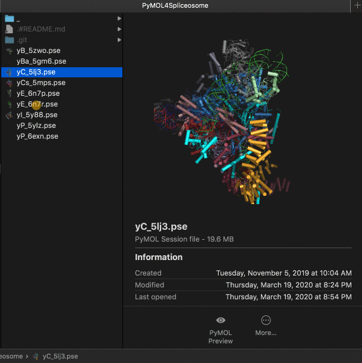
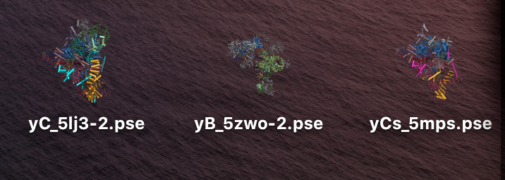
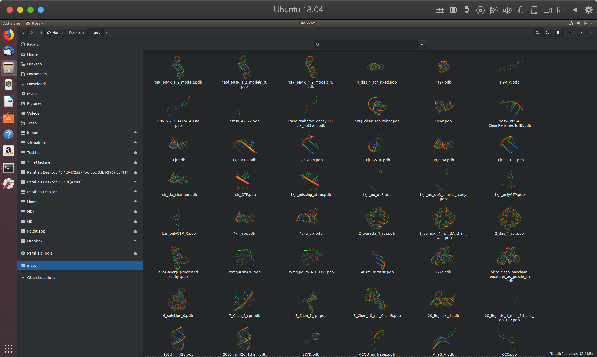

# PyMOL Preview Generator

## Quick Installation [OSX]
The requirements:

     $ brew install fileicon
     $ brew install imagemagick
          
the main programs:
          
     $ pip install rna-tools
     $ pymol_preview_install.py 

## Quick Install [Linux]

The requirements:

     $ sudo apt-get install pymol
     	
the main program:

	 $ pip install rna-tools
     
For Linux use the main engine of the plugin, run for your PDB files:

     $ pymol_preview_generator.py <files>
     
 for example:
 
     $ pymol_preview_generator.py ~/Desktop/input/*.pdb
    

# Errors when installing PyMOL [OSX]
 
## xcode-select --install
 
 If you have an error like this installing PyMOL:
 
     ==> Installing pymol from brewsci/bio
    Error: The following formula
      pymol
    cannot be installed as binary package and must be built from source.
    Install the Command Line Tools:
      xcode-select --install
  
  then simply run:
  
    xcode-select --install
    
and install pymol again:

    brew install brewsci/bio/pymol
    
## brew cask install xquartz
If you have an error like this installing PyMOL:

      Updating Homebrew...
    ==> Tapping brewsci/bio
    Cloning into '/usr/local/Homebrew/Library/Taps/brewsci/homebrew-bio'...
    remote: Enumerating objects: 220, done.
    remote: Counting objects: 100% (220/220), done.
    remote: Compressing objects: 100% (112/112), done.
    remote: Total 8335 (delta 124), reused 162 (delta 106), pack-reused 8115
    Receiving objects: 100% (8335/8335), 1.65 MiB | 366.00 KiB/s, done.
    Resolving deltas: 100% (5563/5563), done.
    Tapped 296 formulae (335 files, 2.3MB).
    ==> Installing pymol from brewsci/bio
    freeglut: XQuartz 2.7.11 (or newer) is required to install this formula. X11Requirement unsatisfied!
    You can install with Homebrew Cask:
      brew cask install xquartz
    You can download from:
      https://xquartz.macosforge.org
    Error: An unsatisfied requirement failed this build.
  
then simply run:
  
    xcode-select --install
 
and install pymol again:

    brew install brewsci/bio/pymol

## Old Installation

Video with an explanation how to set it up:

1:26 Installation
4:05 Shell tool
5:52 Quick Action with Automator

Requirments:

    # install brew [if you don't have it]
    /bin/bash -c "$(curl -fsSL https://raw.githubusercontent.com/Homebrew/install/master/install.sh)"

    $ brew install fileicon
    $ brew install imagemagick

    $ brew install brewsci/bio/pymol # install pymol, if you have any error see below this page

Install rna-tools:
    
    $ pip install rna-tools

Automator:

- New -> Quick Action
- Workflow receives current: `files or folders` in `Finder`
- Select Image that you want, we can use QuickLook
- Action: Run shell script, drag and drop this action to the Main Panel
- Copy paste the code below for this action
- Pass input `as arguments` (!)
- Save action as `PyMOL Preview`

Script for Automator:

    for f in "$@"
    do
        echo "$f"
        <PATH TO THE SCRIPT RNA-TOOLS>/rna-tools/rna_tools/tools/pymol_preview_generator/pymol_preview_generator.py $f
    done

for me:

    for f in "$@"
    do
        echo "$f"
        /Users/magnus/work-src/rna-tools/rna_tools/tools/pymol_preview_generator/pymol_preview_generator.py $f
    done
    
