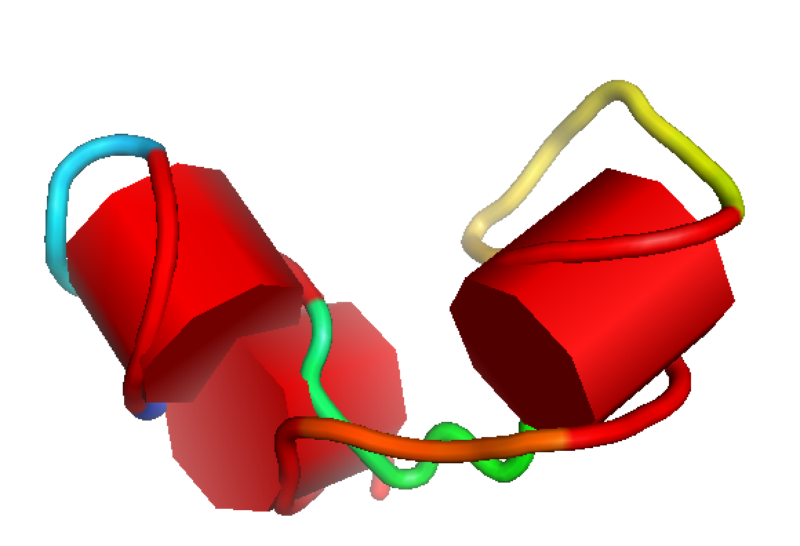

Example

      $ ./rna_helix_vis.py -p test_data/rp14_farna_eloop.out.1.pdb -s test_data/rp14.ss
      (((((.(((((....)))))..[.....((((((..........))))))....)))))].
      from pymol.cgo import *
      from pymol import cmd
      color red, resi 1+2+3+4+5+55+56+57+58+59
      color red, resi 7+8+9+10+11+16+17+18+19+20
      color red, resi 29+30+31+32+33+34+45+46+47+48+49+50
      obj = [ CYLINDER, -4.89364,-21.9653,-24.0907,10.3337,-22.0812,-28.8867, 9, 1, 0, 0, 1,0,0, CYLINDER, 9.52677,-27.707,-35.113,4.12388,-23.5705,-48.3105, 9, 1, 0, 0, 1,0,0, CYLINDER, 3.48367,-49.4752,-18.6601,-12.6687,-57.1961,-17.8483, 9, 1, 0, 0, 1,0,0,]
      cmd.load_cgo(obj,'cgo01')

Install: required: forgi (https://github.com/pkerpedjiev/forgi), `pip install forgi`
