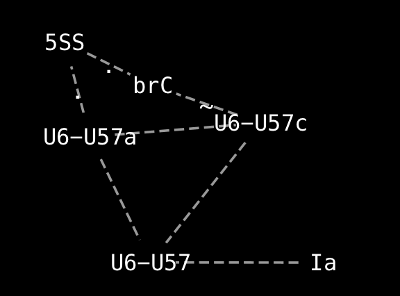

SpliX - a graph (or not) representation of spliceosomal interactions
------------------------------------------------------------------------------- 

	$ python splix.py u2-A25
	----------------------------------- Literature: -----------------------------------
	U2-A25  Helices Ia and Ib show continuous base-stacking and the bulged U2 snRNA nucleotides U24 and A25 protrude from helix I and bind to the Prp8 RT domain. {Galej:2016ht} (Figs 3d, 4d, e and 5a).
	------------------------------ Secondary structure: ------------------------------
	U2-A25 U2-U10
	------------------------------ db/inters_of_A25.csv ------------------------------
	U2-A25 CEF1-H31
	U2-A25 PRP8-D1094
	U2-A25 U2-U24
	U2-A25 U2-G26

aka yeastwhatif: mutation effect predictor [prototype]

yeast-in-monte-carlo.py
-----------------------------------------------------------

    (py37) [mx] splix$ git:(master) ✗ python yeast-in-monte-carlo.py
    [-1.0, -0.9, -0.8, -0.7, -0.6, -0.5, -0.4, -0.3, -0.2, -0.1, 0.0, 0.1, 0.2, 0.3, 0.4, 0.5, 0.6, 0.7, 0.8, 0.9, 1.0]
    ggg inhibits splicing by -0.8 and cwc15 inhibits splicing by -1.0 with error 4.0
    ggg inhibits splicing by -0.6 and cwc15 inhibits splicing by -0.5 with error 3.0
    ggg inhibits splicing by -0.8 and cwc15 does nothing to  with error 2.0
    ggg inhibits splicing by -0.6 and cwc15 promote splicing by 0.2 with error 1.6
    ggg inhibits splicing by -1.0 and cwc15 promote splicing by 0.4 with error 1.2
    ggg inhibits splicing by -0.3 and cwc15 does nothing to  with error 2.0
    ggg promote splicing by 0.8 and cwc15 promote splicing by 0.9 with error 3.6
    ggg inhibits splicing by -0.5 and cwc15 promote splicing by 1.0 with error 1.0
    ggg promote splicing by 0.5 and cwc15 promote splicing by 0.3 with error 3.0
    ggg promote splicing by 0.5 and cwc15 inhibits splicing by -0.4 with error 3.0
    ggg inhibits splicing by -0.2 and cwc15 promote splicing by 0.5 with error 1.6
    ggg inhibits splicing by -1.0 and cwc15 promote splicing by 1.0 with error 0.0
    OK!
    ggg inhibits splicing by -1.0 and cwc15 promote splicing by 1.0 with error 0.0
