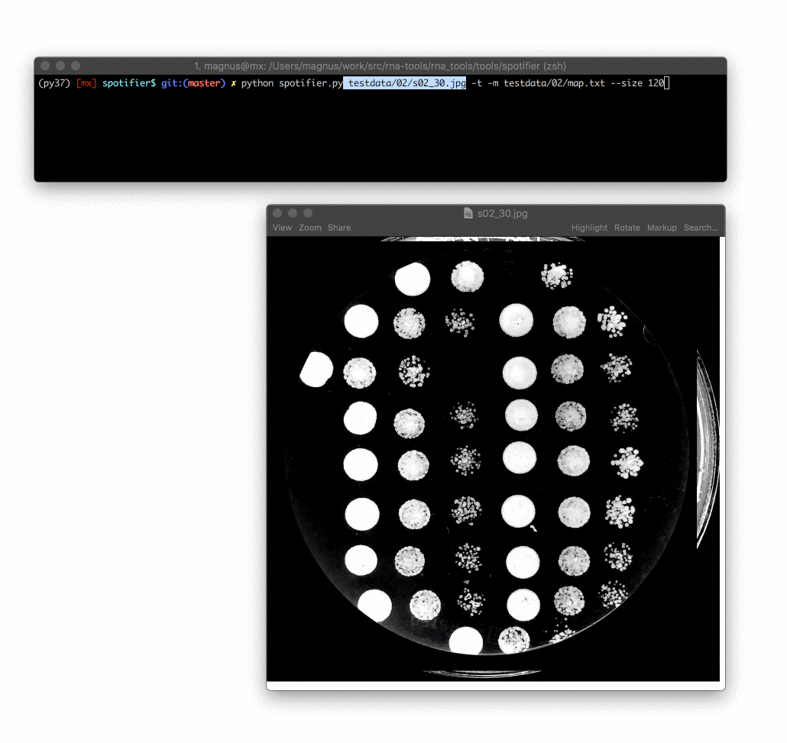
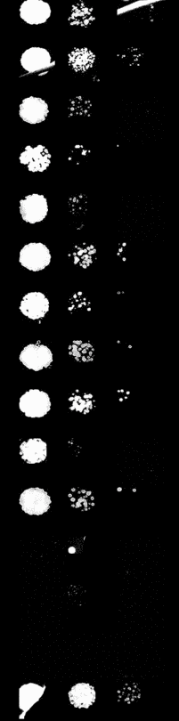
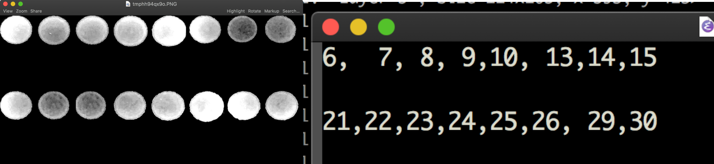
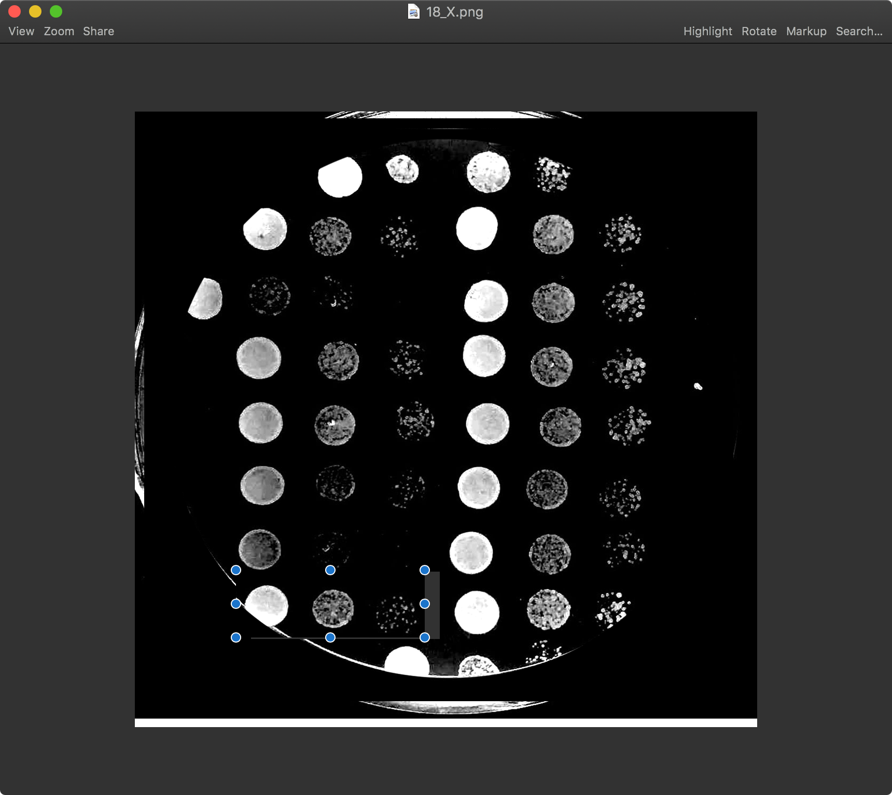
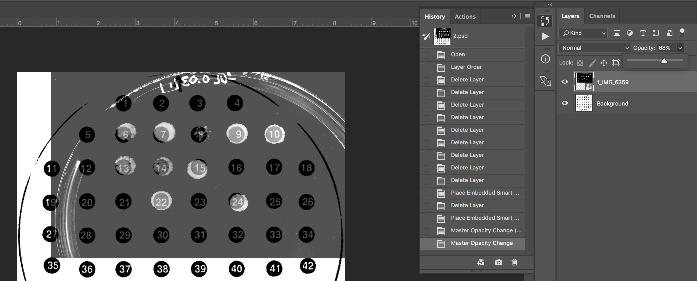

# Spotifier

This script to covert pre-processed plates image into figures.

## Options

    $ spotifier.py -h
    usage: spotifier.py [-h] [-v] [-d] [--dont-align] [-x X] [-y Y]
                        [--trim-rms TRIM_RMS] [--size SIZE] [-a]
                        map file [file ...]

    install to work on psd files: psd-tools3

    positional arguments:
      map                  map
      file                 pre-processed image(s)

    optional arguments:
      -h, --help           show this help message and exit
      -v, --verbose        be verbose
      -d, --debug          be even more verbose
      --dont-align         don't align dots
      -x X
      -y Y
      --trim-rms TRIM_RMS
      --size SIZE
      -a, --dont-annotate

Fig. `-t`,  trim background to get nicely formatted dots.

## Prepare image
Open the image:

Image -> Adjustments -> Black & white

Inverse color (cmd+i) 

Adjust Levels (cmd+l), select black backgroud with the black pippette and white for the white pippette.

Crop image and Edit -> Image Rotation -> Flip Canvas Horizontal.

## Adjust the image to the template
Open template.psd and drag and drop plate photo

Lower opacity for the imported image, to around 30%, to see the template in the background.

Use Move tool and Free transform fit the image to the template.

Use Move tool and Free transform to move "Rectangle" to cover the plate.

Switch off the Backgroud layer, set Opacity to 100.

Save as JPG, e.g., s02_30.jpg.

## Prepare mapping file
Open a text editor and prepare a file used to map dots into figure. 

Run the program:

    python spotifier.py testdata/02/s02_30.jpg -t -m testdata/02/map.txt

The results should be like this:

and the file `s02_30_spots.png` should be created in the folder next to the input file (in this case `testdata/s02/s02_30_spots.png`)

-------------------------------------------------------------------------------

TIP: If you want to introduce one extra, empty line, just add an empty line to a map file.

# Customization

If you want to move single dots, use Preview and just move them around, save it (if you open a JPG, you will be asked if you want to convert the file to PNG, yeah, do it, remember only to change the file name in the command, `18_X.png`).

and re-run:

	python spotifier.py testdata/02/18_X.png -t -m testdata/02/map.txt

-------------------------------------------------------------------------------

Use play with Opacity to see Backgound with the template to adjust positions of your dosts.

# Mappings
Some ideas for your plates ;-):

    5, 6, 7
    8, 9, 10

    12, 13, 14
    15, 16, 17

    20, 21, 22
    23, 24, 25

    28, 29, 30
    31, 32, 33

    36, 37, 38
    39, 40, 41

    44, 45, 46
    47, 48, 49
    
-------------------------------------------------------------------------------

    1, 2, 3
    5, 6, 7
    8, 9, 10
    12, 13, 14
    15, 16, 17
    21, 22, 23
    24, 25, 26
    28, 29, 30
    31, 32, 33
    36, 37, 38
    39, 40, 41
    44, 45, 46
    47, 48, 49
    51, 52, 53
    53, 54, 55
    57, 58, 59
    

# Install

    pip install rna-tools
    
or 

    pip install -e git+http://github.com/mmagnus/rna-tools.git#egg=rna-tools

and install requirements:

    pip install pillow
