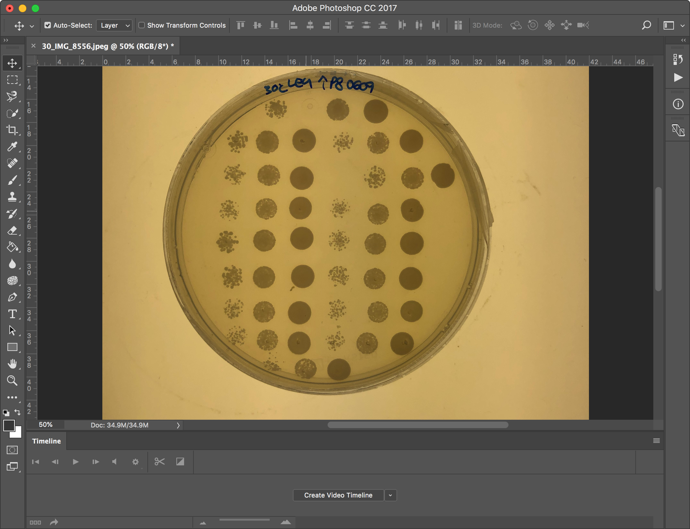
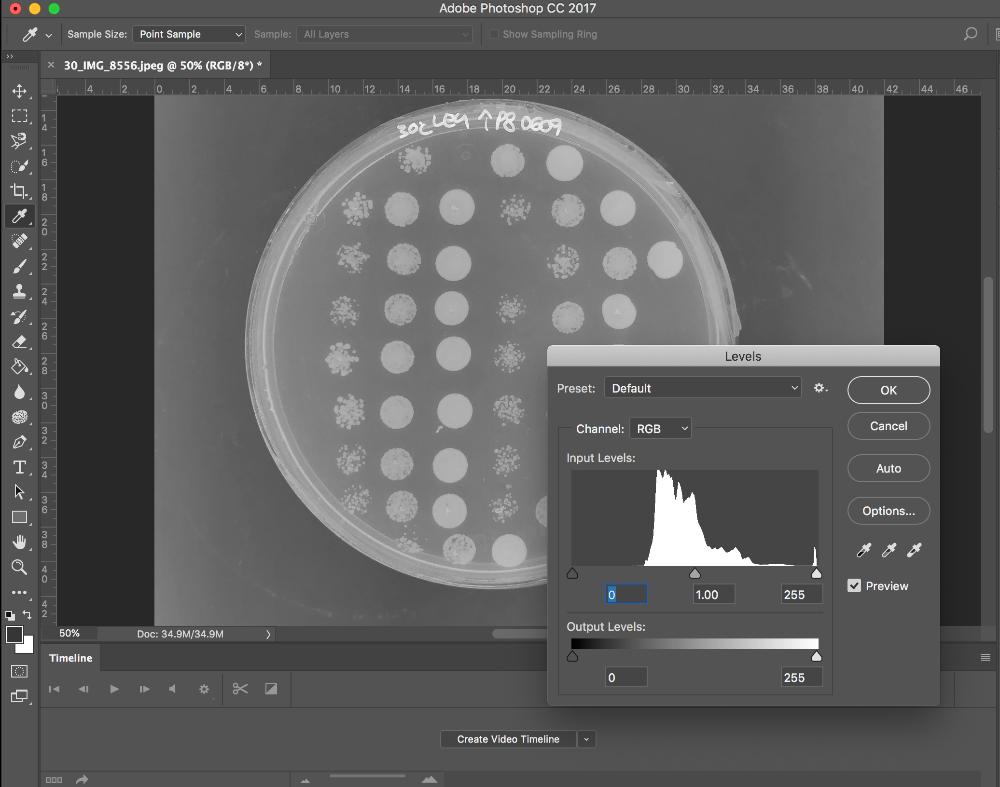
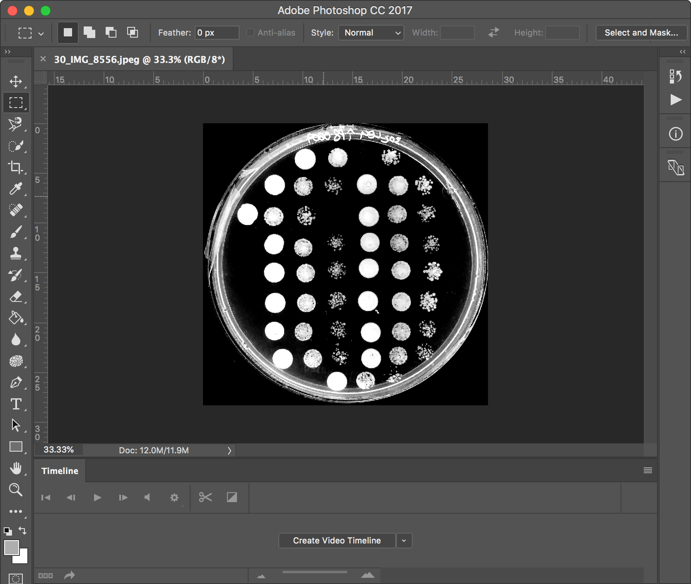
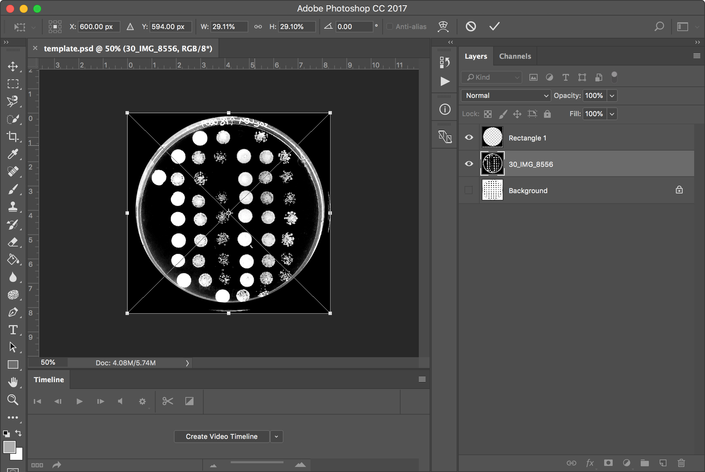
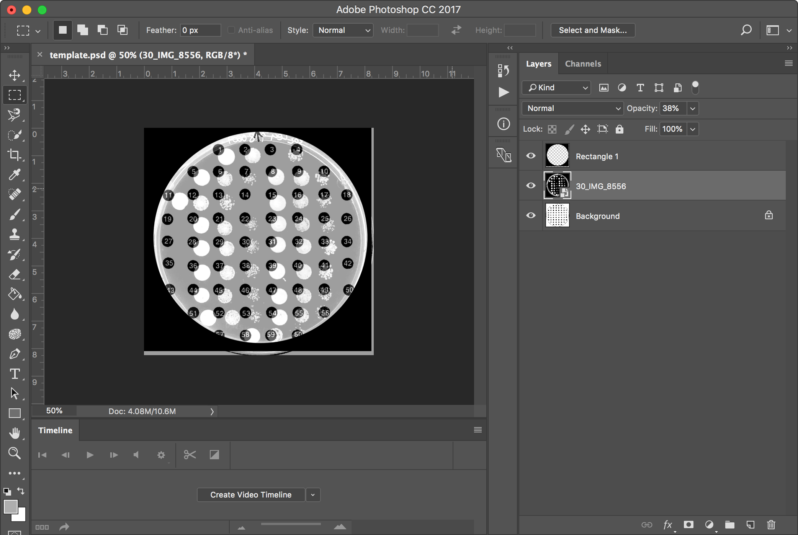
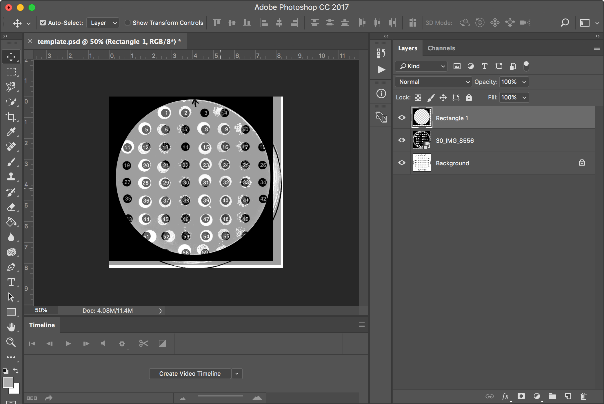
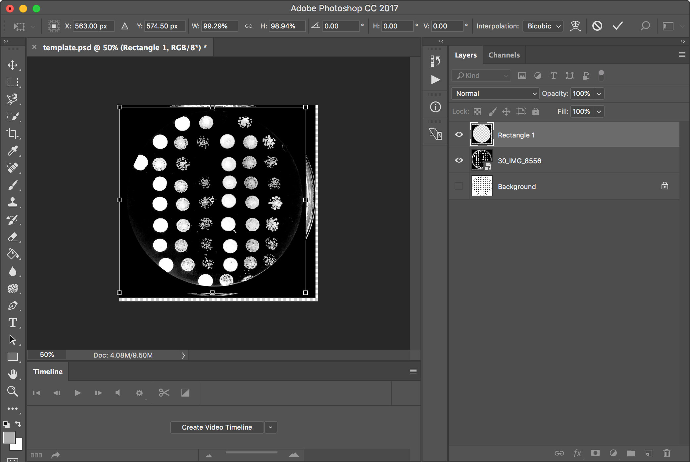
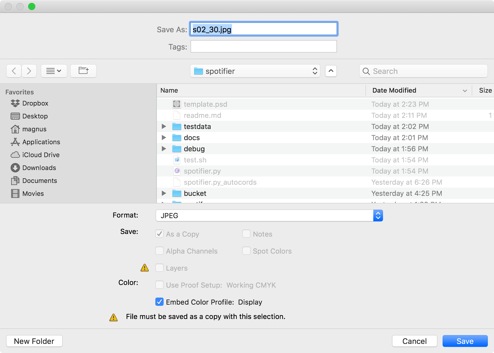
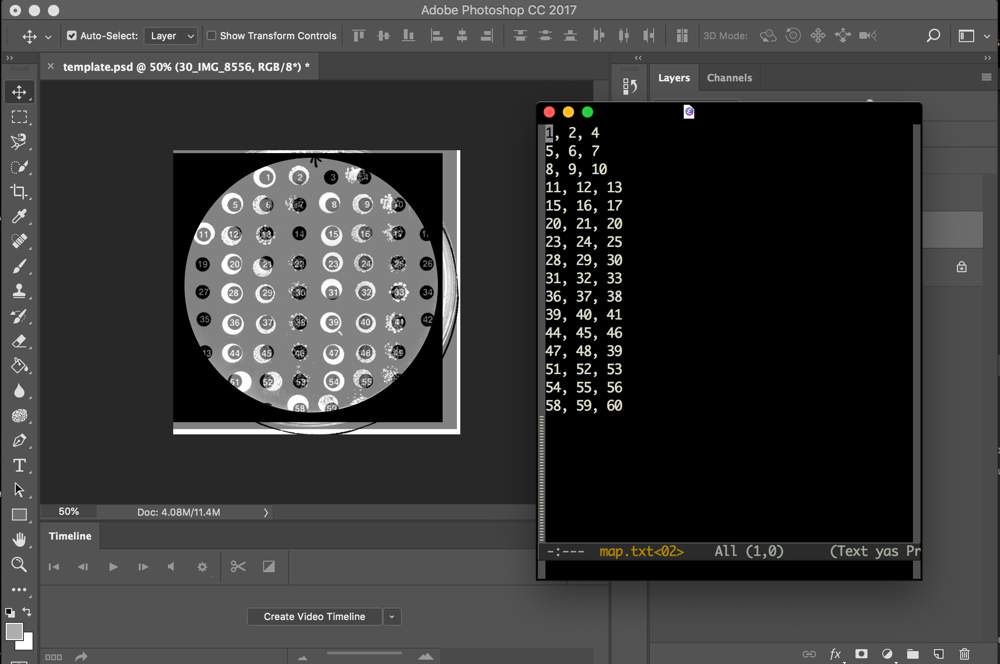
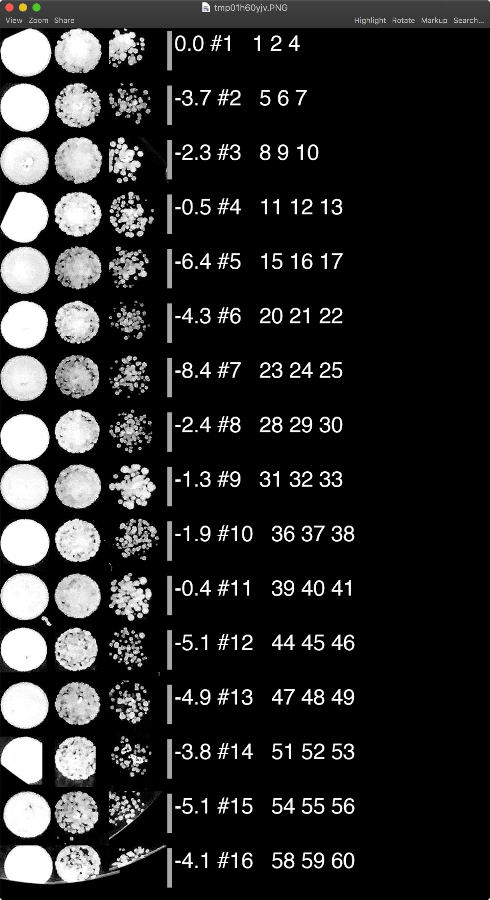

# Spotifier

## Prepare image
Open the image:

Image -> Adjustmenst -> Black & white

Inverse color (cmd+i) 

Adjust Levels (cmd+l), select black backgroud with the black pippette and white for the white pippette.

Crop image and Edit -> Image Rotation -> Flip Canvas Horizontal.

## Adjust the image to the template
Open template.psd and drag and drop plate photo

Lower opacity for the imported image, to aroud 30% and 

Use Move tool and Free transform fit the image to the template.

Use Move tool and Free transform to move "Rectangle" to cover the plate.

Switch off Backgroud layer, set Opacity to 100.

Save as JPG, e.g., s02_30.jpg.

## Prepare mapping file
Open a text editor and prepare a file used to map dots into figure. 

Run the program:

    python spotifier.py testdata/02/s02_30.jpg -t -m testdata/02/map.txt

The results should be like this:

and the file `s02_30_spots.png` should be created in the folder next to the input file (in this case `testdata/s02/s02_30_spots.png`)

