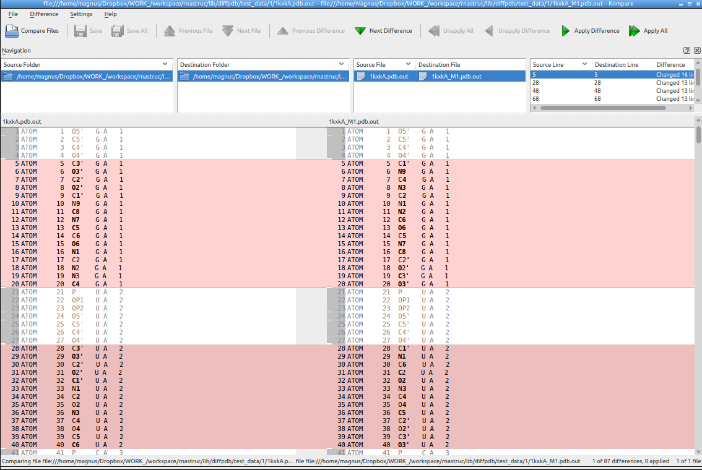

diffpdb - a simple tool to compare text-content of PDB files
-------------------------------------------------------------------------------

    $ ./diffpdb.py -h
    usage: diffpdb.py [-h] [--names] [--htmlout] f1 f2
    
    positional arguments:
      f1          file
      f2          file
    
    optional arguments:
      -h, --help  show this help message and exit
      --names     take only atom residues names
      --htmlout   take only atom residues names

The method is quick-and-dirty, but works!

The script takes first 31 characters of lines (or only atom names and residue names)
starting with 'HETATM' or 'ATOM' and save these lines to a <filename>.out file.

One file is created per pdb. In the final step DIFF_TOOL is executed
 on these two output files. You get a diff output. That's it! Enjoy!

Configuration:

 * DIFF_TOOL, set up what tool would you like to use to diff files (e.g. `diff` or `kompare` etc.)

`./diffpdb.py --names test_data/4/1duq.pdb test_data/4/1duq_decoy0171_amb_clx.pdb`

and on the Mac (using `diffmerge`):

## Features

- [X] htmlout, based on (http://git.droids-corp.org/?p=diff2html.git;a=summary)
